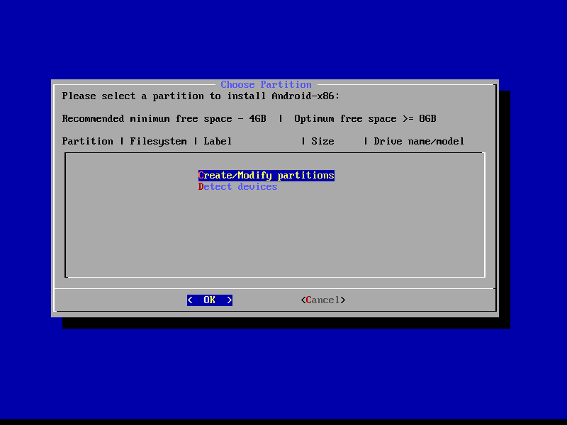
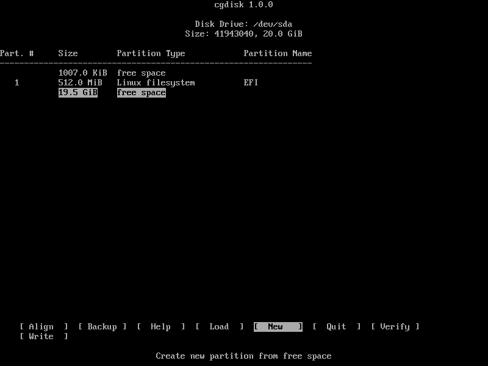
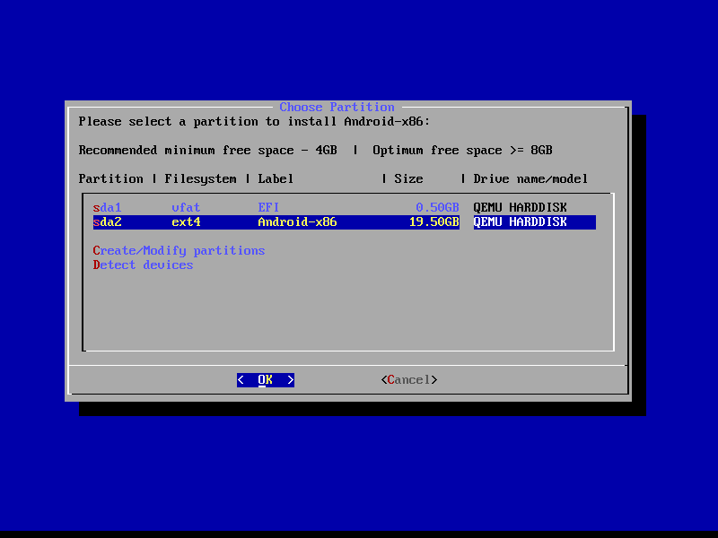
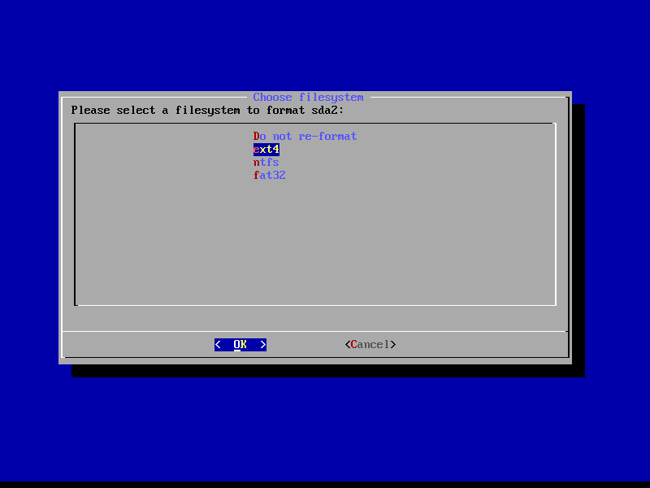
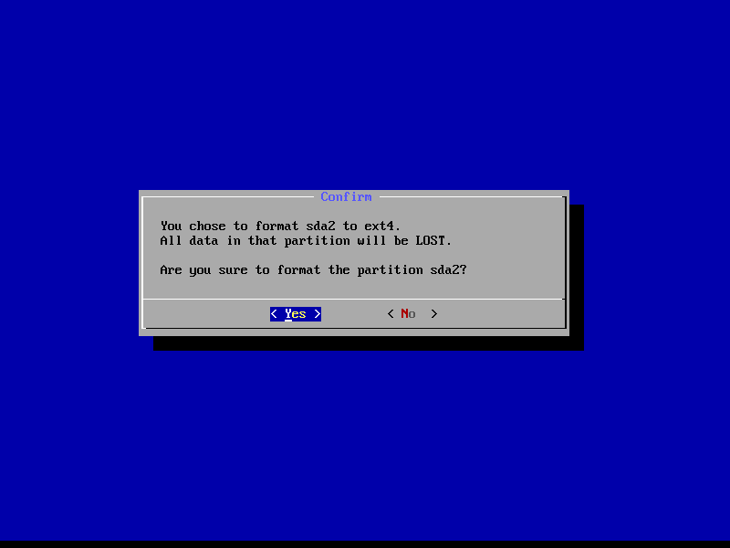
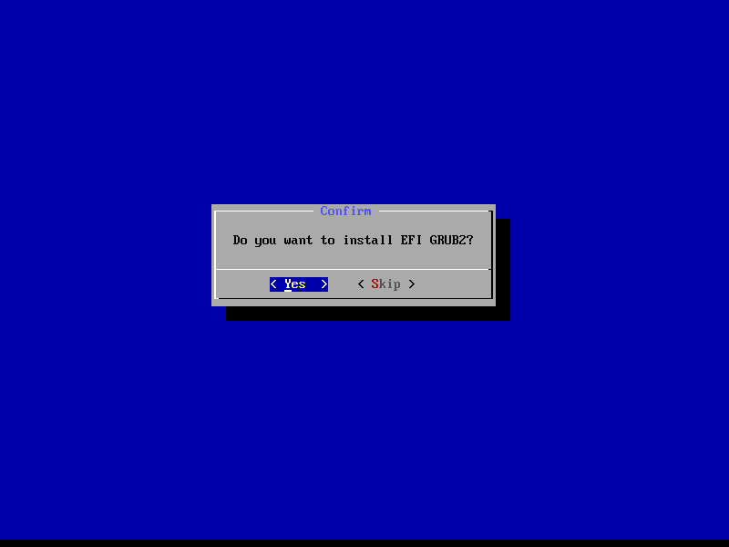
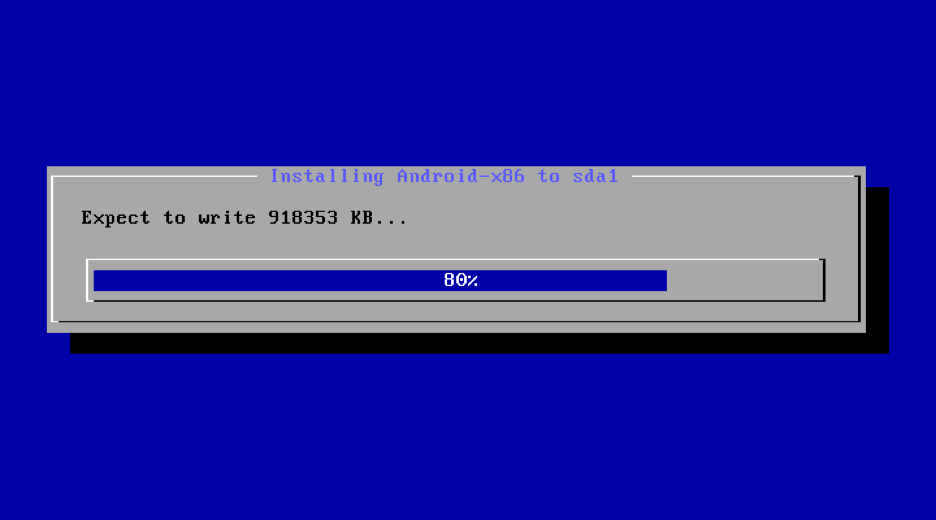

# Install From Bootable USB

## Manual Install Bass OS

##### Install Steps:


WARNING THIS WILL DELETE ANY DATA ON THE DRIVE


We will want to start by booting into the installer by selecting the top Install option from Grub

From here we will want to change the drive partition scheme to be A) EFI (VFAT) B) Android (ext4). This means that we need to delete all partitions except for the top EFI partition, and create a single new partition with the remaining space.  You will need to start by selecting "Create/Modify partitions", then remove all partitions on the device. 

In the next screen, we need to make **two** partiitons for this to work, as Bliss needs to install a bootloader to boot to. if you have a pre-existing install of linux, this step may be unnecessary.

First create the EFI partition, this is the partition that is used to install the bootloader. 

1. Create a [ new ] partition
2. leave First Sector default (Just press enter)
3. for "Size in Sectors" all we need to do is enter `+512M`
4. Set type as ef00 (or EFI)
5. We don't necessairly need to name this partition, but it is best practice to name it `EFI`

Next we need to make the second partition this is the partition that the bulk of android will be installed to.

1. press down until the largest chunk of free space is slected, and click [ NEW ]
2. We can leave everything default. Although a name is not necesary we can call it ANDROID.
3. Lastly we click [ WRITE ] and [ QUIT ] 

Now that we have the drives partitioned, we can start to install android. Select the ANDROID partition that we have made before, and format it as ext4. this is the recomended format unless windows compatibility is need, in that case select NTFS. and click < Yes > on the next screen

The installer will procede to format and install android, you will then be prompted to install EFI GRUB2. we need to accept that, unless you have a pre-existing grub or other bootloader install

The installer will begin to write the changes to the disk. This will take some time. Go grab another coffee!

After this step, it will also prepare the install for A/B updates. This process will take a couple minutes at most. 

Congratulations! You should now have a functional UEFI-boot with Bass OS!
