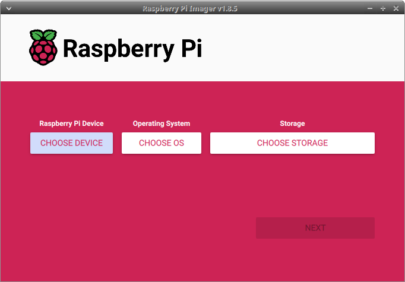
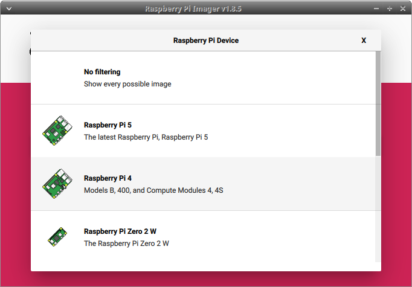
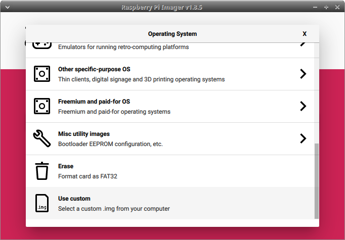
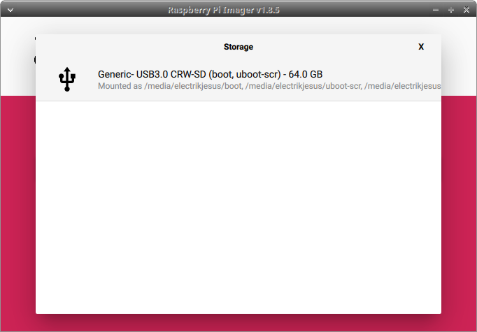
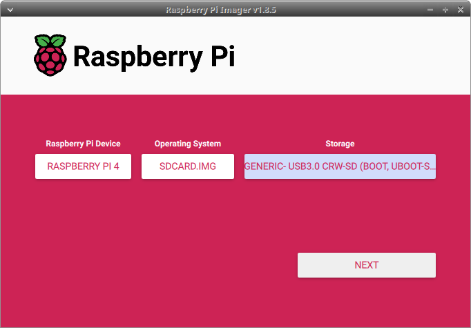
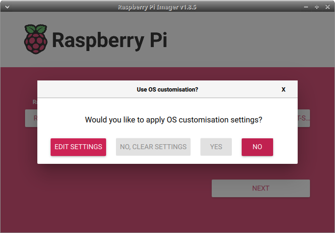
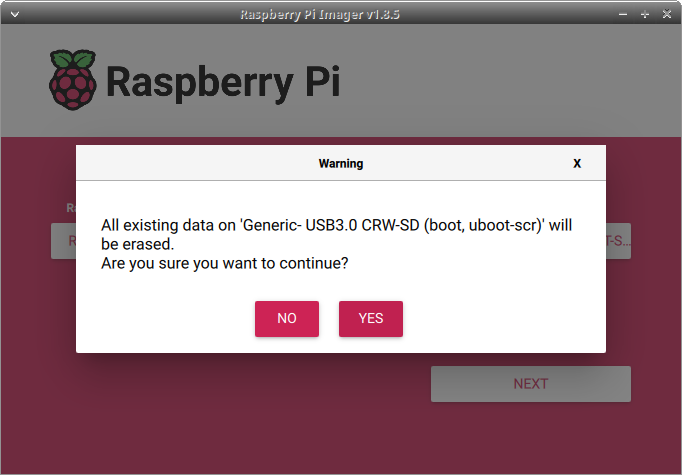
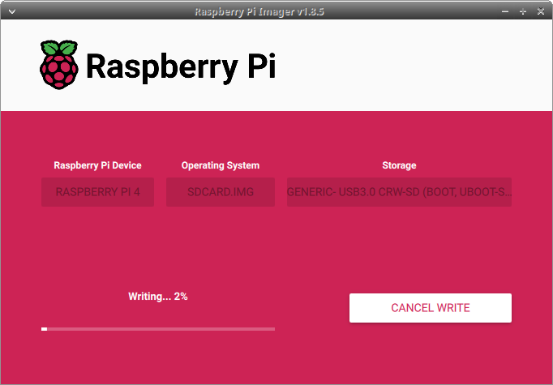
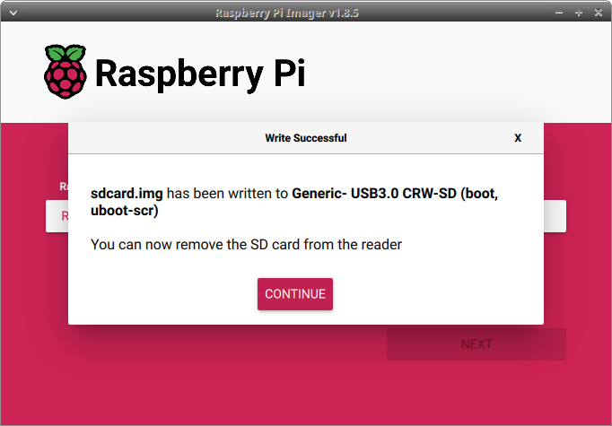

# Bass OS 13 for the Raspberry PI 4 series based on the GloDroid project

## Flashing images

### Requirements

##### Raspberry Pi Imager
Download and install the official Raspberry Pi Imager from [here](https://www.raspberrypi.com/software/)

##### sdcard.img
Find the latest Bass rpi image archive sdcard images for your target use-case [here](https://sourceforge.net/projects/bliss-co-labs/files/BlissBass/Raspberry-Pi/)

### Step 1
Extract the sdcard archive using xz/7zip/Winzip/etc. 

### Step 2
Launch the Raspberry Pi Imager application

### Step 3
Select the **CHOOSE DEVICE** button and select the **Raspberry Pi 4**

### Step 4
Select the **CHOOSE OS** button and scroll down to the bottom of the list, selecting **Use custom**

### Step 5
Click on the **CHOOSE STORAGE** button, and select your SD Card device

### Step 6
Once you have all the parts selected, the Next button will be enabled:

Clicking the **NEXT** button will ask if you want to make any custom changes. Select **NO**

### Step 7
The next question will be a confirmation dialog, making sure you want to erase the contents of the SDCard. Select **YES** to continue. 

### Step 8 
The Imager will then ask for root permissions, and once provided, it will start to flash the sdcard.img onto the SDCard:

Once completed, the Imager will show a **Write Successful** dialog. 

You can safely remove the SDCard from the PC, and plug it into the Raspberry Pi. 

## Booting

After flashing the SDCard, insert it into the device and turn it on, and it will boot into the OS. 

Depending on the version (application use-case), you should let the OS reach the desktop and wait while the target configurations are being set. This process will be setting up configs, apps, and permissions for the user environment, so it may take a bit.

Pressing the home button should make sure that you are set to the correct launcher UI when everthing is all set. 
