## Install Bass OS VirtIO builds

On Debian / Ubuntu, installing the package `virt-manager` would install the GUI manager, and everything that required for libvirt QEMU virtual machine as well as theirs dependencies.

Run the following command to install it:
```
sudo apt install virt-manager
```

Also, install packages according to the architecture:

| Android Architecture  |       Packages to install        |
|-----------------------|----------------------------------|
| ARM (32-bit + 64-bit) | qemu-system-arm qemu-efi-aarch64 |
| ARM (64-bit only)     | qemu-system-arm qemu-efi-aarch64 |
| x86 (64-bit only)     | qemu-system-x86 ovmf             |


## Create and configure virtual machine using `virt-manager`

> This section uses Debian 12 (bookworm) as example. The instructions for other OSes may differ.

Launch `virt-manager`, by opening "Virtual Machine Manager" from the Application menu, or type it on Terminal.

### Virtual machine creation and common configurations

On the menu bar, select `File` > `New Virtual Machine`. A new window named "New VM" will pop up.

#### Step 1 - Machine Architecture

Select `Manual install`. Expand `Architecture options`, select the correct architecture for the built image, as described below:

| Android Architecture  | QEMU Architecture |
|-----------------------|-------------------|
| ARM (32-bit + 64-bit) | aarch64           |
| ARM (64-bit only)     | aarch64           |
| x86 (64-bit only)     | x86_64            |


After selecting the correct architecture, click `Forward`.

#### Step 2 - OS Details

Search and select `Generic Linux 2022` on `Select the operation system you are installing` field. Click `Forward`.

#### Step 3 - CPU & Memory

Specify the number of CPU cores and the size of Memory that you're willing to allocate to the virtual machine.
Minimal RAM requirement is 2048 MiB. After filling these, click `Forward`.

#### Step 4 - Storage

Untoggle `Enable storage for this virtual machine`, because we will setup storage for this virtual machine later. Click `Forward`.

#### Step 5 - Network

Specify the name that you would like to assign to the virtual machine,
and select the network which you wish to connect to in `Network selection` menu, click `Forward`.

> **Note**: The virtio network service will have to be enabled at boot in order for this interface to work across host machine reboots. To enable the service, run `sudo systemctl enable libvirtd.service` and `sudo systemctl start libvirtd.service`.

#### Select `Chipset` or `Machine` and `Firmware`

The virtual machine configuration window will pop up.

On `Overview` tab, select `Chipset` or `Machine` and `Firmware` type according to the architecture, as described below:

| Android Architecture  | Chipset / Machine |                     Firmware                      |
|-----------------------|-------------------|---------------------------------------------------|
| ARM (32-bit + 64-bit) | virt (required)   | Custom: /usr/share/AAVMF/AAVMF_CODE.no-secboot.fd |
| ARM (64-bit only)     | virt (required)   | Custom: /usr/share/AAVMF/AAVMF_CODE.no-secboot.fd |
| x86 (64-bit only)     | Q35 (recommended) | UEFI x86_64: /usr/share/OVMF/OVMF_CODE_4M.fd      |


Click `Apply`.

On `Memory` tab, toggle `Enable shared memory`, click `Apply`.

### Create virtual disks

1. Click `Add Hardware` on the bottom left corner, new window `Add New Virtual Hardware` will appear.
2. Select `Storage`, select `Disk device` on `Device type` menu, and select `VirtIO` on `Bus type` menu.
3. Fill in the disk size.
    
4. Click `Finish`.
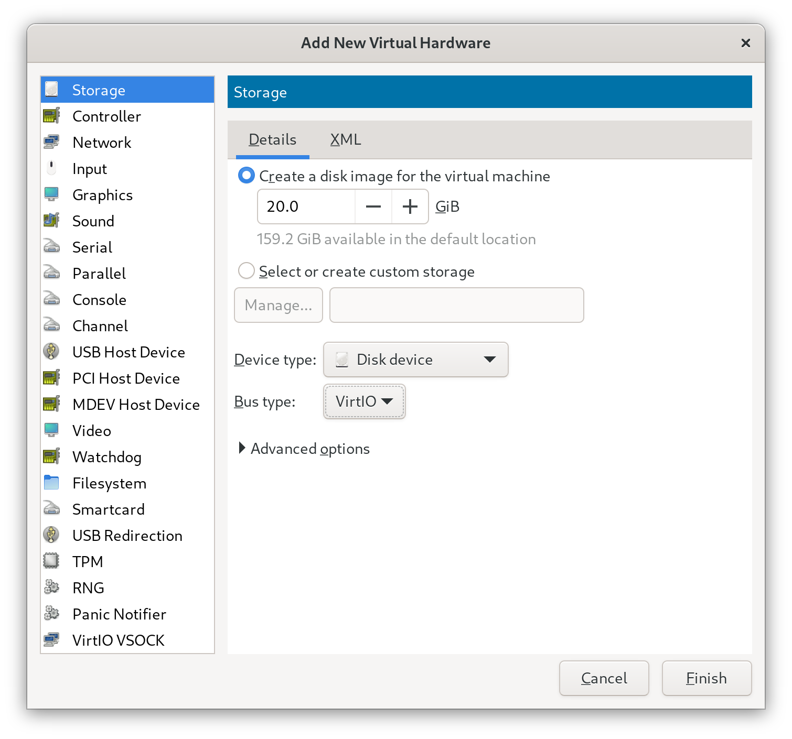
5. Repeat the above steps, to add disk for storing userdata. Minimum size of 2 GiB is recommended.

### Attach the installation image

1. Click `Add Hardware` on the bottom left corner, new window `Add New Virtual Hardware` will appear.
2. Select `Storage`.
3. If the installation image is in ISO9660 format, select `CDROM device` on `Device type` menu, and select `SATA` on `Bus type` menu; Otherwise, select `Disk device` on `Device type` menu, and select `USB` on `Bus type` menu.
4. Expand `Advanced`, toggle `Readonly`.
5. Select `Select or create custom storage`, select the installation image.
6. Click `Finish`.

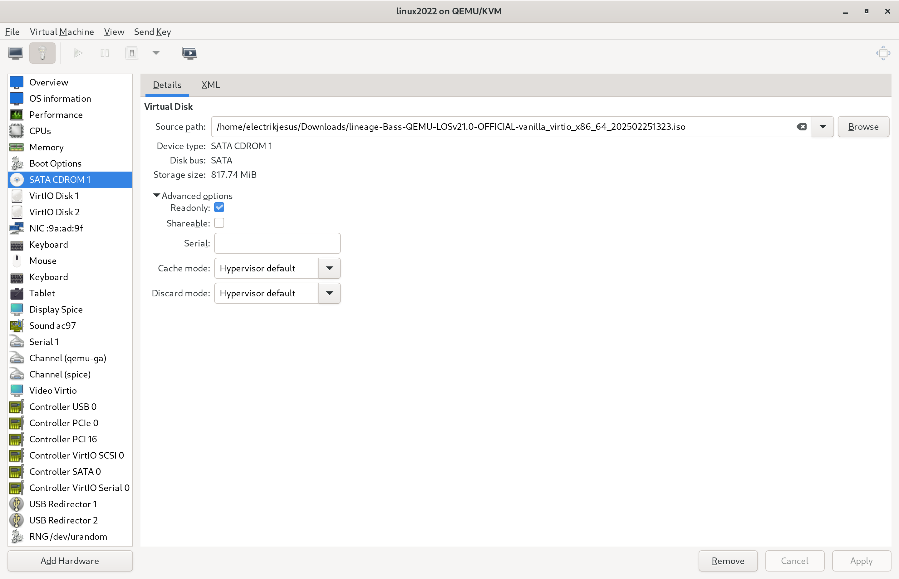

7. On `Boot Options` tab, toggle `SATA CDROM 1` or `USB Disk 1`, click `Apply`.

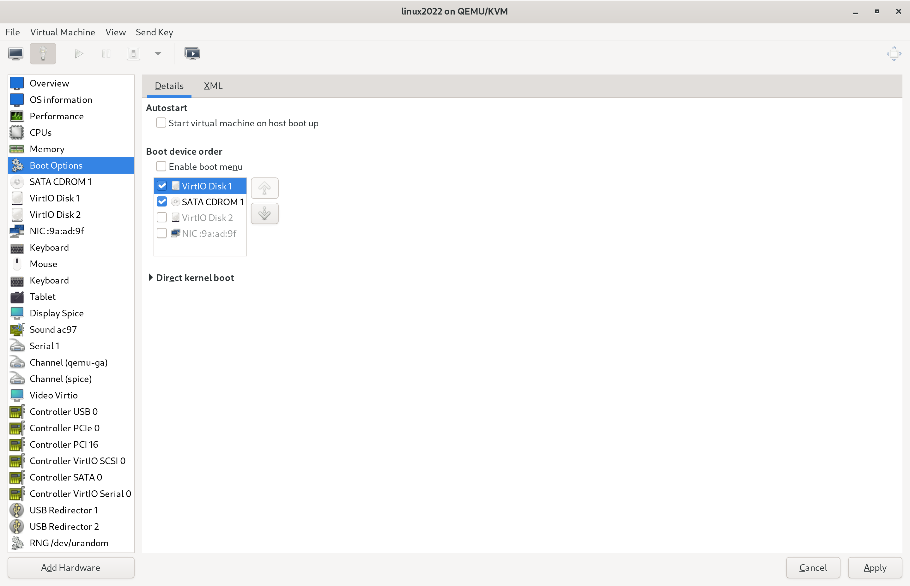

### Configure virtual machine input

#### Tablet or Mouse

If the PC has a touchscreen and you would like to interact with the virtual machine using touchscreen,
or if you are controlling from remote desktop, you shall use tablet input device for the virtual machine.

> Both EvTouch and VirtIO types of tablet are supported.

Otherwise, use mouse input device.

> Both PS/2 and USB types of mouse are supported.

#### Keyboard

Keyboard is always needed. Ensure there is a keyboard included in virtual machine hardware.

> VirtIO, PS/2 and USB types of keyboard are supported.

### Configure virtual machine graphics

#### Video

1. If `Video` tab is missing, add it using the `Add Hardware` button on the bottom left corner.
2. On `Video` tab, select `Virtio` on `Model` menu, click `Apply`.
3. If the PC and the remote desktop application (if you're viewing from it) supports 3D accelerated graphics, Toggle `3D acceleration`, click `Apply`.
4. (Optional) To specify custom display resolution, switch to `XML` tab, insert `<resolution x="<Width>" y="<Height>"/>`, like this:
    ```
    <video>
    <model type="virtio" heads="1" primary="yes">
        <acceleration accel3d="yes"/>
        <resolution x="1920" y="900"/>
    </model>
    <alias name="video0"/>
    <address type="pci" domain="0x0000" bus="0x00" slot="0x01" function="0x0"/>
    </video>
    ```

    > Some rare host video cards may not display 3D accelerated graphics properly. If that happens, you shall disable it.

#### Display

1. If `Display` tab is missing, add it using the `Add Hardware` button on the bottom left corner.
2. Open `Display` tab.
3. Select `None` on `Listen type` menu.
4. If `3D acceleration` is enabled on `Video` tab, toggle `OpenGL`, and select an active host video card on the menu below of `OpenGL` toggle.
5. Click `Apply`.

### Configure virtual machine sound

Sound card model `AC97` (which is the default) is recommended. Other models shall work too, but may have issues.

> aarch64 architecture does not have a sound card added by default. You will have to add it manually.

### Install the new virtual machine

Click `Begin Installation` on the top left corner, installation process will happen, and then the virtual machine will run.

## Install Bass OS to the virtual machine

The virtual machine should boot into the boot manager menu of the installation image.

1. Select the first option that begins with `Install Bass OS` using arrow keys, press Enter.
2. The virtual machine should enter Bass OS Recovery. You could select a option using arrow keys and enter it by pressing Enter.
3. Select `Factory reset` >

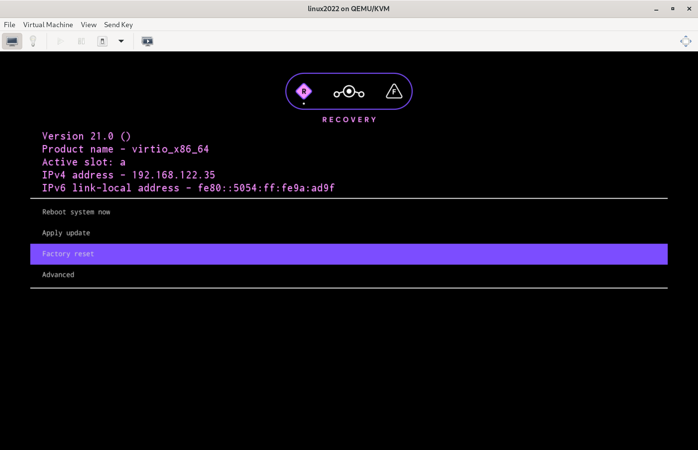

4. Select `Format data/factory reset` >

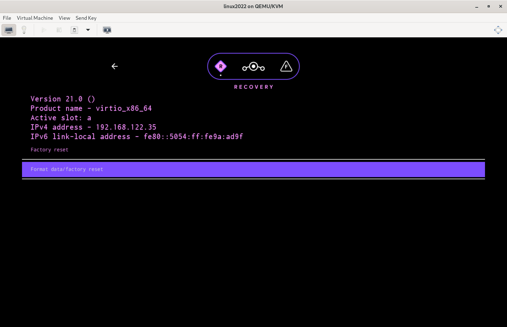

5. Select `Format data` & Confirm.

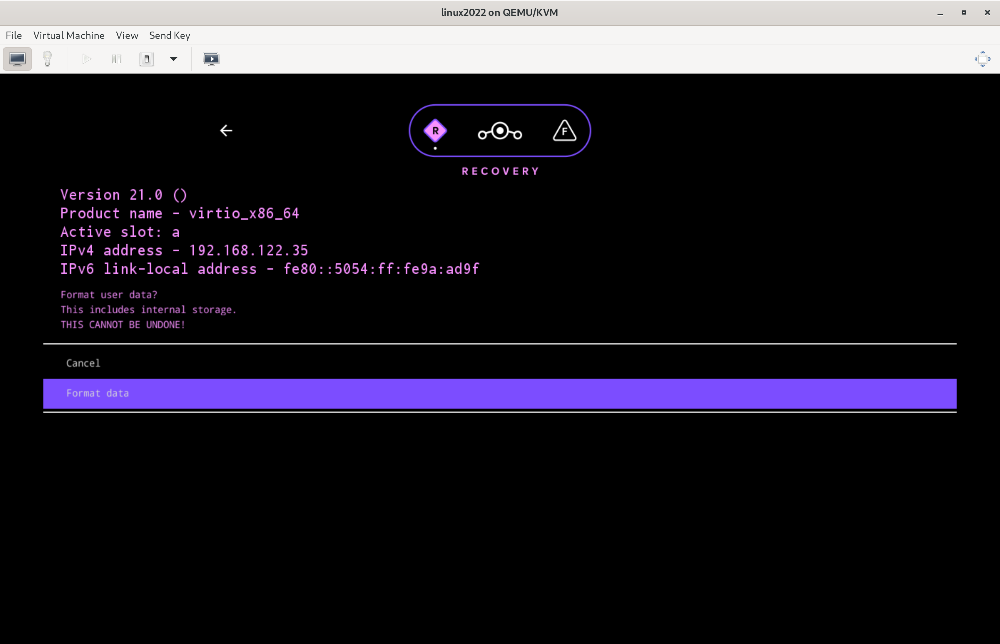

6. Tap 'esc' key or back button to go back to the main menu.
7. Select `Apply update` >

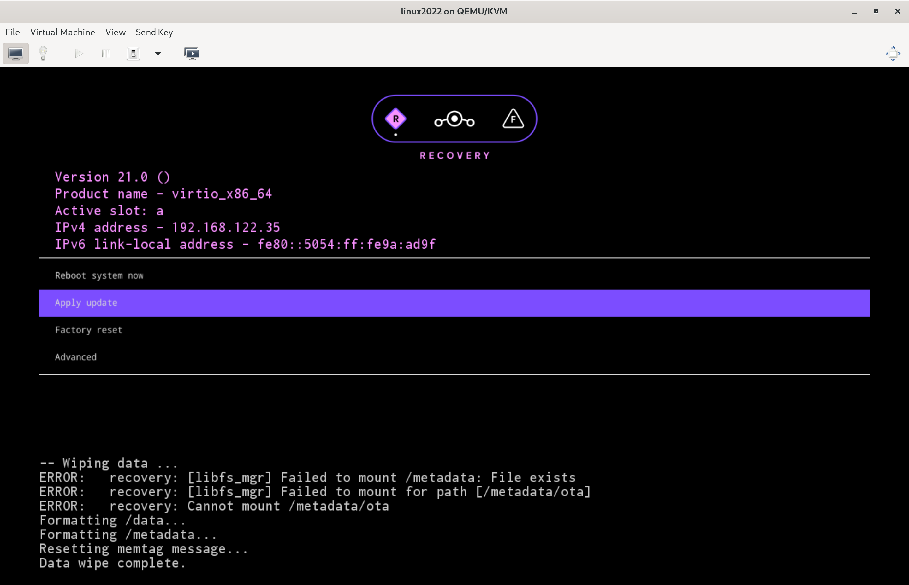

8. Select `Choose from INSTALL` or `Choose from ISOIMAGE` >

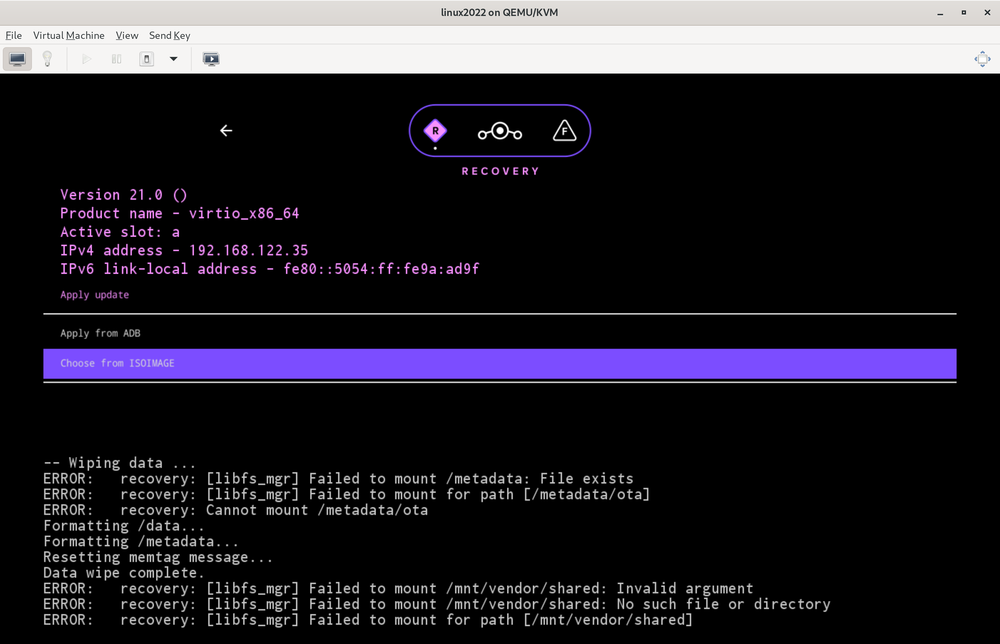

9. Select `lineage-*-{{ site.time | date: "%Y%m%d" }}-UNOFFICIAL-<target>.zip`.

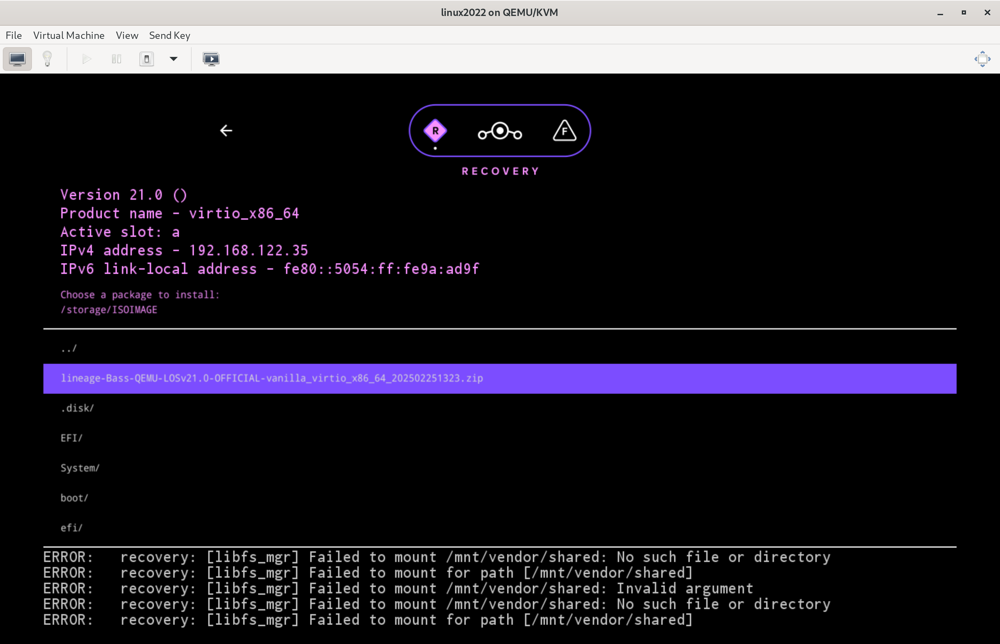

10. When asked to reboot to recovery now, select 'No'
11. Congratulations! You now have Bass OS installed in the virtual machine.

You could now select `Reboot system now` to start using Bass OS.

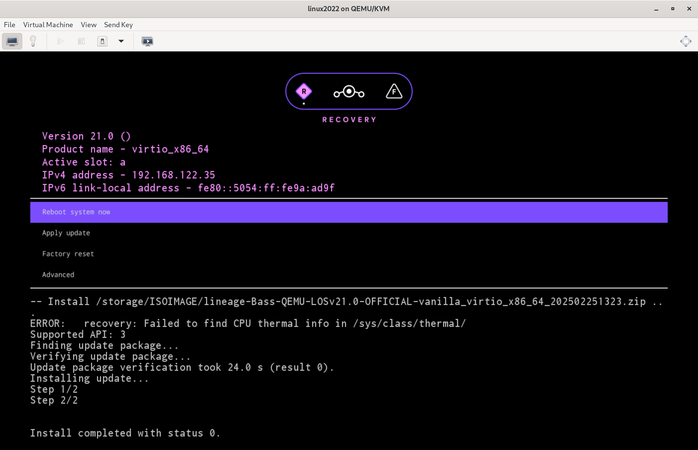

## Run Bass OS inside the virtual machine

The virtual machine should enter Bass OS boot menu.

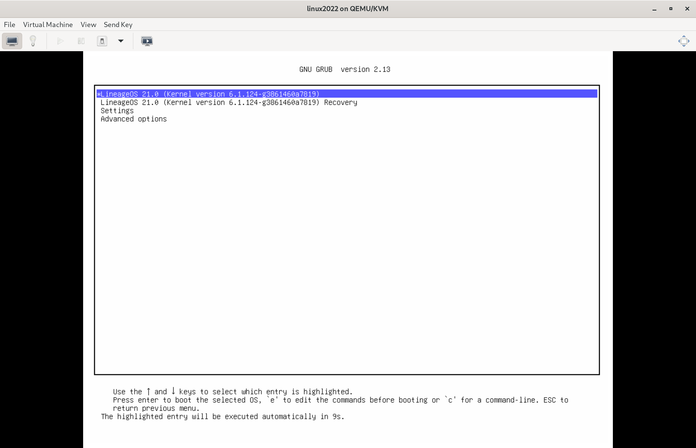

If the virtual machine is configured with 3D acceleration enabled, boot Bass OS by selecting the first option.

Otherwise, select `Advanced options` > `Bass OS * (Kernel version *) (Swiftshader graphics)`.

If done correctly, Bass OS should start to boot up. 

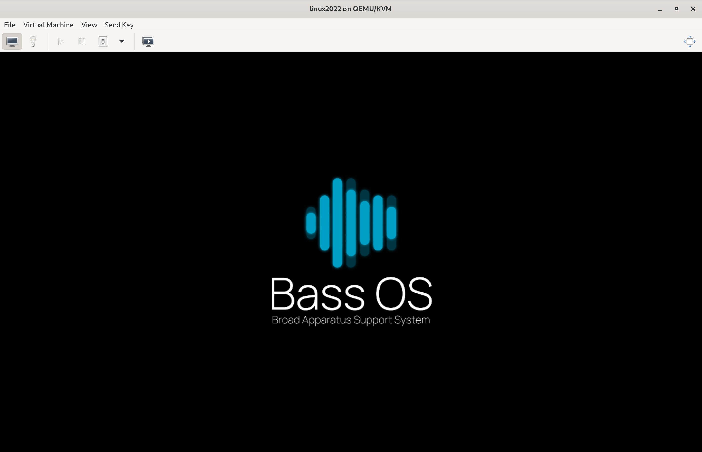

When boot is complete, you should be greeted with the onboarding app (Setup Wizard). 

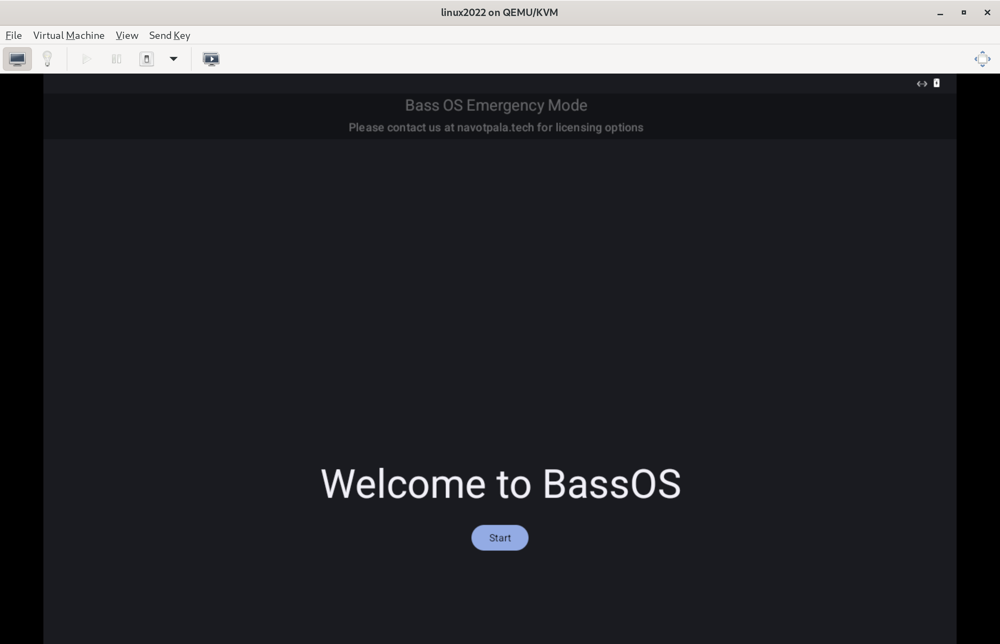
