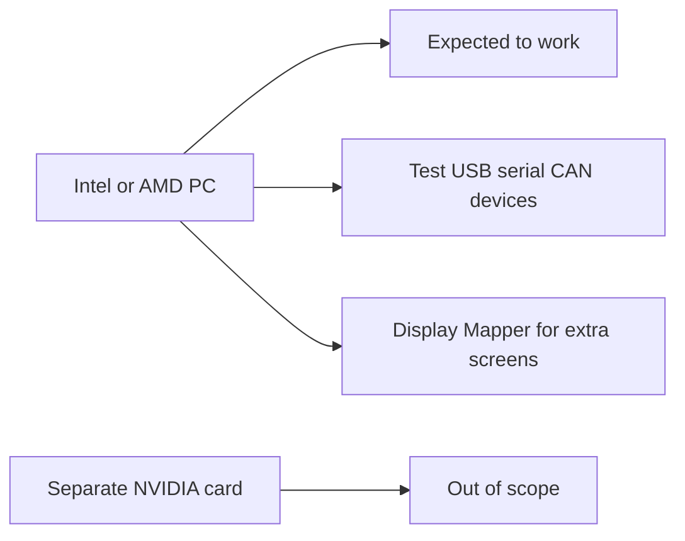
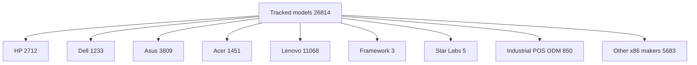

# Hardware compatibility (x86)

This page answers a simple question: **will Bass:Lineout run on this PC?**

## The short answer

1. **Yes**, for most **Intel** or **AMD** PCs from about the last ten years (and many older ones too).
2. **No** for machines that need a **separate NVIDIA graphics card** (gaming laptops and many workstations). Bass does not ship NVIDIA's closed-source driver.
3. The PC itself is usually fine. Extra screens (including many customer-facing displays) are largely handled by Bass [Display Mapper](../../UserGuides/display-mapper.md) and [Input Mapper](../../UserGuides/touch-mapper.md), plus related stack work. What still needs project-level care is **store or factory devices that talk over USB, serial, or CAN**: card readers, cash drawers, receipt printers, barcode scanners, and similar. Bass can expose those buses (including Config Overrides for common wiring cases), but the **Android app** still has to speak the device protocol.

Numbers on this page come from a public list of PCs that people have reported to [linux-hardware.org](https://linux-hardware.org) ([linuxhw/DMI on GitHub](https://github.com/linuxhw/DMI)). A brand missing from that list is **not** the same as unsupported. See the [appendix](#appendix-a-word-list) for short definitions.

## Check your graphics chip

On a running Bass system (or any Linux live session):

```bash
lspci -nn | grep -iE 'vga|3d|display'
```

| If you see | What it means |
|------------|---------------|
| Intel vendor id `8086:` | Expected to work (built-in Intel graphics). |
| AMD vendor id `1002:` | Expected to work (built-in AMD graphics). Confirm the screen comes up. |
| NVIDIA vendor id `10de:` | Treat as out of scope for production unless you already tested that exact chip with our build. |

If this is a point-of-sale or industrial box, test card readers, cash drawers, printers, and other USB/serial/CAN devices with your Android app on that exact model. Extra monitors and customer-facing displays are usually covered by Display Mapper and Input Mapper.

## Buying tips by brand

Quick "buy this / skip that" notes. Model counts later on this page come from linuxhw. This table is shopping guidance only.

| Brand | Prefer | Skip | Notes |
|-------|--------|------|-------|
| HP | EliteBook / ProBook / ZBook Firefly (Intel iGPU); EliteDesk / ProDesk / Mini (Intel) | OMEN / Victus gaming (NVIDIA) | Mixed: prefer Intel or AMD built-in graphics |
| Dell | Latitude / XPS / Precision mobile (Intel iGPU); OptiPlex / XPS Desktop (Intel) | G-Series / Alienware (NVIDIA) | Mixed: prefer Intel or AMD built-in graphics |
| Asus | ExpertBook / Zenbook / VivoBook (Intel); NUC / Mini PC (Intel) | ROG / TUF Gaming (NVIDIA) | Mixed: prefer Intel or AMD built-in graphics |
| Acer | Aspire / Swift / TravelMate (Intel); Veriton / Chromebox-class desktop (Intel) | Nitro / Predator (NVIDIA) | Mixed: prefer Intel or AMD built-in graphics |
| Star Labs | StarBook / StarLite / StarFighter (Intel/AMD open) | Optional NVIDIA dGPU configs | Mixed: prefer Intel or AMD built-in graphics |
| Framework | Framework Laptop (Intel / AMD iGPU) | Framework Laptop 16 (NVIDIA Expansion Card) | Mixed: prefer Intel or AMD built-in graphics |
| Lenovo (optional) | ThinkPad / ThinkCentre / Yoga (Intel); ThinkPad AMD / IdeaPad AMD (radeonsi) | Legion / LOQ gaming (NVIDIA) | Mixed: prefer Intel or AMD built-in graphics |

Full series notes for each brand are in [Appendix D](#appendix-d-series-notes-by-brand).

## Picture of the inventory

We track **26,814** distinct PC models across the brands and segments below (out of **34,784** models in the full linuxhw tree).

| Outcome (name-matched sample) | Models |
|--------------------------------|-------:|
| Expected OK (Intel/AMD open graphics path) | 25,649 |
| Likely gaming / discrete NVIDIA naming | 1,165 |



| Where the models sit | Count |
|----------------------|------:|
| Lenovo | 11,068 |
| Other x86 ODMs | 5,683 |
| Asus | 3,809 |
| HP | 2,712 |
| Acer | 1,451 |
| Dell | 1,233 |
| Industrial POS ODM | 850 |
| Star Labs | 5 |
| Framework | 3 |



## Common PC brands

| Brand | Models in sample | Expected OK | Skip (gaming/NVIDIA naming) |
|-------|-----------------:|------------:|----------------------------:|
| HP | 2,712 | 2,619 | 93 |
| Dell | 1,233 | 1,223 | 10 |
| Asus | 3,809 | 3,147 | 662 |
| Acer | 1,451 | 1,346 | 105 |
| Lenovo (optional) | 11,068 | 10,887 | 181 |
| Framework | 3 | 3 | 0 |
| Star Labs | 5 | 5 | 0 |
| Industrial / POS / ODM | 850 | 850 | 0 |
| Other x86 makers / boards | 5,683 | 5,569 | 114 |

### Popular name lines (examples)

**HP** (2,712 models)

- Common name prefixes: `Pavilion` (230), `Compaq` (163), `Laptop` (152), `ENVY` (141), `EliteBook` (139), `ProBook` (131), `OMEN` (69), `ProLiant` (66)

**Dell** (1,233 models)

- Common name prefixes: `Inspiron` (383), `Latitude` (220), `Vostro` (133), `Precision` (119), `PowerEdge` (96), `OptiPlex` (88), `XPS` (71), `Studio` (24)

**Asus** (3,809 models)

- Common name prefixes: `VivoBook_ASUSLaptop` (451), `ROG` (347), `ASUS` (244), `PRIME` (202), `TUF` (171), `P5` (115), `ZenBook` (102), `VivoBook` (56)

**Acer** (1,451 models)

- Common name prefixes: `Aspire` (808), `TravelMate` (129), `Veriton` (98), `Swift` (75), `Predator` (57), `Extensa` (49), `Nitro` (36), `Spin` (18)

**Lenovo** (11,068 models)

- Common name prefixes: `ThinkPad` (7676), `ThinkCentre` (1140), `IdeaPad` (501), `IdeaCentre` (254), `ThinkStation` (212), `Yoga` (162), `Legion` (160), `ThinkBook` (71)

**Framework** (3 models)

- Common name prefixes: `Laptop` (3)

**Star Labs** (5 models)

- Common name prefixes: `StarLite` (2), `LabTop` (1), `Lite` (1), `StarBook` (1)

## Industrial, POS, and panel PCs

This group covers factory PCs, point-of-sale terminals, panel PCs, rugged notebooks, thin clients, and many mini-PC makers (examples: Advantech, AAEON, Shuttle, Panasonic Toughbook, Intel NUC-class, OnLogic, Elo Touch).

The same physical machine can show up under more than one maker name in the database (retail brand vs board maker vs a generic `OEM` label). Treat the counts as a sample, not a perfect product catalog.

**850** models in this group (850 expected OK, 0 skip).

| Maker | Models | Expected OK | Skip | Common shapes |
|-------|-------:|------------:|-----:|---------------|
| Intel Client Systems | 104 | 104 | 0 | Mini PC (89), Notebook (12), Desktop (3) |
| Panasonic | 97 | 97 | 0 | Notebook (90), Tablet (6), Convertible (1) |
| Intel | 88 | 88 | 0 | Mini PC (88) |
| Shuttle | 69 | 69 | 0 | Desktop (61), Notebook (8) |
| ZOTAC | 66 | 66 | 0 | Mini PC (56), Desktop (10) |
| Chuwi | 54 | 54 | 0 | Notebook (32), Tablet (9), Mini PC (6) |
| AZW | 54 | 54 | 0 | Desktop (33), Mini PC (13), Notebook (8) |
| BESSTAR Tech | 37 | 37 | 0 | Desktop (18), Mini PC (9), Notebook (3) |
| Teclast | 24 | 24 | 0 | Notebook (15), Tablet (6), Convertible (2) |
| Getac | 24 | 24 | 0 | Notebook (19), Tablet (5) |
| AAEON | 14 | 14 | 0 | Desktop (12), Notebook (2) |
| DFI | 13 | 13 | 0 | Desktop (13) |
| AOpen | 12 | 12 | 0 | Desktop (12) |
| CompuLab | 12 | 12 | 0 | Mini PC (7), Desktop (4), Notebook (1) |
| GMKtec | 12 | 12 | 0 | Desktop (6), Mini PC (4), Notebook (1) |

Plus 42 more makers in [`oem_devices.json`](../../data/hardware/oem_devices.json) (field `industrial_pos_odm.vendors`).

- Common name prefixes: `NUC7` (31), `NUC11` (23), `NUC8` (18), `CF-31` (14), `CF-19` (13), `NucBox` (10), `NUC12` (10), `CF-53` (10)

## Other PC makers and motherboard brands

Board makers (MSI, Gigabyte, ASRock, and similar), notebook factories (Clevo and peers), Linux PC brands (System76, TUXEDO), and common generic labels. This is a curated slice, not every remaining name in linuxhw.

**5,683** models in this group (5,569 expected OK, 114 skip).

| Maker | Models | Expected OK | Skip | Common shapes |
|-------|-------:|------------:|-----:|---------------|
| Gigabyte Technology | 1,404 | 1,404 | 0 | Desktop (1262), Notebook (103), Server (34) |
| MSI | 1,214 | 1,130 | 84 | Notebook (674), Desktop (496), All-in-One (38) |
| ASRock | 897 | 897 | 0 | Desktop (895), Notebook (2) |
| Intel | 611 | 596 | 15 | Desktop (515), Notebook (40), Server (35) |
| Supermicro | 234 | 234 | 0 | Desktop (118), Server (112), Mini PC (4) |
| Biostar | 213 | 212 | 1 | Desktop (211), Notebook (2) |
| ECS | 154 | 151 | 3 | Desktop (148), Notebook (5), All-in-One (1) |
| Foxconn | 99 | 98 | 1 | Desktop (98), Notebook (1) |
| PC Specialist | 86 | 83 | 3 | Notebook (61), Desktop (25) |
| TUXEDO | 75 | 75 | 0 | Notebook (75) |
| Huanan | 73 | 73 | 0 | Desktop (73) |
| Clevo | 71 | 71 | 0 | Notebook (70), Desktop (1) |
| Pegatron | 69 | 69 | 0 | Desktop (41), Notebook (24), All-in-One (4) |
| Wortmann AG | 58 | 58 | 0 | Notebook (25), Desktop (23), Tablet (5) |
| ASRockRack | 49 | 49 | 0 | Desktop (31), Server (18) |
| OEM | 40 | 40 | 0 | Desktop (26), Notebook (8), Server (4) |
| MACHINIST | 36 | 36 | 0 | Desktop (36) |
| EVGA | 32 | 32 | 0 | Desktop (32) |
| MECHREVO | 31 | 24 | 7 | Notebook (29), Desktop (1), Mini PC (1) |
| System76 | 31 | 31 | 0 | Notebook (20), Desktop (9), Mini PC (1) |

Plus 22 more makers in [`oem_devices.json`](../../data/hardware/oem_devices.json) (field `other_x86_odm.vendors`).

- Common name prefixes: `MS` (229), `MS-7` (216), `H61` (99), `H81` (51), `X79` (50), `H110` (43), `G41` (43), `Katana` (37)

## Retail POS and kiosk brands

Many store and kiosk brands ship Windows-only images, so they rarely show up in linuxhw. **Missing from the list does not mean Bass will not run.** If the unit uses Intel or AMD built-in graphics, treat it as expected to work. Use Display Mapper / Input Mapper for extra screens; test USB, serial, and CAN devices with your Android app on that model.

Our curated list: **37** of **75** brands appear at least once in this linuxhw snapshot (38 do not).

| Brand | Seen in linuxhw? | Models seen | Notes |
|-------|:----------------:|------------:|-------|
| POSNation | no | - | Channel/reseller POS systems; usually rebadge Intel AiOs. |
| Barcodes Inc. | no | - | Reseller; hardware often third-party Intel panels. |
| Newegg Business | no | - | Reseller/channel; DMI usually shows the ODM or panel OEM. |
| Elo Touch | yes | 1 | Touch AiO / kiosk panels; Intel iGPU SKUs fit Mesa. |
| POSGuys | no | - | Reseller; treat underlying Intel/AMD panel as the real target. |
| Sunany | no | - | Panel/POS OEM; uncommon in Linux probe datasets. |
| POS Catch | no | - | Channel POS kits; verify GPU before deploy. |
| Alibaba | no | - | Marketplace listings - DMI is whatever ODM flashed; not a single OEM. |
| Aonpos | no | - | POS terminals; rare Linux probes. |
| Gilong | no | - | POS/panel OEM; rare in linuxhw. |
| Tysso | no | - | POS terminals; rare Linux uploads. |
| Jassway | no | - | Panel PC / POS; rare in linuxhw. |
| Beetronics | no | - | Industrial/touch monitors and panels. |
| Hosoton | no | - | POS / panel hardware; rare Linux probes. |
| Penetek | no | - | Panel PC OEM; uncommon in linuxhw. |
| DFPOS Machine | no | - | Dedicated POS machines; typically Windows-centric. |
| CSMRT | no | - | POS OEM; rare in linuxhw. |
| Licon | no | - | POS / kiosk; rare Linux probes. |
| Smart Tech Systems | no | - | Systems integrator; DMI may show ODM instead. |
| Ocom | no | - | POS OEM; match vendor equality / word-boundary only (not "computer"). |
| Touch Dynamics | yes | 1 | Touch AiO / POS panels. |
| Faytech | yes | 1 | Touch monitors and panel PCs; Intel SKUs preferred. |
| Elanda | no | - | POS hardware; rare in linuxhw. |
| Advantech | yes | 4 | Industrial / embedded / panel PC - well represented in linuxhw. |
| Panasonic (Toughbook) | yes | 99 | Toughbook / Toughpad rugged class; Intel iGPU SKUs preferred. |
| Sam4S | no | - | POS terminals; rare Linux probes. Bass-validated: SA-660011 (Intel/AMD open path) works on Lineout - specialty I/O still per-SKU. |
| Toshiba (POS/Toughpad) | no | - | Count only POS/Toughpad/Toughbook-style rows - not all Toshiba laptops. |
| Posiflex | no | - | POS terminals and AiOs. |
| Flytech | no | - | POS / panel PC OEM. |
| Senor | no | - | POS OEM; uncommon Linux uploads. |
| IEI | yes | 12 | Industrial / embedded IPC (ICP-IEI). |
| AAEON | yes | 14 | Industrial / embedded / panel. |
| NEXCOM | yes | 2 | Industrial / transportation / embedded. |
| Cincoze | yes | 3 | Rugged embedded / panel PC. |
| Kontron | yes | 3 | Embedded / industrial computing. |
| Shuttle | yes | 69 | Slim / XPC desktops and mini-PCs; common in kiosk embeds. |
| Getac | yes | 24 | Rugged notebooks and tablets; Intel iGPU SKUs preferred. |
| DFI | yes | 13 | Industrial / embedded motherboards and systems. |
| AOpen | yes | 12 | Digital signage and commercial mini-PCs. |
| CompuLab | yes | 14 | Intense PC / industrial mini-PCs. |
| Wyse (Dell) | yes | 16 | Thin clients; often Intel graphics - validate peripherals. |
| Neousys | yes | 10 | Rugged embedded / in-vehicle PCs. |
| RuggedPC / DT Research | yes | 10 | Rugged tablets and POS-adjacent panels. |
| ADLINK | yes | 7 | Industrial / embedded computing. |
| ASRock Industrial | yes | 5 | Industrial motherboards and fanless systems. |
| Jetway | yes | 5 | Embedded / industrial boards and mini-PCs. |
| congatec | yes | 6 | COM / industrial computer-on-modules and systems. |
| Siemens | yes | 160 | Industrial IPC / Simatic-class; Intel open-GPU path preferred. |
| Xplore / Zebra Xplore | yes | 4 | Rugged tablets; often rebranded under Zebra. |
| OnLogic | yes | 3 | Industrial / fanless PCs for kiosk and automation. |
| Seco | yes | 4 | Embedded / industrial systems. |
| IGEL | yes | 3 | Thin clients; validate display and peripheral stack. |
| Axiomtek | yes | 1 | Industrial / embedded / panel PC. |
| Portwell | yes | 1 | Industrial / embedded boards and systems. |
| Vecow | no | - | Rugged embedded / in-vehicle PCs. |
| Partner Tech | yes | 3 | POS terminals and AiOs. |
| NCR | yes | 4 | Retail POS / self-checkout; validate MSR and cash drawer. |
| Diebold Nixdorf | yes | 4 | Retail / banking POS; specialty I/O needs soak testing. |
| Ingenico | no | - | Payment terminals - often paired with a separate Intel/AMD host. |
| Verifone | no | - | Payment terminals; host PC is usually a separate AiO. |
| PAX Technology | no | - | Payment terminals; treat host GPU separately. |
| Oracle MICROS | yes | 42 | Hospitality POS; host is often a standard Intel AiO. |
| HP Engage / POS | no | - | HP retail AiOs; Intel iGPU SKUs are the expected path. |
| Zebra Technologies | no | - | Rugged tablets / kiosks / scanners; validate specialty I/O. |
| KIOSK Information Systems | no | - | Kiosk enclosures; compute module is often a standard mini-PC. |
| Acrelec | no | - | QSR / self-order kiosks. |
| Meridian Kiosks | no | - | Interactive kiosk enclosures; verify embedded PC GPU. |
| Olea Kiosks | no | - | Kiosk hardware; host often third-party Intel. |
| Pyramid Computer | yes | 1 | Self-service / kiosk systems. |
| Teguar | yes | 1 | Industrial / medical panel PCs. |
| CoastIPC | no | - | Industrial panel PCs and embedded systems. |
| Maple Systems | no | - | HMI / panel PC class. |
| Phoenix Contact | yes | 1 | Industrial IPC / automation panels. |
| Minisforum | no | - | Mini-PCs often used in kiosk embeds; Intel/AMD iGPU SKUs preferred. |
| Beelink | yes | 6 | Mini-PCs / stick PCs used in digital signage and light kiosk. |

Source list: [`pos_manufacturers.yaml`](../../scripts/pos_manufacturers.yaml); machine-readable: [`pos_brands.json`](../../data/hardware/pos_brands.json).

## Appendix A: Word list

| Term | Plain meaning |
|------|---------------|
| Bass:Lineout | Our Android-on-PC product: Android is the main OS. |
| Built-in graphics (iGPU) | Graphics chip on the same package as the CPU (typical Intel or AMD laptops and office PCs). |
| Separate / discrete GPU (dGPU) | A dedicated graphics card or module, often NVIDIA in gaming PCs. |
| Mesa | The open-source graphics library Bass uses to drive the display. |
| DRM | Direct Rendering Manager: the Linux kernel side of display and GPU access. |
| DMI | Desktop Management Interface: the firmware strings that name the PC maker and model. |
| linuxhw / linux-hardware.org | Public database of PCs people probed while running Linux. |
| Unique model | One maker + product name line in that database (not one physical serial number). |
| ODM / white-label | A factory builds the chassis; several retail brands may sell the same box under different names. |
| POS | Point of sale: store terminals, cash drawers, receipt printers. |
| Panel PC | A computer built into a touchscreen for factory or kiosk use. |
| Display Mapper | Bass Settings tool for resolution, density, and rotation on built-in and extra screens (including many customer displays). |
| Input Mapper (Touch Mapper) | Bass Settings tool for mapping touch and related input across screens. |
| Config Overrides | Bass settings/files that can help wire common serial, USB, and CAN cases; the Android app still owns the device protocol. |
| SKU | A specific sellable configuration (CPU, graphics, memory). |
| PCI vendor id | A short code for the chip maker (`8086` Intel, `1002` AMD, `10de` NVIDIA). |

## Appendix B: How we count models

Each unique model is one combination of `(shape, maker, name prefix, model)` from linuxhw. We do not count every individual machine by serial number.

"Expected OK" vs "Skip" in the tables is a simple name heuristic: gaming or discrete-NVIDIA style names are marked skip. It is not a lab certification.

| PC shape in the full linuxhw tree | Unique models |
|------------------------------------|--------------:|
| Notebook | 19,983 |
| Desktop | 11,253 |
| Convertible | 984 |
| Mini PC | 743 |
| All-in-One | 744 |
| Tablet | 320 |
| Server | 677 |
| Stick PC | 10 |
| System On Chip | 67 |
| Firewall | 3 |

JSON dumps: [`oem_devices.json`](../../data/hardware/oem_devices.json), [`oem_summary.json`](../../data/hardware/oem_summary.json).

## Appendix C: Graphics drivers in this build

Chip id tables come from Mesa `include/pci_ids/` in our source tree.

| Driver | Chip ids | Families | Policy |
|--------|----------|----------|--------|
| Intel Iris | 279 | 59 | Fully supported |
| Intel i915 (older) | 11 | - | Supported; older chips may need extra care |
| Intel crocus | 97 | 15 | Supported; older chips may need extra care |
| AMD radeonsi | 150 | 9 | Supported; confirm display on your build |
| NVIDIA discrete | - | - | **Not supported** for production (Nouveau only) |

**537** open-driver chip ids parsed (Iris + i915 + crocus + radeonsi).

Sample Intel Iris family names: `ADL GT2`, `ADL-N`, `ADL-S GT0.5`, `ADL-S GT1`, `AML-CFL`, `AML-KBL`, `APL 2`, `APL 3`, `ARL`, `ATS-M`, `BDW GT1`, `BDW GT2`, ... (+47 more)

### NVIDIA policy (detail)

Bass ships Nouveau + Mesa only. Discrete NVIDIA (GeForce / RTX / Quadro dGPU) is treated as unsupported for production use. Prefer Intel or AMD open iGPU systems.

## Appendix D: Series notes by brand

### HP

#### EliteBook / ProBook / ZBook Firefly (Intel iGPU)

- **Status:** Supported
- **Graphics class:** `intel_igpu`
- **Examples:** EliteBook 840, ProBook 450, ZBook Firefly 14
- **Notes:** Business Ultrabooks and thin workstations with Intel UHD/Iris Xe.

#### EliteDesk / ProDesk / Mini (Intel)

- **Status:** Supported
- **Graphics class:** `intel_igpu`
- **Examples:** EliteDesk 800 Mini, ProDesk 400 G9, HP Mini
- **Notes:** Common office mini-PCs and desktops with Intel graphics.

#### OMEN / Victus gaming (NVIDIA)

- **Status:** Unsupported
- **Graphics class:** `nvidia_dgpu`
- **Examples:** OMEN 16, Victus 15, OMEN Desktop
- **Notes:** Discrete NVIDIA gaming lines need proprietary drivers; Nouveau-only here.

### Dell

#### Latitude / XPS / Precision mobile (Intel iGPU)

- **Status:** Supported
- **Graphics class:** `intel_igpu`
- **Examples:** Latitude 5440, XPS 13, Precision 3470
- **Notes:** Business and thin laptops with Intel integrated graphics.

#### OptiPlex / XPS Desktop (Intel)

- **Status:** Supported
- **Graphics class:** `intel_igpu`
- **Examples:** OptiPlex 7090 Micro, XPS Desktop (Intel), Inspiron small form
- **Notes:** Office desktops and micros with Intel iGPU.

#### G-Series / Alienware (NVIDIA)

- **Status:** Unsupported
- **Graphics class:** `nvidia_dgpu`
- **Examples:** G15, Alienware m16, Alienware Aurora
- **Notes:** Gaming lines with discrete NVIDIA; treat as unsupported on Bass.

### Asus

#### ExpertBook / Zenbook / VivoBook (Intel)

- **Status:** Supported
- **Graphics class:** `intel_igpu`
- **Examples:** ExpertBook B9, Zenbook 14, VivoBook 15
- **Notes:** Everyday and business notebooks with Intel iGPU.

#### NUC / Mini PC (Intel)

- **Status:** Supported
- **Graphics class:** `intel_igpu`
- **Examples:** ASUS NUC, PN series mini PC
- **Notes:** Compact Intel systems; strong Mesa Iris fit.

#### ROG / TUF Gaming (NVIDIA)

- **Status:** Unsupported
- **Graphics class:** `nvidia_dgpu`
- **Examples:** ROG Zephyrus, ROG Strix, TUF Gaming A15
- **Notes:** Discrete NVIDIA gaming; proprietary driver required for full use.

### Acer

#### Aspire / Swift / TravelMate (Intel)

- **Status:** Supported
- **Graphics class:** `intel_igpu`
- **Examples:** Aspire 5, Swift 3, TravelMate P2
- **Notes:** Mainstream and business Intel iGPU notebooks.

#### Veriton / Chromebox-class desktop (Intel)

- **Status:** Supported
- **Graphics class:** `intel_igpu`
- **Examples:** Veriton N, Aspire TC (Intel SKU)
- **Notes:** Office desktops with Intel graphics.

#### Nitro / Predator (NVIDIA)

- **Status:** Unsupported
- **Graphics class:** `nvidia_dgpu`
- **Examples:** Nitro 5, Predator Helios, Predator Orion
- **Notes:** Gaming lines centered on discrete NVIDIA GPUs.

### Star Labs

#### StarBook / StarLite / StarFighter (Intel/AMD open)

- **Status:** Supported
- **Graphics class:** `mixed`
- **Examples:** StarBook Mk VI, StarLite Mk V, StarFighter
- **Notes:** Linux-first notebooks; Intel and AMD open-GPU SKUs fit Mesa well. Confirm AMD vs Intel per unit.

#### Optional NVIDIA dGPU configs

- **Status:** Unsupported
- **Graphics class:** `nvidia_dgpu`
- **Examples:** StarFighter (NVIDIA option)
- **Notes:** Any discrete NVIDIA option is unsupported on Bass.

### Framework

#### Framework Laptop (Intel / AMD iGPU)

- **Status:** Supported
- **Graphics class:** `mixed`
- **Examples:** Framework Laptop 13 Intel, Framework Laptop 13 AMD, Framework Laptop 16 AMD
- **Notes:** Intel Iris and AMD Radeon iGPU mainboards are the expected path. AMD treated as caveat at GPU-driver level but OEM line is a strong fit.

#### Framework Laptop 16 (NVIDIA Expansion Card)

- **Status:** Unsupported
- **Graphics class:** `nvidia_dgpu`
- **Examples:** Framework 16 NVIDIA Graphics Module
- **Notes:** Discrete NVIDIA expansion module needs proprietary drivers; not supported.

### Lenovo (optional)

#### ThinkPad / ThinkCentre / Yoga (Intel)

- **Status:** Supported
- **Graphics class:** `intel_igpu`
- **Examples:** ThinkPad T14, ThinkPad X1 Carbon, ThinkCentre M70q, Yoga 7
- **Notes:** Business and consumer Intel iGPU lines are typically well supported.

#### ThinkPad AMD / IdeaPad AMD (radeonsi)

- **Status:** Caveat
- **Graphics class:** `amd_igpu`
- **Examples:** ThinkPad T14s AMD, IdeaPad Slim 5 AMD
- **Notes:** AMD iGPU via amdgpu + Mesa radeonsi; validate on your release build.

#### Legion / LOQ gaming (NVIDIA)

- **Status:** Unsupported
- **Graphics class:** `nvidia_dgpu`
- **Examples:** Legion 5, LOQ 15, Legion Tower
- **Notes:** Gaming lines with discrete NVIDIA; unsupported without proprietary drivers.

## Appendix E: Data files

| File | Contents |
|------|----------|
| [`oem_devices.json`](../../data/hardware/oem_devices.json) | Per-model inventory rows |
| [`oem_summary.json`](../../data/hardware/oem_summary.json) | Roll-up counts |
| [`pos_brands.json`](../../data/hardware/pos_brands.json) | POS / panel / kiosk brand checklist |
| [`compat.json`](../../data/hardware/compat.json) | Mesa chip id summary |
| [`oem_catalog.yaml`](../../scripts/oem_catalog.yaml) | Curated prefer / skip series |
| [`pos_manufacturers.yaml`](../../scripts/pos_manufacturers.yaml) | Curated POS brand list |

---

*Generated by `scripts/gen_hardware_compat.py` on 2026-09-23. Inventory from [linuxhw/DMI](https://github.com/linuxhw/DMI). Graphics id tables from Mesa. Prefer/skip tips are guidance only.*
