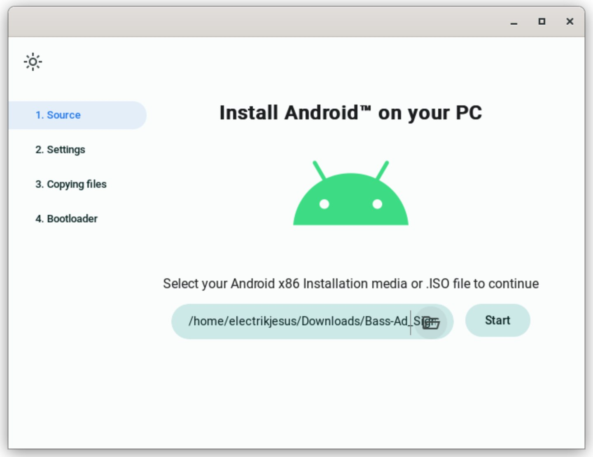
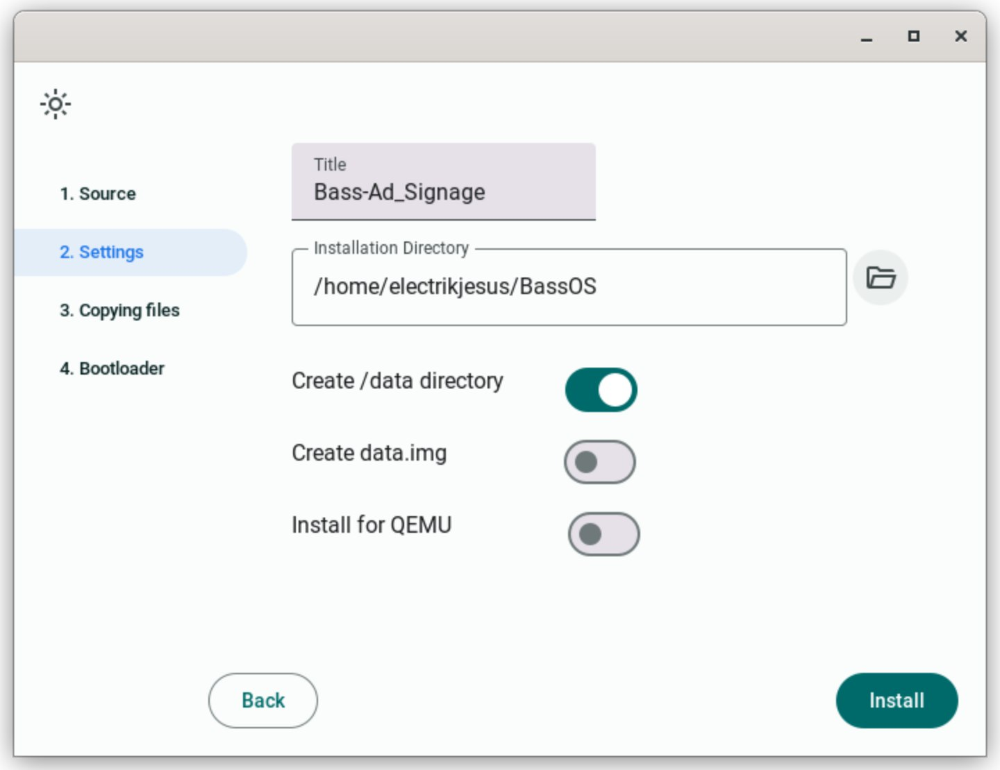
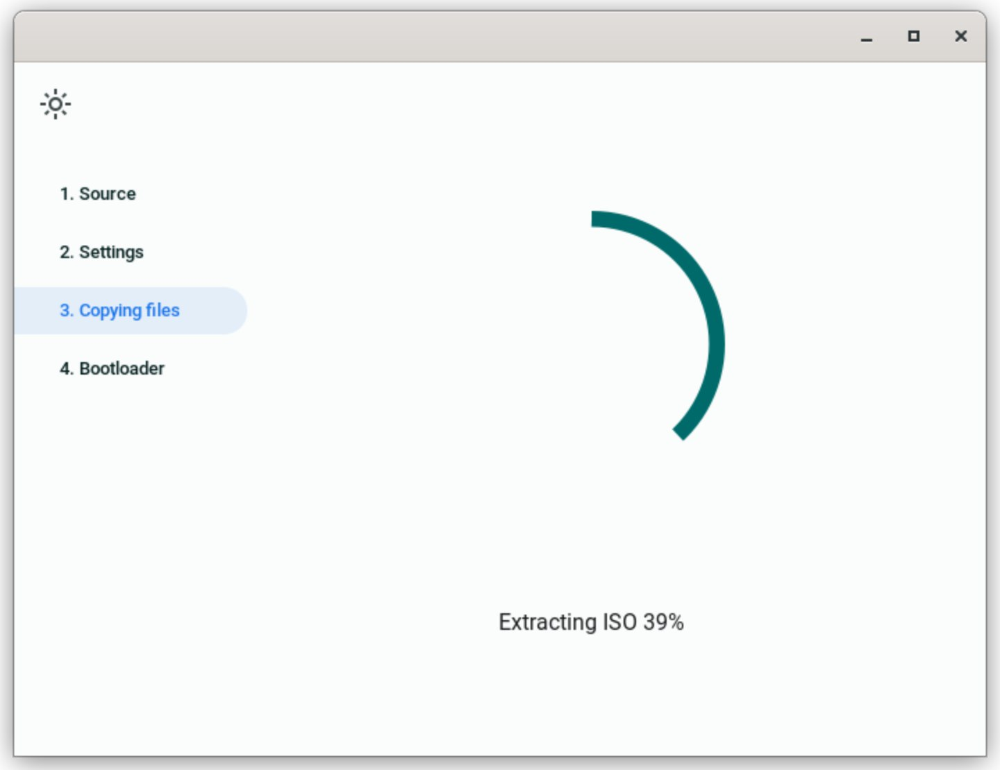
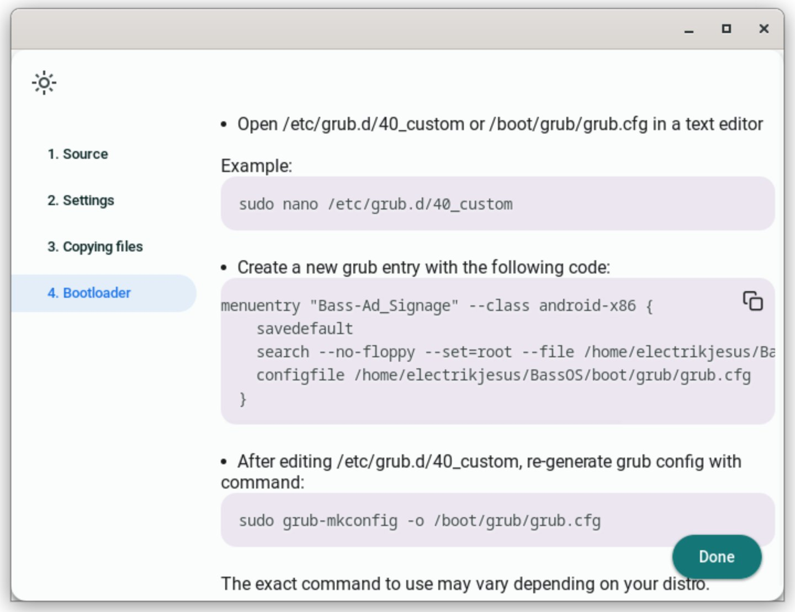

# Using Android-x86 Installer

This installer is developed and maintained by Xtr126 and is intended to be used to dual-boot Bass OS along with Linux or Windows

## Requirements

* Windows/Linux PC
* Android-x86 Installer (Found here: [Releases Page](https://github.com/Xtr126/Android-x86-installer/releases))
* 20GB+ Storage Space

## Installation

Please follow these steps for installing Bass OS along side your current OS. 
(Linux instructions depicted)

### Preparation

Please create a folder for your Bass OS install on your home drive or C:/ drive. In this example, we will be using ~/BassOS. 

### Step 1

Launch the installer and select your target iso

### Step 2

Select the target folder you created in the preparation step. 

### Step 3

Select the Install button at the bottom right, and wait for the process to finish. 

### Step 4

This is where you will need to add the boot entries to your Grub. We will need to follow the directions given on the last screen of the installer. 

This steps last screen might differ if you are installing it on Windows. 
