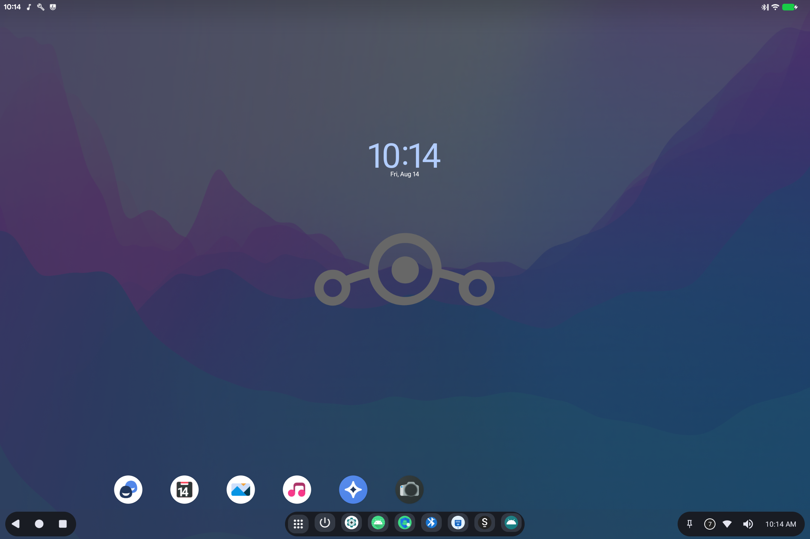
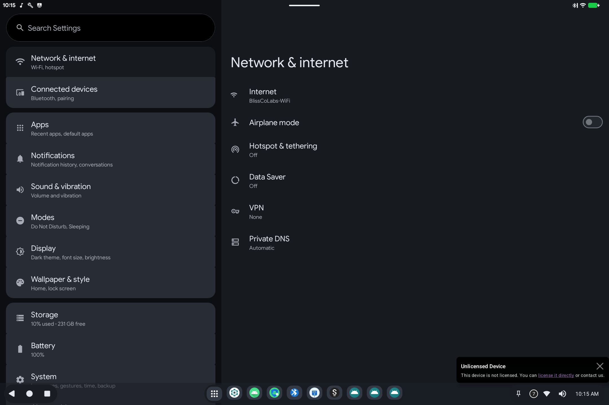

# Getting started

> **Android 16 Lineout.** Screenshots and steps on these pages were taken on **Bass: Lineout** (Lineage **23.2** / Android **16**). On **Android 14** (Lineage **21.0**) the same tools can look different, sit in a different Settings place, or be missing from that image entirely.

Welcome to **Bass: Lineout**. This is an Android tablet (and optional desktop-style) system for PCs and convertibles. These pages explain how to use the tools on the device. Developer build flags, properties, and source layout live under [Applications](../README.md#applications) and [Development](../README.md#development) on this site. The same guides also ship in the on-device **Ax86Docs** app.

## How this device is laid out

- **Home**: wallpaper, clock, and shortcuts. Open the app grid from the dock (the 3×3 dots).
- **Taskbar** (bottom): Back, Home, Recents, pinned apps, Wi-Fi, sound, and the clock.
- **Settings**: the gear icon. Many Bass tools live under **System** (and Bass Audio under **Sound**).

Not every image includes every tool. If a page below describes something you do not see, that feature was not built into this particular install.

## What the tools are for

| Guide | What it is for |
|-------|----------------|
| [Ax86 Power](ax86-power.md) | Sleep, wake, reboot, and shut down |
| [Bass Audio](bass-audio.md) | Speakers vs HDMI, volume, and sound effects |
| [Boot Config](boot-config.md) | How the device starts next time (tablet, desktop, kiosk, ...) |
| [BootSight](bootsight.md) | Device status and licensing |
| [Display Mapper](display-mapper.md) | Screen size, rotation, extra monitors |
| [Touch Mapper](touch-mapper.md) | Which touchscreen or mouse belongs to which screen |
| [BlissTweaks](bliss-tweaks.md) | Extra desktop and display switches |
| [SmartDock](smartdock.md) | The taskbar / desktop dock |
| [Ethernet](ethernet.md) | Wired network |
| [BT Ferry](bt-ferry.md) | Use your phone's calls, messages, and contacts over Bluetooth |
| [Internet Security](internet-security.md) | Extra network protection app |
| [BassView](bassview.md) | License agreement and device integrity |
| [Monterey Standby](monterey-standby.md) | Standby screen and live wallpaper |
| [Button Manager](button-manager.md) | Extra hardware keys (P1 / P2 / ...), if this device has them |
| [Bass Boot Options](bass-boot-options.md) | The menu you see *before* Android starts |
| [This help app](ax86-docs.md) | How to use Ax86Docs |

## Tips

1. **Search in Settings** if you cannot find a tool by name.
2. **Reboot** after Boot Config or Display Mapper changes that say they apply at next start.
3. **Sleep** is controlled in Ax86 Power: useful on laptops that wake from a USB keyboard or mouse.
4. Licensing banners (BootSight) are separate from Android Settings; use [BootSight](bootsight.md) to check or activate.
