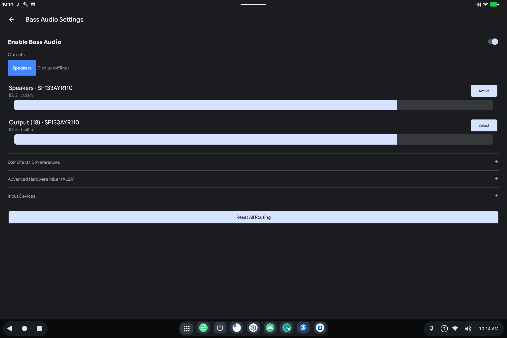

# Bass Audio

> **Android 16 Lineout.** Screenshots and steps on these pages were taken on **Bass: Lineout** (Lineage **23.2** / Android **16**). On **Android 14** (Lineage **21.0**) the same tools can look different, sit in a different Settings place, or be missing from that image entirely.

Bass Audio is the extra sound panel for this OS: pick **speakers or the monitor**, adjust levels, and turn on effects.

Open it from **Settings → Sound → Bass Audio**, or from the Quick Settings tile (equalizer icon).

## What it is for

Android's volume slider only goes so far on a PC. Bass Audio talks to the real outputs (built-in speakers, HDMI / DisplayPort on a monitor) so music and video play from the screen you expect.

## How to use it

1. Turn **Enable Bass Audio** on.
2. Choose **Speakers** or **Display** (HDMI/DP). "Offline" means that output is not connected.
3. Use **Active** / **Select** next to an output, and the slider for level.
4. Open **DSP Effects & Preferences** for equalizer-style sound (including voice clarity).
5. **Advanced Hardware Mixer** is for fine hardware controls: skip it unless a speaker is silent or too loud and the main slider did not help.
6. **Reset All Routing** returns to defaults if sound is going to the wrong place.

If you plug in a monitor and there is no picture-sound, open Bass Audio again and select **Display**.

## Related

- [Getting started](README.md)
