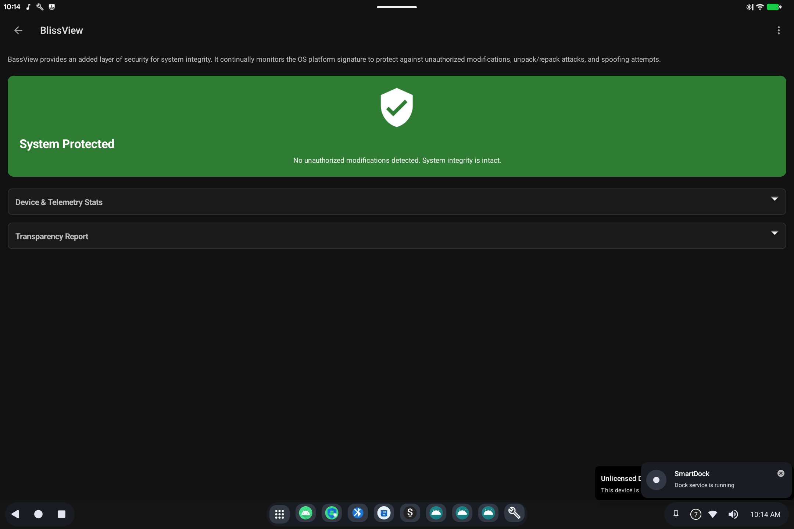

# BassView

> **Android 16 Lineout.** Screenshots and steps on these pages were taken on **Bass: Lineout** (Lineage **23.2** / Android **16**). On **Android 14** (Lineage **21.0**) the same tools can look different, sit in a different Settings place, or be missing from that image entirely.

BassView is a small system screen for the **end-user license** and a check that this software still matches the signed system it shipped with.

## What it is for

- Accept the license when the device first asks.
- Confirm the OS has not been unpacked and resigned with a different key (integrity).

It is not a general settings app. Day-to-day sleep, sound, and displays are the other guides.

## How to use it

If you see a license or BassView prompt at first boot, read it and accept to continue. Later you can open **BassView** from the app list if it is installed.

Device **licensing** (fleet / activation) is [BootSight](bootsight.md), not BassView.

## Related

- [Getting started](README.md)

- Technical: [BassView](../../applications/BassView/BassView.md)
