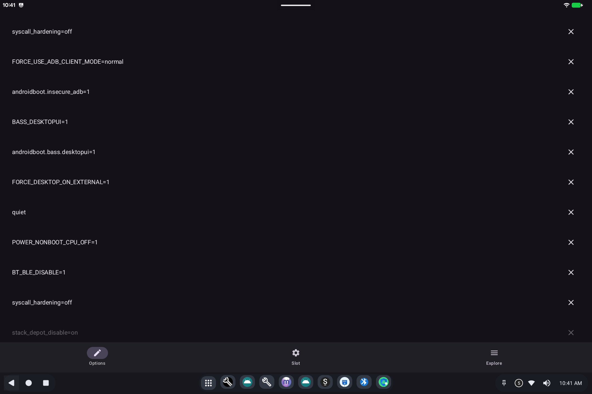

# Boot Config

> **Android 16 Lineout.** Screenshots and steps on these pages were taken on **Bass: Lineout** (Lineage **23.2** / Android **16**). On **Android 14** (Lineage **21.0**) the same tools can look different, sit in a different Settings place, or be missing from that image entirely.

Boot Config changes **how the device starts the next time you reboot**: tablet vs desktop, extra screens, power behavior, and similar options.

Open it from **Settings** (search for **Boot Config**). A wrong combination can make the next boot difficult, so treat it as an admin tool.

## First launch

You will see a warning that this tool edits bootloader settings. Read it. **Decline** closes the app. **I Accept Risks - Proceed** opens the option list. You can check **Do not show this warning again** if you use this tool often.

## What it is for

Android on a PC can start in more than one mode. Boot Config turns those modes on or off without rebuilding the system. Typical groups:

- **How it looks**: tablet, desktop (windows on the desktop), or kiosk (locked to one app).
- **Screens**: resolution, rotation, extra monitors.
- **Power**: sleep-related boot flags (day-to-day sleep is still [Ax86 Power](ax86-power.md)).
- **Hardware extras**: audio routing at boot, sensors, and similar.

## How to use it

1. Browse the list and turn on only what you need.
2. Save when the app asks you to.
3. **Reboot** so the next start picks up the new flags.

If the device will not start after a change, use the GRUB / Bass boot menu on the next power-on ([Bass Boot Options](bass-boot-options.md)) or restore a known-good boot entry.

## Related

- [Getting started](README.md)
- Technical: [Boot Config](../../applications/BootConfig/BootConfig.md)
