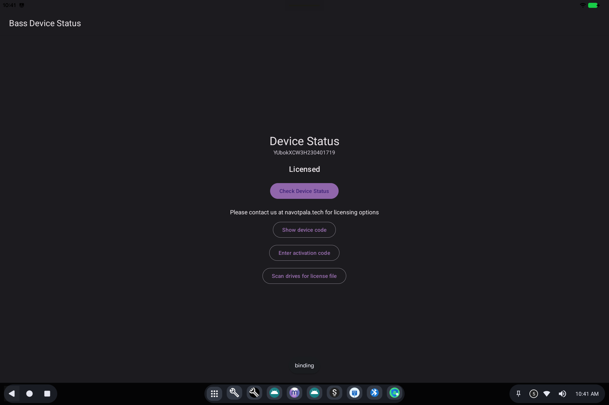

# BootSight (Device Status)

> **Android 16 Lineout.** Screenshots and steps on these pages were taken on **Bass: Lineout** (Lineage **23.2** / Android **16**). On **Android 14** (Lineage **21.0**) the same tools can look different, sit in a different Settings place, or be missing from that image entirely.

BootSight is the **device status and licensing** screen for Bass builds that use BootSight instead of a third-party device-management suite.

Open **Bass Device Status** from the app grid, or follow a licensing banner.

## What it is for

Organizations license devices so they can be supported and, when needed, managed as a fleet. This screen shows whether *this* machine is licensed and gives you a way to activate it.

## What you will see

- A **serial** (device code): support may ask for this.
- **Licensed** or **Not Licensed**.
- **Check Device Status**: ask the licensing service again (needs a network on online installs).
- **Show device code**: display the code for support or a QR workflow.
- **Enter activation code**: type a code you were given.
- **Scan drives for license file**: look for a dropped license on USB / internal storage (used on machines that cannot reach the internet).

Banners that say **Unlicensed Device** come from this same system. They do not mean Android Settings is broken.

For licensing options, the screen points to **navotpala.tech**.

## Related

- [Getting started](README.md)
- [License activation](../../setup_and_configuration/license-activation.md)
- Technical: [BootSight](../../applications/BootSight/BootSight.md)
