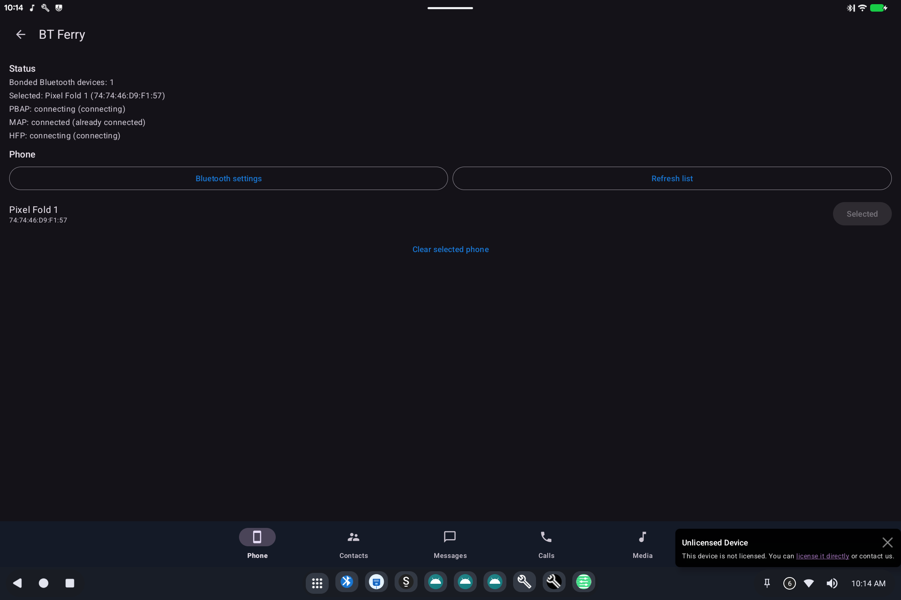

# BT Ferry

> **Android 16 Lineout.** Screenshots and steps on these pages were taken on **Bass: Lineout** (Lineage **23.2** / Android **16**). On **Android 14** (Lineage **21.0**) the same tools can look different, sit in a different Settings place, or be missing from that image entirely.

BT Ferry lets this tablet or desktop **use your phone over Bluetooth**: contacts, messages, calls, and (when supported) the phone's music on this device's speakers.

The cellular radio stays on the phone. This device is the bigger screen and speaker.

Open **BT Ferry** from the app grid, or **Settings → System**.

## What it is for

Wi-Fi-only PCs still need SMS and calls. Pair a phone once; then read messages, look up contacts, and answer calls here.

## How to use it

1. On this device, tap **Bluetooth settings** and pair the phone (system Bluetooth screen).
2. Return to BT Ferry and **Refresh list**.
3. Select the phone. Status lines show:
   - **PBAP**: contacts
   - **MAP**: messages
   - **HFP**: calls / headset
4. Use the tabs **Phone**, **Contacts**, **Messages**, **Calls**, and **Media**.

Keep Bluetooth on both devices. The first connection after pairing can take a minute. **Clear selected phone** if you are switching handsets.

Picture messages, RCS, and iMessage decorations are not guaranteed: the phone still owns those apps.

## Related

- [Getting started](README.md)
