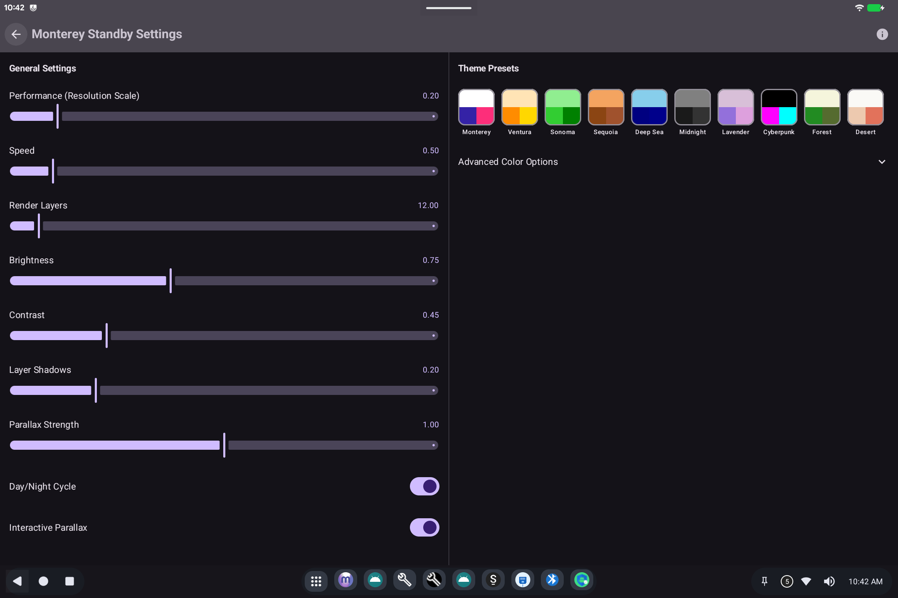

# Monterey Standby

> **Android 16 Lineout.** Screenshots and steps on these pages were taken on **Bass: Lineout** (Lineage **23.2** / Android **16**). On **Android 14** (Lineage **21.0**) the same tools can look different, sit in a different Settings place, or be missing from that image entirely.

Monterey is a **standby screen and live wallpaper** experience. On Bass images that include it, it is installed as a normal user app.

## What it is for

When the device is idle, Monterey can show a standby screen or live wallpaper instead of a blank panel. That is not the same as [Ax86 Power](ax86-power.md) (hardware sleep).

## How to use it

1. Open **Monterey** from the app grid.
2. Walk through **Welcome to Monterey** with **Next**.
3. Allow wallpaper / overlay permissions if Android asks: live wallpaper and standby need them.

If Monterey is not in the app list, this image was built without it.

## Related

- [Getting started](README.md)

- [Ax86 Power](ax86-power.md) for actual sleep
