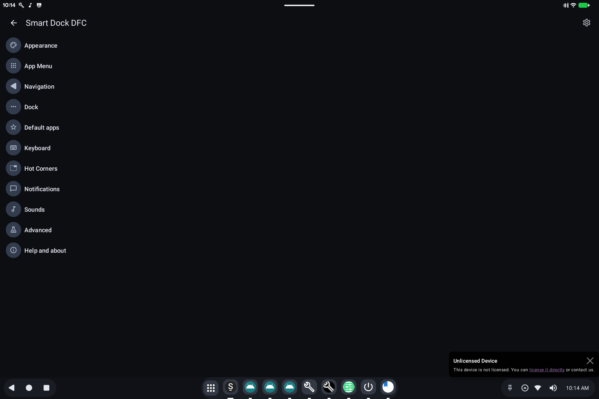

# SmartDock

> **Android 16 Lineout.** Screenshots and steps on these pages were taken on **Bass: Lineout** (Lineage **23.2** / Android **16**). On **Android 14** (Lineage **21.0**) the same tools can look different, sit in a different Settings place, or be missing from that image entirely.

SmartDock is the **taskbar** along the bottom of the screen: Back / Home / Recents, pinned apps, and a system tray (Wi-Fi, sound, clock).

## What it is for

On a tablet or PC, a persistent dock is easier than a phone-style gesture-only bar. SmartDock is that dock. It can look like a desktop (many pinned icons) or stay closer to a tablet.

## How to use it

- **App grid** (3×3 dots): all apps.
- **Pinned icons**: launch or switch to those apps.
- **Tray**: network, volume, notifications, time.
- Open **SmartDock** from the app list if you need its own settings (auto-hide, position, which icons appear).

If the dock is missing, it may be turned off in [BlissTweaks](bliss-tweaks.md) launcher options, or this image was built without SmartDock.

## Related

- [Getting started](README.md)
- [SmartDock DFC (technical)](../../applications/SmartDockDFC/README.md)
