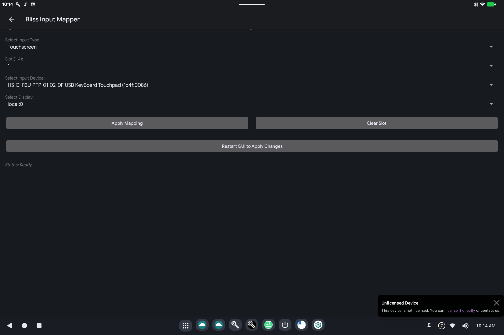

# Touch Mapper (Input Mapper)

> **Android 16 Lineout.** Screenshots and steps on these pages were taken on **Bass: Lineout** (Lineage **23.2** / Android **16**). On **Android 14** (Lineage **21.0**) the same tools can look different, sit in a different Settings place, or be missing from that image entirely.

Touch Mapper tells Android **which touchscreen, stylus, mouse, or keyboard belongs to which screen**, and can flip axes when a panel is mounted upside-down.

Open it from **Settings** (search for **Input Mapper** or **Touch Mapper**).

## What it is for

On a PC, USB touch panels and extra monitors can get crossed: you tap the tablet and the cursor moves on the HDMI screen. This tool writes the mapping so each digitizer stays on the right display, including after you plug a monitor in.

## How to use it

1. **Select Input Type**: usually Touchscreen; also pointer (mouse/touchpad) or keyboard.
2. **Slot**: a numbered slot (1-4 or similar). Use a free slot for each device.
3. **Select Input Device**: pick the hardware from the list (names come from USB).
4. **Select Display**: `local:0` is the main (usually built-in) screen.
5. Tap **Apply Mapping**.
6. If the UI asks, **Restart GUI to Apply Changes**.

**Clear Slot** removes that mapping.

If touch is inverted after a rotate, that is also configured here (flip / orientation on the same page when shown). For display size and rotation itself, use [Display Mapper](display-mapper.md).

## Related

- [Getting started](README.md)

- Technical: [Touch Mapper](../../applications/BlissTouchMapper/BlissTouchMapper.md)
