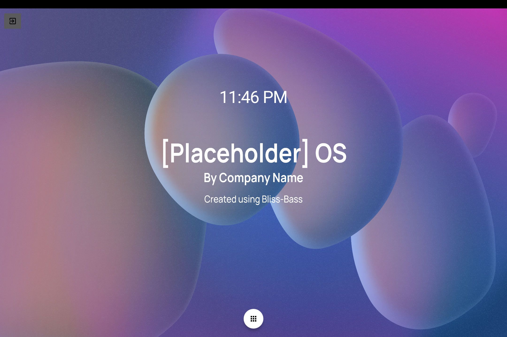
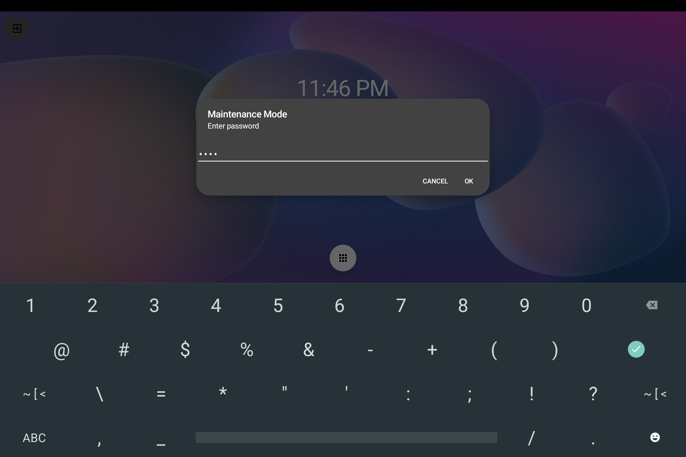
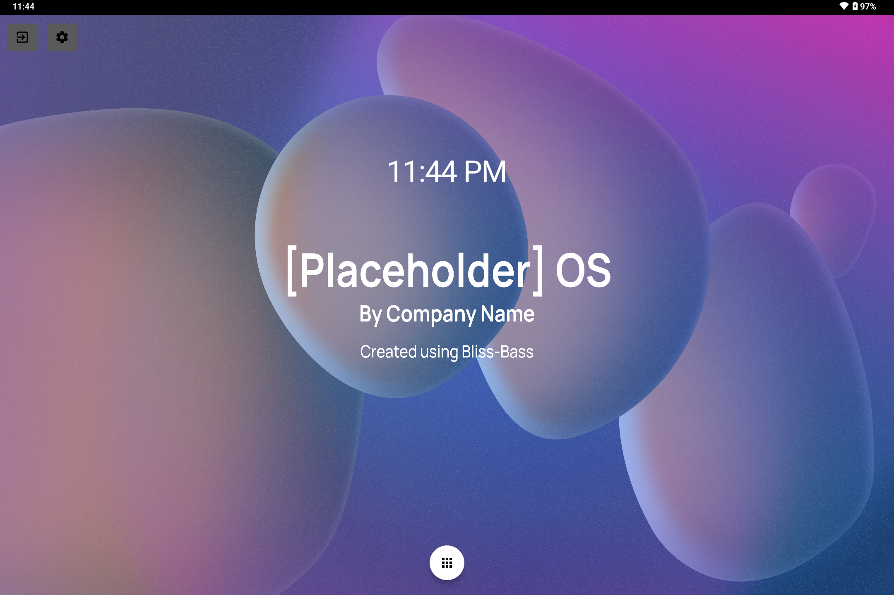
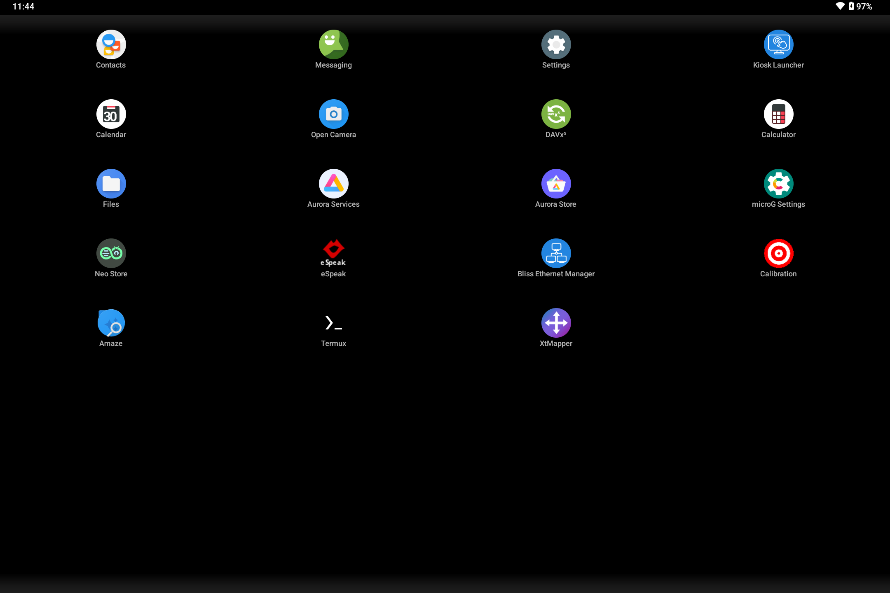

# Setting Up Bliss Kiosk Launcher

If your BlissBass build comes with Bliss Kiosk Launcher, then you have the ability to restrict access to various packages on the device, as well as set specific packages to auto-launch when booting into Lockdown / Kiosk mode (Intel Default), or locking the device while in Admin mode (Other Options > Intel - Admin).

Boot mode is controlled by the kernel/cmdline property **`ro.boot.bliss.bootmode`**:

| Value | Behavior |
|-------|----------|
| `lockdown` or `kiosk` | Kiosk restrictions enabled; auto-start app runs if configured |
| `admin` (or empty / unset) | Admin UI; lock task / auto-start not forced |

GRUB / boot menu entries for kiosk builds set this property. See also [Booting into lockdown builds](../../setup_and_configuration/booting-into-lockdown-builds.md).

### Lockdown Mode:

In Lockdown mode, navigation bar, gesture handle and status bar are all disabled. The app drawer will only display allowed packages. Example:

While in Lockdown mode, you can access the Kiosk Launcher Settings by clicking the Exit button, and inputting the maintenance password set (default is: **123**):

### Admin Mode:

This mode shows a sprocket next to the exit icon, and depending on boot mode, will also display the navigation handle and statusbar. 

Along with the app drawer containing all packages:

### Configuration: 

Clicking on the sprocket from the home screen will launch the Kiosk Launcher Settings screen:

From the settings screen, you can:

* **Change Password** — maintenance / exit password (default `123`)
* **Change whitelisted apps** — packages shown in the lockdown app drawer
* **Auto launch app** — package to start when the launcher runs in `lockdown` or `kiosk` boot mode
* **Show clock** — display or hide the home screen clock (default on; build default via `config_show_clock`)

You can also test the Kiosk Launcher while within Admin mode to ensure functionality before rebooting to Lockdown mode.

### Android 15 notes

On Android 15 Bass builds:

* The home UI respects **system bar insets** so controls are not drawn under the status or navigation bars when those bars are visible (Admin mode).
* Auto-start no longer waits on a Bliss Ethernet Manager “enumeration complete” signal. Ethernet is handled by [Ethernet Config](../EthernetConfig/EthernetConfig.md); the kiosk launcher starts the configured auto-start app directly when boot mode is `lockdown` or `kiosk`.
