# Setting Up Bliss Restricted Launcher

If your BlissBass builds comes with Bliss Restricted Launcher, then you have the ability to restrict it’s access to various packages on the device, as well as set specific packages to auto-launch across multiple connected displays when booting the device into Lockdown mode (Default), or locking the device while in Admin mode (Other Options > Admin).

**Availability Note:** The Settings **Unlock** option, live appearance/overlay updates, company logo watermark gating, and the improved Back/Home handling during locked sessions described below are only available on recent builds (**Bass: Lineout**) or Bliss Restricted Launcher versions newer than **1.0**. If your build ships an older version of the launcher, please contact us for updates.

### Admin Mode:

Admin mode will display both the sprocket and the lock button on the top right of the display, and allow access to navigation, statusbar, recents, and other Android features by default. 

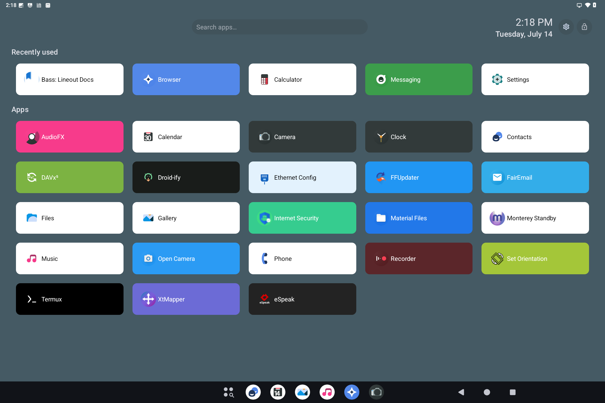

This mode is open by default and allows for the launcher defaults to be configured. Tapping the lock button (top right) prompts for the admin password and enters a locked session without rebooting: whitelisted auto-start apps are launched and pinned, and the rest of the system is locked down until the session is unlocked again.

### Configuration:

Clicking on the sprocket from the home screen will launch the Restricted Launcher Settings screen, where it should prompt you for a password:

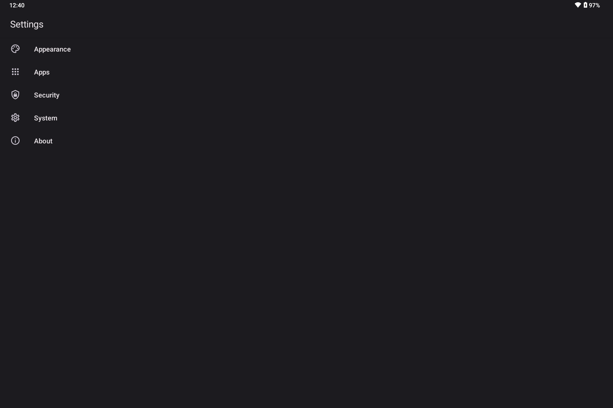

The main settings screen has a number of suboptions to select from:

#### Unlock

When the device is in a locked session (booted into Lockdown mode, or locked from Admin mode with the lock button), an **Unlock** option is shown at the top of the settings list (Bass: Lineout builds / launcher versions newer than 1.0):

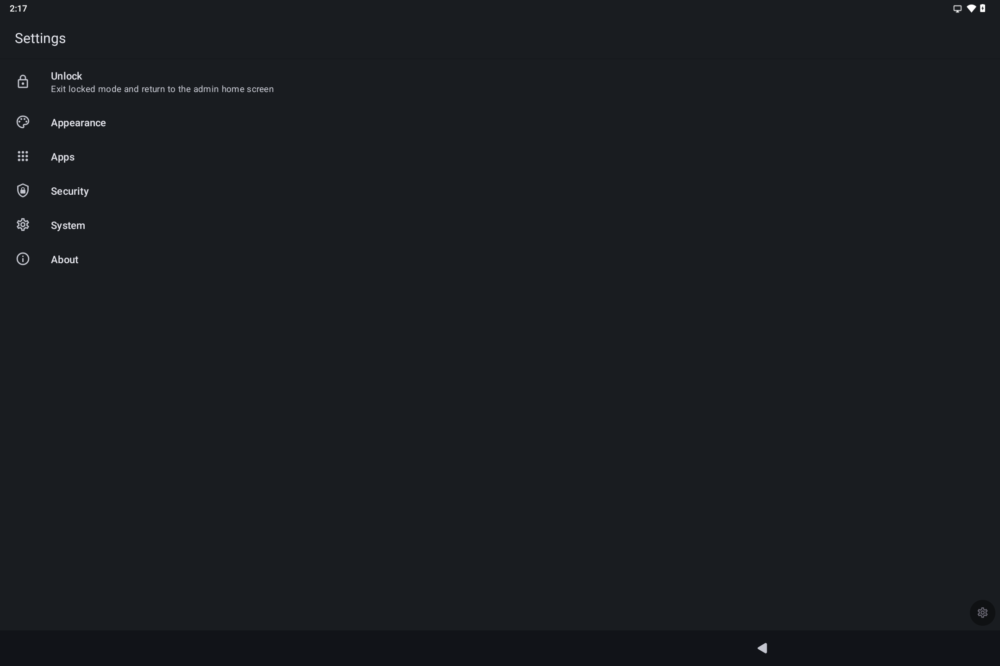

Tapping **Unlock** prompts for the admin password. Once entered, the device exits locked mode, removes the on-screen overlays, and returns to the admin home screen. No reboot is required.

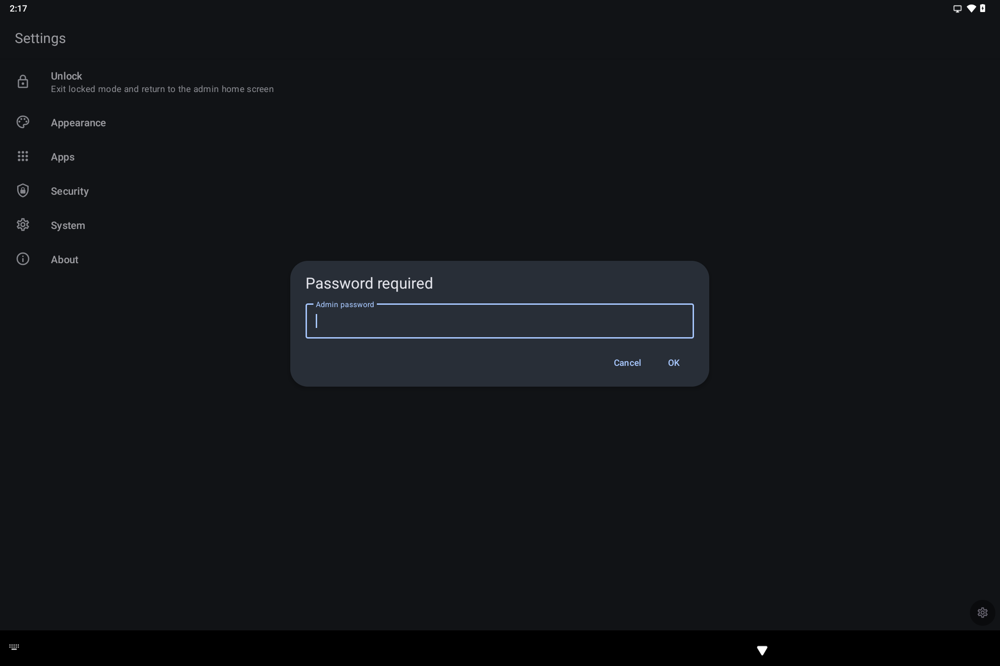

The Unlock option is only visible while a locked session is active; it stays hidden during normal Admin use.

#### Appearance

The appearance settings screen allows you to change a number of details about the overall look and feel of the kiosk interface. Depending on the Free or Pro version of the app, there may be some options that are unavaialable like setting custom logo, and hiding/changing the logo overlay options. 

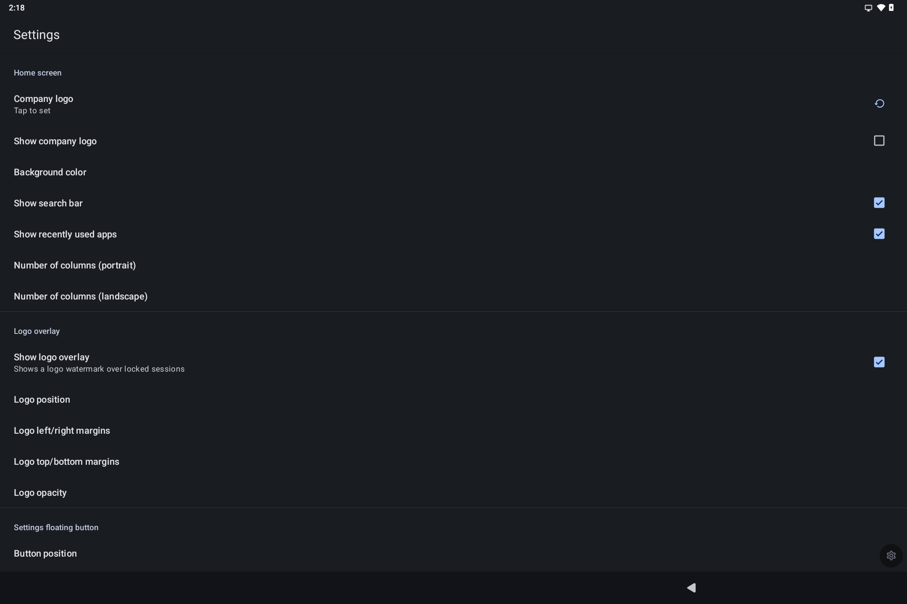

Appearance options that affect the locked-session overlays (logo watermark position, margins, opacity, and the settings button placement) now apply live: changes take effect immediately, without restarting the launcher or the locked session.

**Please Note:** The logo watermark shown over locked sessions follows both toggles: **Show company logo** (Home screen section) and **Show logo overlay** (Logo overlay section). Disabling **Show company logo** hides the logo on the home screen *and* removes the watermark from locked sessions.

The **Button position** option (Settings floating button section) also offers a **Hidden** setting. When set to Hidden, the floating settings sprocket is not drawn during locked sessions. Instead, a small invisible touch area remains in the bottom-right corner of the screen. To open Settings from it, double-tap the corner and keep the second tap held for about 3 seconds; the device will vibrate to confirm before showing the settings password prompt.

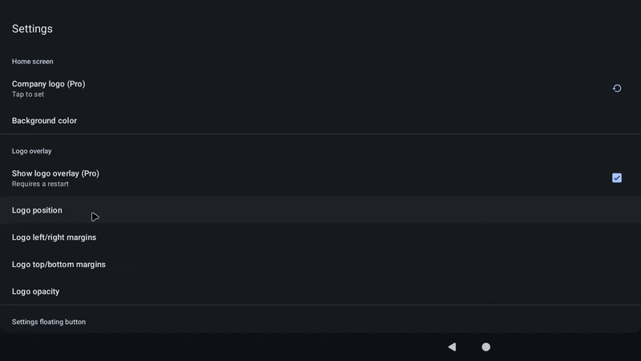

#### Apps

Apps settings has all the options related to selecting your whitelisted apps and auto-launching them across multiple displays. The auto-start app options will show a list of apps for you to select from:

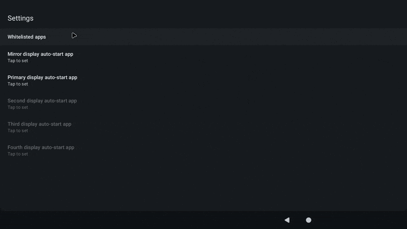

#### Security

The Security options is where you will initially want to set the Kiosk password, and enable/disable the various features on the kiosk that you want to be available in lockdown mode:

- Example below shows enabling and disabling the home button.

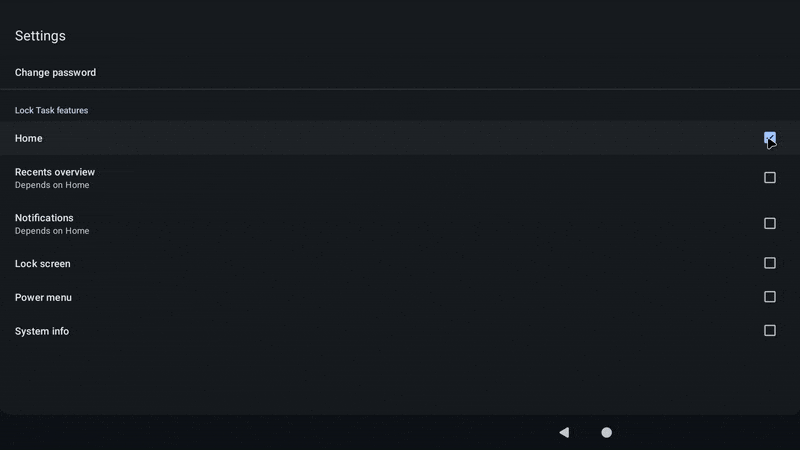

**Please Note:** While auto-start apps are configured, the Home (and Recents) lock task features are kept off during locked sessions regardless of these toggles. This matches kiosk behavior, as Back at an app's root or the Home button would otherwise briefly expose the launcher home screen behind the pinned app.

- Example below shows enabling and disabling the recents overview

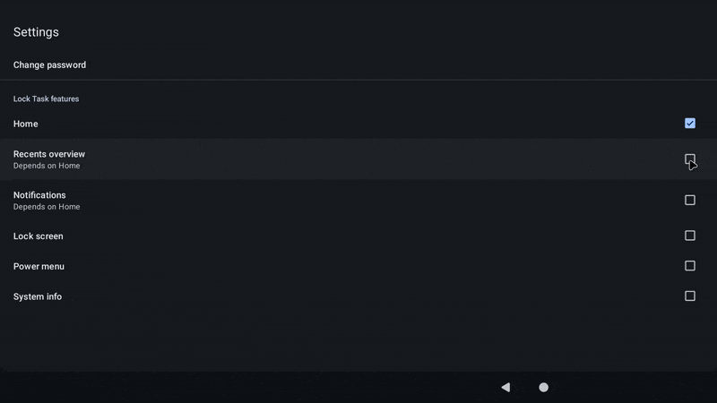

- Example below shows enabling and disabling notifications

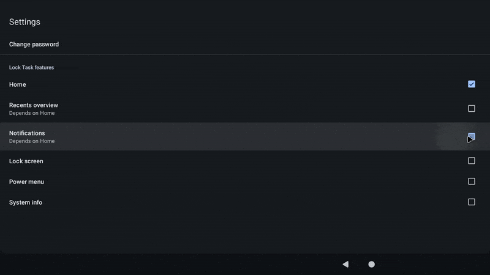

- Example below shows enabling and disabling system info

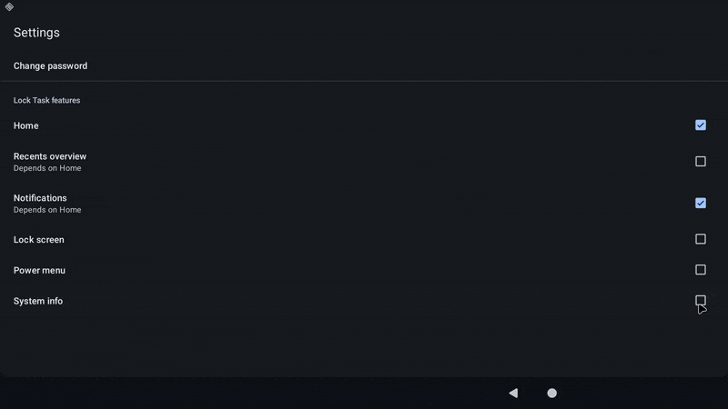

#### System

The system settings page allows you to set the kiosk screen timeout and enable/disable the on-screen keyboard (if your device has a secondary keyboard attaches, this override may be needed):

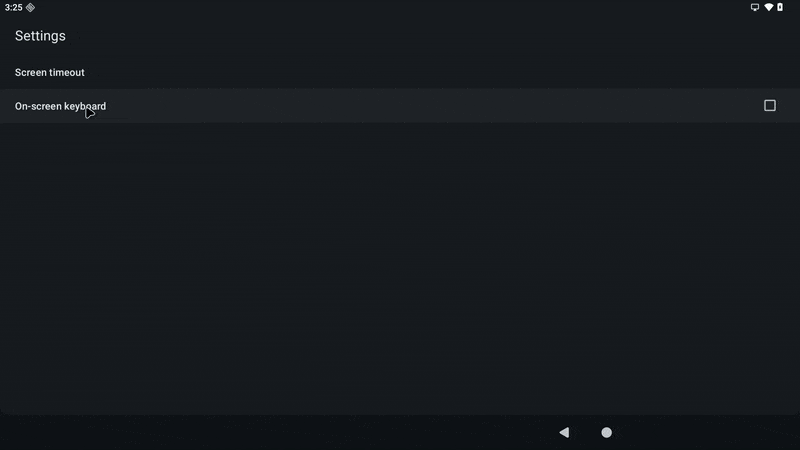

### Lockdown Mode:

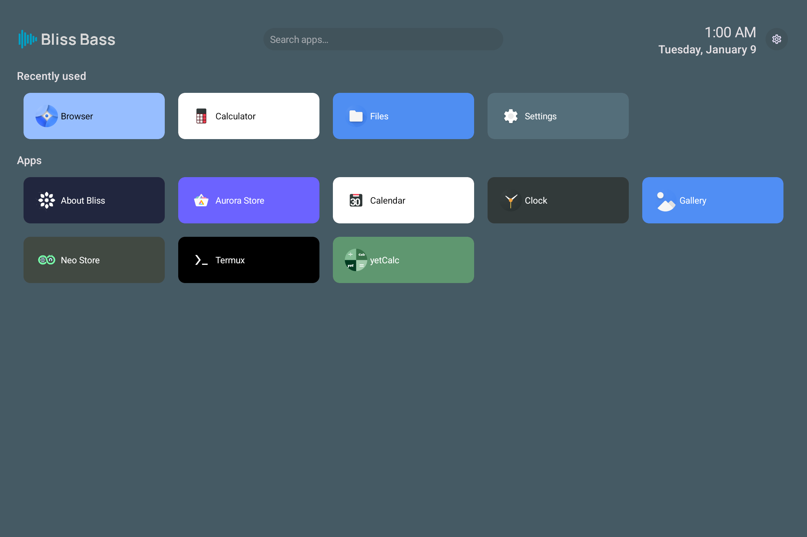

You can configure Restricted Launchers Lockdown mode to have navigation bar, gesture handle and status bar are all disabled, and the app drawer will only display allowed packages. 

When auto-start apps are configured, they are launched and pinned on their assigned displays as soon as the locked session starts. The Back and Home buttons will no longer flash the launcher home screen; the auto-start app stays in front until the session is unlocked:

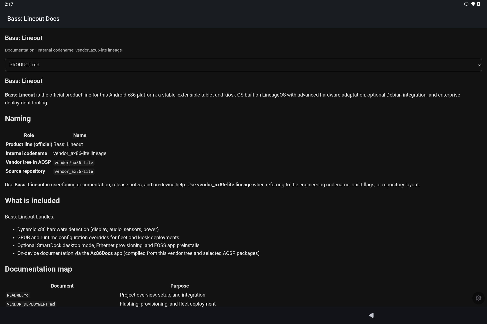

While in Lockdown mode, you can access the Restricted Launcher Settings by clicking the sprocket at the top right of the screen, and a password prompt will display requiring the password set from Admin mode to be input:

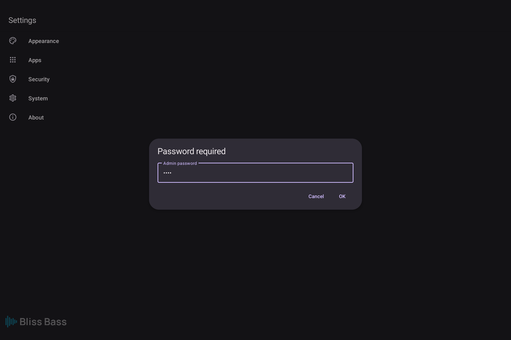

If the settings button position was set to **Hidden** under Appearance, the sprocket will not be visible. In that case, double-tap the bottom-right corner of the screen and hold the second tap for about 3 seconds (a vibration confirms the gesture) to bring up the same password prompt.

From there, the **Unlock** option at the top of the settings list can be used to exit the locked session and return to the admin home screen (see the Unlock section above).
