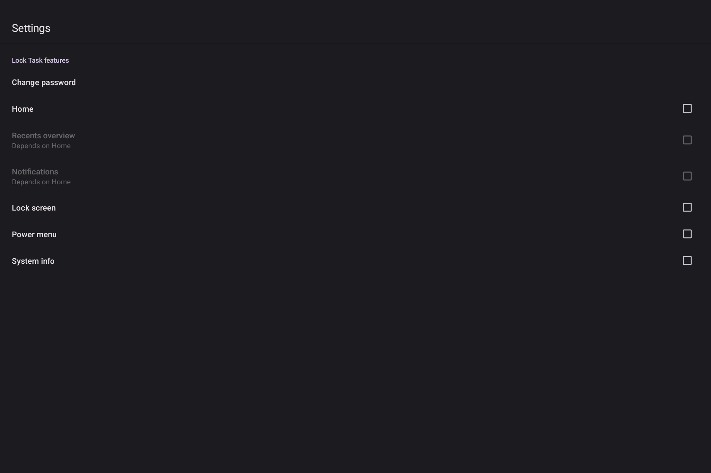
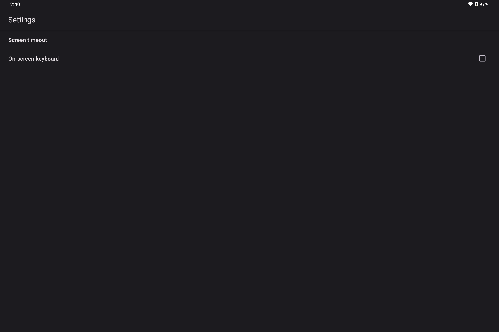

# Setting Up Bliss Restricted Launcher

If your BlissBass builds comes with Bliss Restricted Launcher, then you have the ability to restrict it’s access to various packages on the device, as well as set specific packages to auto-launch across multiple connected displays when booting the device into Lockdown mode (Default), or locking the device while in Admin mode (Other Options > Admin).

### Admin Mode:

Admin mode will display both the sprocket and the lock button on the top right of the display, and allow access to navigation, statusbar, recents, and other Android features by default. 

This mode is open by default and allows for the launcher defaults to be configured. 

### Configuration: 

Clicking on the sprocket from the home screen will launch the Restricted Launcher Settings screen:

The main settings screen has a number of suboptions to select from:

#### Appearance

The appearance settings screen allows you to change a number of details about the overall look and feel of the kiosk interface. Depending on the Free or Pro version of the app, there may be some options that are unavaialable like setting custom logo, and hiding/changing the logo overlay options. 

#### Apps

Apps settings has all the options related to selecting your whitelisted apps and auto-launching them across multiple displays:

The auto-start app options will show a list of apps for you to select from:

#### Security

The Security options is where you will initially want to set the Kiosk password, and enable/disable the various features on the kiosk that you want to be available in lockdown mode:

#### System

The system settings page allows you to set the kiosk screen timeout and enable/disable the on-screen keyboard (if your device has a secondary keyboard attaches, this override may be needed):

### Lockdown Mode:

You can configure Restricted Launchers Lockdown mode to have navigation bar, gesture handle and status bar are all disabled, and the app drawer will only display allowed packages. 

While in Lockdown mode, you can access the Restricted Launcher Settings by clicking the sprocket at the top right of the screen, and a password prompt will display requiring the password set from Admin mode to be input:

