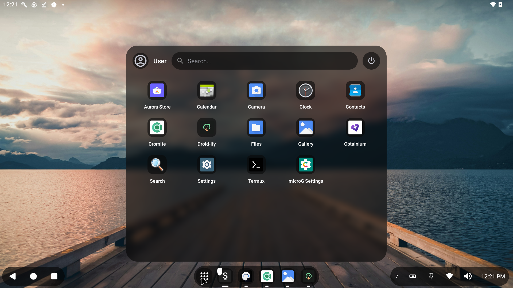
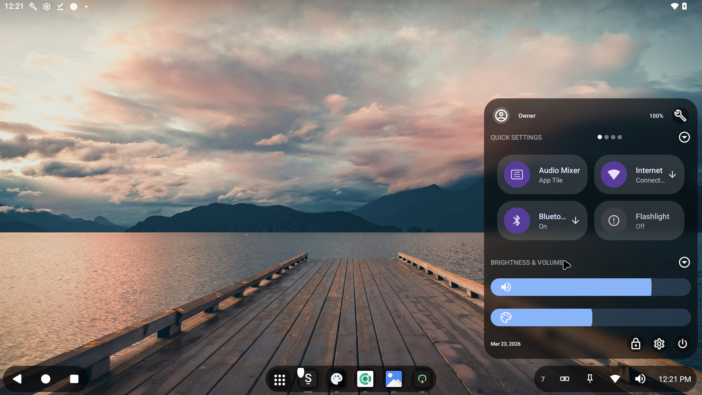

<div align="center">
  Smart Desktop Framework Component for Android.
  A user-friendly desktop mode launcher that offers a modern and customizable user interface.
</div>




## Overview
SmartDock DFC (Desktop Framework Component) is a complete reimagining of the Android interface, built to bridge the gap between mobile flexibility and desktop productivity. It transforms any AOSP-based device into a professional workstation with a focus on multi-window multitasking and OEM-level customization.

## 📖 Documentation
- **[Feature Overview](SMARTDOCK_FEATURES.md)**: Detailed breakdown of all current and experimental features.
- **[The Vision](MARKETING.md)**: Explore the paradigm shift and the unified computing future of SmartDock DFC.
- **[Sales Guide](SALES_GUIDE.md)**: A comprehensive guide for OEMs and Enterprise customers on product pillars and market strategies.
- **[Vendor Implementation Guide](VENDOR_GUIDE.md)**: Exhaustive technical documentation for OEMs and AOSP integrators, including all `persist.bass.sd.*` system properties.

## Main features
- **Freeform Multi-Window:** Run multiple apps simultaneously in resizable windows.
- **Unified Material Drawer:** A modern hub for Quick Settings and Notifications.
- **OEM-Ready Integration:** No-code configuration via system properties.
- **Whitelisted Permissions:** Pre-granted privileged access for a seamless first-boot.
- **Multi-Display Support:** Independent docks and launchers for external monitors.

## Usage

### Grant restricted permissions
On some devices, Accessibility and Notification permissions might not be available. To solve this, go to: **System Settings > Apps > Smartdock > 3 Dot menu (Top right corner) > Allow restricted permissions**.

### Secure settings
To grant secure settings permissions for advanced features, run the following command on an adb or root shell:
```bash
pm grant cu.axel.smartdock android.permission.WRITE_SECURE_SETTINGS
```

### Build Environment
SmartDock DFC is designed to be built as a privileged system component. Refer to the **[Vendor Implementation Guide](VENDOR_GUIDE.md)** for instructions on including the `SmartDock.mk` product configuration in your AOSP build.

## Licensing
SmartDock DFC is a commercial distribution. While it incorporates components and logic derived from the open-source GPL-licensed SmartDock project, this DFC edition has been extensively modified and enhanced for professional OEM and enterprise environments.

**This version is NOT licensed under the GPL and is available exclusively via commercial licensing.**

For licensing inquiries, volume distribution, or enterprise support, please contact Navotpala Tech (Bliss Co-Labs Inc):
- **Email:** info@navotpala.tech
