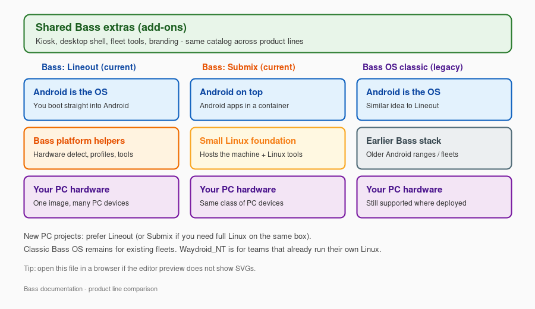
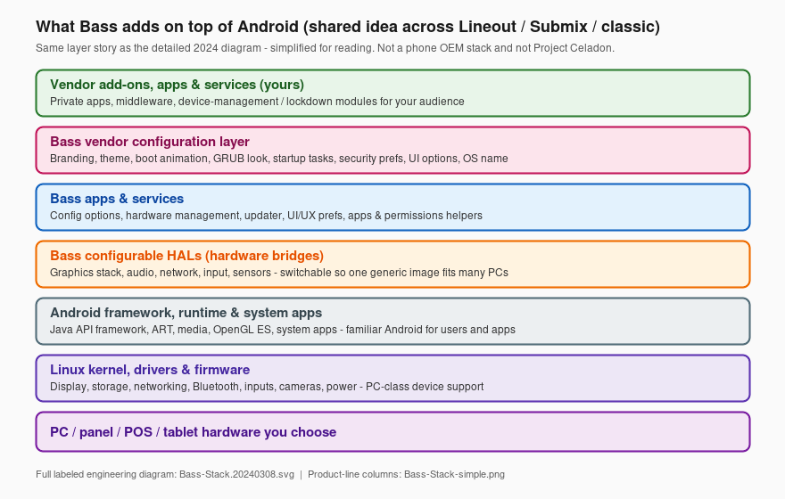
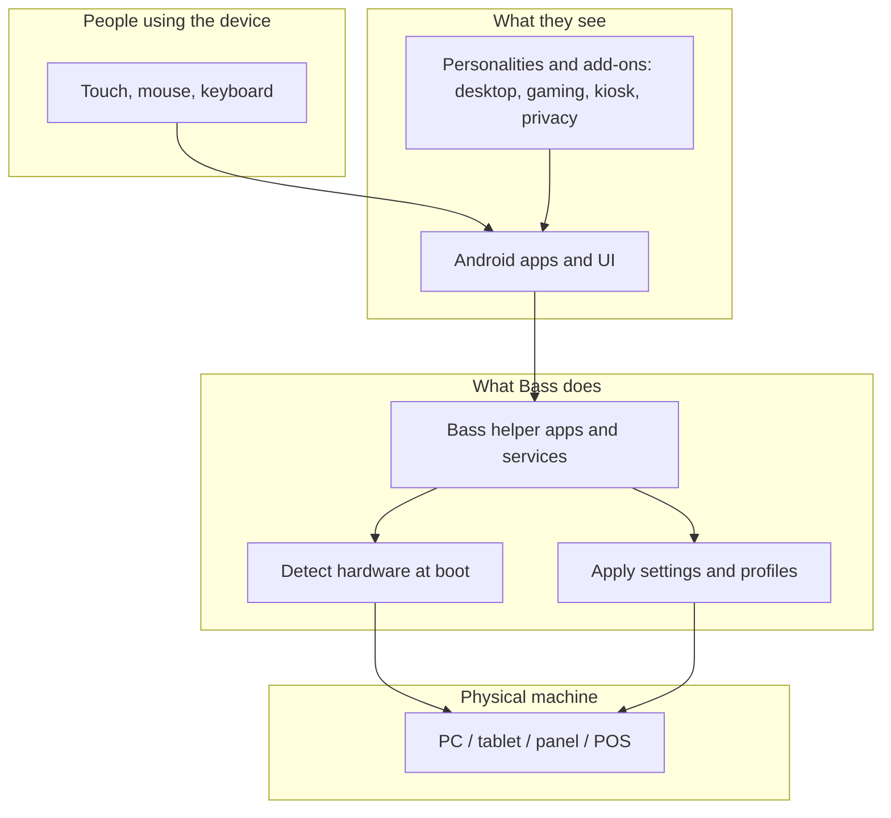
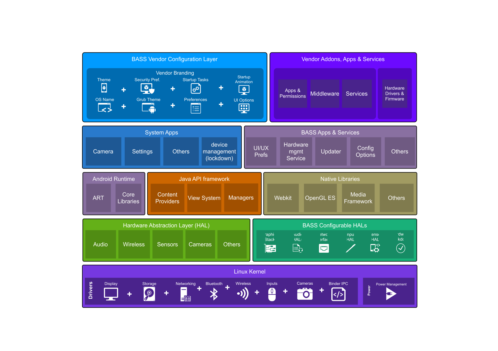

# Bass - High Level Overview

**In plain English:** Bass is software that lets you run Android on ordinary PC-class machines - home desktops and laptops, gaming PCs, tablets, panel PCs, POS terminals, mini PCs, and more - without buying a special "Android-only" device from a big OEM, and without building Android yourself.

This page is a **map of how the pieces fit**. For choosing a product line (Lineout, Submix, and so on), start with the [Bass Product Family Guide](../product-guide/bass-product-family.md).

Bass is for **people and organizations**: everyday desktop users, gamers, journalists, privacy-minded / OPSEC setups, schools and shops, and enterprise fleets. The same platform family; different personalities and add-ons.

---

## What problem does Bass solve?

Stock Android is written for phones and tablets that ship with **fixed, factory-tuned hardware**. Plenty of people still want Android apps and an Android-style experience on **PC hardware they already own or can buy off the shelf** - whether that is a personal desktop, a gaming rig, a newsroom laptop, a hardened personal machine, or a store / clinic panel PC.

That sounds simple - until you look at how Android actually treats devices.

### Android is not "generic" about hardware

On a typical PC or Linux box, many peripherals are expected to work after you plug them in: USB gadgets, PCI cards, keyboards and mice, speakers, touch panels, and so on. Drivers and userspace cooperate across a wide range of vendors.

**Android does not work that way.**

A commercial Android image is usually built for **one device family**. The OEM (or silicon partner) wires up a long list of pieces that must match that board:

| Area | What stock Android usually assumes | What breaks on ordinary PC / panel hardware |
|---|---|---|
| **USB** | Known controllers, gadgets, and permissions for *that* product | Scanners, payment dongles, cameras, serial adapters, and hubs often need policy, HAL, and permission work - not just "plug in" |
| **PCI / PCIe** | A fixed set of GPUs, NICs, storage, and bridges | Different chipsets and discrete cards need kernel + graphics/audio/network bring-up that phone images never shipped |
| **I²C / SPI / platform buses** | Sensors, touch controllers, PMICs, and codecs soldered to *that* board | Panel PCs and tablets reuse many of these buses with **different** chips; wrong tables = no touch, no battery fuel gauge, dead sensors |
| **Input** | One touch panel, a few buttons, maybe a fingerprint sensor | Multi-touch overlays, HID keyboards/mice, barcode wedges, and "weird" HID devices need mapping so Android sees them as the right kind of input |
| **Audio / speakers** | A phone-style codec path tuned in the factory | HDMI audio, USB headsets, multi-channel PC sound, and panel speakers each need the right audio HAL and routing - silence or wrong output is common otherwise |
| **Display** | One internal panel with a known pipeline | HDMI / DP hotplug, multiple monitors, and minipc GPUs need compositor and HWC behavior phone builds do not provide |

On top of that, modern Android keeps **tightening the walls**: sealed partitions, signed images, SELinux, Treble HALs, scoped storage, and stricter USB / peripheral access. That is good for phone security. It is hard for anyone who wants **one Android experience across many off-the-shelf machines**.

So "just install AOSP on a PC" is rarely enough. Without adaptive hardware bridges, device policies, and product packaging, you get a locked-down phone OS sitting on hardware it was never taught to drive.

### What Bass does about that

Bass fills the gap:

1. You install a Bass image on the machine.
2. Bass **detects and adapts** displays, touch, audio, USB/input paths, and related hardware at boot where the platform allows.
3. Optional **add-ons** and **build personalities** shape the experience: desktop shell, gaming-oriented setups, journalism / field kits, security and OPSEC-minded lockdown, kiosk mode, fleet tools, branding, and more.

You get an Android experience that fits the **machine and the person using it** - without a custom OS project for every SKU, and without pretending stock Android was ever a generic PC OS.

### Who it is for (not only businesses)

| Audience | Typical goal |
|---|---|
| **Consumers / desktop users** | Android on a normal PC or mini PC, with a desktop-friendly shell instead of a phone UI stretched onto a monitor |
| **Gaming** | Play Android titles (and related gaming tooling) on PC hardware you already own |
| **Journalism / field work** | Portable Android on laptops and tablets with the peripherals and workflows a newsroom or freelancer needs |
| **Security / OPSEC** | Hardened, low-telemetry, no-Google-by-default builds for people who care who can see what the device does |
| **Business / education / public sector** | Kiosk, POS, panel PC, classroom, and fleet deployments with **white-label** branding (your look, not Bass chrome) and optional management |

Same underlying Bass platform; different combinations of product line, personality, and add-ons.

### How Bass is different (quick contrast)

| Approach | What it is | What Bass does instead |
|---|---|---|
| **Phone / OEM Android tablets** | Fixed hardware + OEM skin; Google stack often baked in; limited PC flexibility | Runs on **PC-class hardware you choose**, with desktop / gaming / kiosk / privacy options and **no Google account required by default** |
| **Intel Project Celadon** | Android-on-PC reference built around a **container-based device tree**: often a **separate Android container per display**. Displays can be isolated that way, but USB, PCI, I2C, input, and audio still sit behind Android's usual lockdown - not a generic "plug in any PC peripheral" host | **One** Android system on the machine for normal PC use (Lineout as the OS, or Submix with a single Android container on a Linux host). Multi-monitor is handled in the Android/desktop shell, while Bass works the **adaptive HAL / policy** problem so ordinary PC hardware and peripherals are usable - not another sealed phone image per screen |
| **DIY AOSP / android-x86 alone** | You assemble hardware bring-up, desktop/gaming/kiosk packaging, and maintenance yourself | Those concerns are **packaged** as Bass platform + optional add-ons and personalities |

Bliss (and Bass as the PC-facing product family) is therefore **not** "stock Android with a wallpaper," and it is **not** Celadon rebranded. Celadon is a useful reference for some silicon and virtualization paths; it does not solve generic PC peripheral access the way Bass targets. Bass is the product you install and use.

---

## The simple picture (product lines)

Bass shares the same **extras catalog** (desktop, gaming helpers, kiosk, fleet, security, white-label branding, and more). Product lines differ in **how Android sits on the machine**:

| Column | Meaning |
|---|---|
| **Bass: Lineout** (current) | Android *is* the OS. Best default for new PC projects. White-label branding without a separate OS fork. |
| **Bass: Submix** (current) | A small Linux foundation hosts the machine; Android runs on top. Same white-label model on the Android side. |
| **Bass OS classic** (legacy) | Earlier Android-on-PC line - still for existing fleets; new work prefers Lineout/Submix. Same branding override approach. |

**Not shown as a full column:** **Waydroid_NT** (you already run Linux; Bass only adds Android) and **Bass-ARM** (Raspberry Pi-class boards). See the [Product Family Guide](../product-guide/bass-product-family.md).

Vector source: [`Bass-Stack-simple.svg`](assets/Bass-Stack-simple.svg) (open in a browser if the editor SVG preview is blank).

---

## Bass layers we keep from the full architecture

The original engineering diagram (`Bass-Stack.20240308.svg`) shows the whole Android stack plus Bass blocks. We **still ship that file**. For day-to-day reading, here is the same Bass-specific story without the phone-style density:

| Layer (from the 2024 architecture) | Everyday meaning |
|---|---|
| **Vendor add-ons, apps & services** | Your private apps and device-management pieces |
| **Bass vendor configuration** | White-label wallpapers, boot animation, themes, startup prefs (same OS, your look) |
| **Bass apps & services** | Helpers for config, hardware management, updates, permissions |
| **Bass configurable HALs** | Adaptive bridges so graphics/audio/input/network fit many PCs |
| **Android framework & runtime** | Normal Android for users and apps |
| **Linux kernel / drivers** | PC device support underneath |

So: **three diagrams, three jobs**

1. `Bass-Stack-simple` - Lineout vs Submix vs classic  
2. `Bass-Stack-layers` - Bass blocks retained from the full architecture (readable)  
3. `Bass-Stack.20240308.svg` - full labeled engineering stack (unchanged, still linked below)

---

## How the pieces work together

**Boot time (short version):**

1. The machine starts and Bass looks at what hardware is attached.
2. It applies the right display, audio, touch, and power behavior when it can.
3. Android starts with your chosen personality (tablet, desktop, kiosk, or a specialized build such as gaming, journalism, or security/OPSEC) if those options are in the image.
4. Add-ons and branding included with that build are already part of the image - you do not assemble the stack by hand.

---

## Four ideas that show up everywhere

### 1. One platform family, several product lines

Bass is a **family**. Product lines differ mainly in *how Android sits on the machine*:

- **Bass: Lineout** - Android *is* the OS (most common for new PC projects).
- **Bass: Submix** - a small Linux foundation hosts the machine; Android runs on top.
- **Waydroid_NT** - you keep your own Linux; Bass adds Android in a container.
- **Bass OS (classic)** / **Bass-ARM** - earlier PC line, or Raspberry Pi-class boards.

Details and a choice table: [Product Family Guide](../product-guide/bass-product-family.md).

### 2. Add-ons are optional parts, not a separate OS

Think of add-ons as a **parts catalog**: desktop shell, gaming helpers, kiosk launcher, journalism/field tools, security and OPSEC modules, fleet licensing, DNS lockdown, display/touch helpers, and so on. You (or your image builder) pick what that machine needs. The catalog is shared across product lines on the Android side.

### 3. "Configurable HALs" in everyday words

In Android engineering, a **HAL** is the bridge between software and hardware. Phone OEMs ship HALs that match **one** bill of materials. Bass includes **switchable / adaptive bridges** for graphics, audio, network, input, and related paths so **one** product image can behave correctly across many PC chipsets and peripherals - the opposite of a sealed single-SKU phone build.

You do not configure HALs by hand day to day. You notice the result: the right screen lights up, touch lines up, USB devices show up usefully, HDMI audio works, and so on.

### 4. White-label branding (same OS, your face)

On a normal Android product, wallpaper packs, boot animation, and other brand chrome often mean a **completely separate build** (and a separate maintenance trail) for every customer.

Lineout, Submix, and legacy Bass are built so those overrides can ride on the **same** OS:

- Boot animation, wallpapers, and related branding can be swapped without forking a new platform tree for each buyer.
- Most customers run that shared OS. What they and *their* end users notice is often the absence of Bass branding - the device looks like the customer's product, not like a Bass demo image.
- That anonymity is intentional. We do not publish a client list or "kiss and tell" about who runs Bass underneath. Discretion is part of why organizations choose the platform.

Public Bass pieces stay the shared core. **Your** look, private apps, and private policies stay packaged for you - not mixed into someone else's image or into marketing material.

---

## Where this sits vs full Android architecture

Android itself has many technical layers (kernel, runtime, framework, system apps). Bass **does not replace** Android - it **extends** it for PC-class use: home and desktop, gaming, journalism, security/OPSEC, education, and commercial deployments (and related product lines).

That is also why Bass is not interchangeable with:

- a typical **OEM Android tablet** image, or  
- **Intel Project Celadon** as a drop-in product (Celadon centers on containerized Android, often per display, with the same class of locked-down peripheral access; Bass is the installable Bass/Bliss product family with adaptive PC hardware support, add-ons, personalities, branding, and support).

- Prefer this page and the Product Guide if you are deciding *what to install or deploy*.
- Prefer the detailed stack diagram below if you need every Android box labeled.

Show detailed technical stack diagram (engineering - original 2024 asset)

That diagram labels Android's classic layers plus Bass-specific blocks (configurable HALs, Bass apps/services, vendor configuration, vendor add-ons). It remains the authoritative detailed picture; the simpler diagrams above are reading aids, not replacements. Labels can change as the platform evolves.

---

## Related reading

| If you want to... | Open |
|---|---|
| Choose Lineout vs Submix vs others | [Bass Product Family Guide](../product-guide/bass-product-family.md) |
| Install on a PC | [Install A13-A16 (Aaropa)](../Installation/x86_64-v2/bass_os_aaropa_install_process.md) |
| Learn add-on concepts (builders) | [Addon Development: Bass Lineout](addon-development.md) |
| Desktop / multi-monitor shell | [SmartDock DFC Guide](../applications/SmartDockDFC/SALES_GUIDE.md) |

**Naming in public material:** use **Bass OS**, **Bass: Lineout**, **Bass: Submix**, **Waydroid_NT**, and **Bass-ARM**. Avoid internal tree or codenames.
