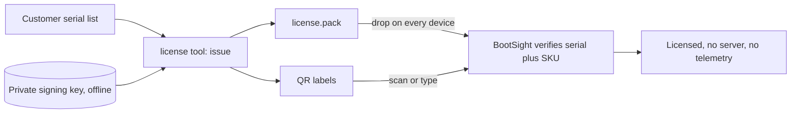

# BootSight Offline Licensing (Internal Runbook)

This is the internal process for issuing offline BootSight activations for
air-gapped or no-telemetry customers. End-user activation steps live in
[License Activation](../setup_and_configuration/license-activation.md).

## How it works

Offline licenses are Ed25519-signed tokens bound to a device serial + SKU. The
signing private key never ships; only the public key is embedded in the BootSight
app. The device re-verifies the signature and re-checks the serial + SKU against
live system properties on every boot, so a code only ever activates the device it
was issued for, and cloned images revert to unlicensed on the wrong hardware.

Seat count is controlled at issuance: we sign exactly the serials purchased, so a
pack can only activate those devices. No per-device involvement from us is needed
after we hand over the pack, which keeps it zero-touch for the customer.



## Build

Produce an offline-only image with:

```bash
./build.sh --bs-offline ...
```

This implies `--bootsight` and sets `persist.bass.bootsight.offline_licensing=1`,
disabling server sync and telemetry. The BootSight APK must be built with the
license public key embedded (see below) for verification to work.

## One-time key setup

The tool lives in `vendor/ax86-lite/vendor_packages/bootsight/tools/license-tool/`.

```bash
python3 bootsight_license_tool.py keygen --out bootsight_license_private.key
```

Paste the printed public key into
`app/src/main/java/com/bliss/bootsight/offline/OfflineLicenseConfig.kt`
(`LICENSE_PUBLIC_KEYS_B64`), rebuild the BootSight APK, and drop it into the
vendor package prebuilts. Store the private key seed offline and backed up; it
cannot be recovered. Multiple public keys may be embedded to support rotation.

## Issuing a pack per purchase

1. Collect the customer's device serials (Settings -> Device Status, or
   `adb shell getprop ro.bliss.serialnumber`) into a CSV.
2. Issue:

```bash
python3 bootsight_license_tool.py issue \
    --key bootsight_license_private.key \
    --csv serials.csv --sku BASS.KIOSK --customer "Acme Corp" \
    --pack acme-licenses.pack --out-dir acme-lic --labels acme-labels.pdf
```

3. Verify before sending:

```bash
python3 bootsight_license_tool.py verify \
    --pubkey "<base64 public key>" --pack acme-licenses.pack
```

4. Send the customer `acme-licenses.pack` (drop on every device) and/or the QR
   labels. Full option reference is in the tool's `README.md`.

## Notes

- Expiry is optional per license; blank means perpetual.
- `features` is a capability-tag list baked into the token (CSV column or
  `--features`). The app currently recognizes only `bootsight` (device
  licensing), which is also the default when left blank, so leave it empty unless
  told otherwise. Other tags are signed and carried but not yet enforced
  (reserved for future per-feature gating). It applies to `issue`, not `keygen`.
- A short hand-typeable HMAC code tier exists but is weaker (shared secret in the
  app) and disabled by default. Only enable per contract.
- True customer-hosted issuance (a seat pool plus a customer-held signing tool
  with a local ledger) is a planned phase 2 and not part of this flow.
