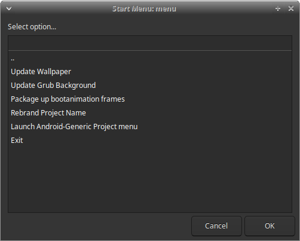

# Building Bass: Lineout

This page is the **Bass: Lineout** build guide (LineageOS 23.2 / Android 16, `vendor/ax86-lite`, `tools/build.sh`).

Classic **Bass OS (Android 12L)** instructions are retained in full under [Legacy Bass OS (classic, Android 12L)](#legacy-bass-os-classic-android-12l). Do not mix the two flows.

Licensed private addons and white-label assets are supplied separately to licensed builders. Public docs do not cover bypassing licensing.

---

## Machine requirements

| Resource | Minimum guidance |
|----------|------------------|
| CPU | 16+ cores recommended |
| RAM | 32 GB+ |
| Swap | 16 GB+ |
| Disk | 500-700 GB free (source + `out/`) |
| OS | **Ubuntu 22.04 LTS** or **Ubuntu 24.04 LTS** (officially targeted) |

First sync and full image can take many hours depending on network and hardware.

---

## Host dependencies

Install these **before** `repo sync` / `./build/unfold_lineage.sh` / `./build.sh`. Prefer `apt` packages on Ubuntu; use the optional blocks only when you need that feature.

### 1. Base build packages (AOSP / Lineage + ISO tools)

Enable `i386` multiarch once (needed for some 32-bit linker/ncurses packages on x86_64 hosts):

```bash
sudo dpkg --add-architecture i386
sudo apt-get update
```

```bash
sudo apt-get install -y \
  git-core git-lfs gnupg flex bison gperf build-essential zip curl \
  zlib1g-dev gcc-multilib g++-multilib libc6-dev-i386 \
  libncurses5 libncurses5:i386 lib32ncurses-dev \
  x11proto-core-dev libx11-dev lib32z1-dev \
  ccache libgl1-mesa-dev libxml2-utils xsltproc unzip \
  squashfs-tools python3-mako libssl-dev ninja-build lunzip \
  syslinux syslinux-utils gettext genisoimage bc xorriso xmlstarlet \
  meson glslang-tools libelf-dev aapt zstd rdfind nasm \
  rustc bindgen \
  swig device-tree-compiler mtools libgmp-dev libmpc-dev \
  cpio rsync dosfstools kmod gdisk lz4 cmake libglib2.0-dev \
  wget python-is-python3 openssl openjdk-17-jdk
```

Notes:

- Package names drift slightly between 22.04 and 24.04 (`lib32ncurses5-dev` vs `lib32ncurses-dev`). If `apt` rejects a name, install the closest `ncurses` / `lib32z` package your release offers.
- `rustc` / `bindgen` are used by parts of the Android / Mesa stack. Prefer distro packages; a separate `rustup` toolchain is not required for a normal Lineout image.
- `openjdk-17-jdk` covers host Java needs (signing helpers, some app tooling). Newer JDKs may work; 17 is the safe default.

### 2. Lineout host packages (`ax86_setup.sh`)

`vendor/ax86-lite/build/ax86_setup.sh` hard-checks these (kernel `.deb` packaging and related host work):

```bash
sudo apt-get install -y \
  debhelper dpkg-dev bc bison flex libssl-dev rsync cpio unzip libdw-dev
```

(`build-essential` and `wget` from section 1 cover the rest of the vendor README list.)

### 3. Meson / Python helpers (Mesa and other Meson components)

```bash
sudo apt-get install -y python3-pip pkg-config python3-dev ninja-build meson python3-mako
sudo pip3 install --user jinja2 ply pyyaml pyelftools
```

If your distro already ships usable `python3-jinja2` / `python3-yaml` / `python3-ply` / `python3-pyelftools`, prefer `apt` over `pip3`.

### 4. Aaropa installer (Podman) - needed for `--aaropa-local`

Lineout ISOs use the **Aaropa** installer. Building `install.sfs` on the host uses **rootless Podman** (preferred) via `bootable/aaropa/build/aaropa-prebuilt.sh`.

```bash
sudo apt-get install -y \
  podman uidmap slirp4netns fuse-overlayfs passt \
  squashfs-tools p7zip-full curl git rsync
```

`passt` provides `pasta` (Podman 5.x default networking). Older hosts may use `slirp4netns` instead; install both if unsure.

Configure rootless Podman (one-time):

```bash
# Confirm unprivileged user namespaces are allowed (should be 1)
cat /proc/sys/kernel/unprivileged_userns_clone

# Ensure /etc/subuid and /etc/subgid have an entry for your user, e.g.:
#   youruser:100000:65536
grep "^$USER:" /etc/subuid /etc/subgid
```

If entries are missing, add them as root (adjust IDs if your site policy differs), then log out and back in:

```bash
sudo usermod --add-subuids 100000-165535 --add-subgids 100000-165535 "$USER"
```

Verify Aaropa deps (prints an `apt install` line if anything is missing):

```bash
# From the AOSP workspace root after sync
bash bootable/aaropa/build/aaropa-prebuilt.sh --check-deps
```

Alternatives:

- `--aaropa-fetch` on `build.sh` downloads release artifacts instead of a local Podman build (still needs `curl`/`wget`, `p7zip-full`, etc.).
- Docker can work for some Aaropa steps, but local export currently expects **Podman** `unshare`. Prefer Podman for Lineout.

### 5. `repo` and Git LFS

```bash
mkdir -p ~/bin
curl -fsSL https://storage.googleapis.com/git-repo-downloads/repo -o ~/bin/repo
chmod a+x ~/bin/repo
echo 'export PATH="$HOME/bin:$PATH"' >> ~/.bashrc
source ~/.bashrc

git lfs install
```

`unfold_lineage.sh` runs `repo init ... --git-lfs`.

### 6. Optional: GameNative (`--gamenative`)

Default path downloads a CI-signed APK with the **GitHub CLI** (no local Vulkan compile):

```bash
sudo apt-get install -y gh
gh auth login
```

Then `vendor/ax86-lite/build/gamenative_build.sh` (or enable `--gamenative` so setup stages it).

**Local from-source GameNative** (dev only: Podman/Docker container builds + Gradle) additionally needs:

```bash
# Same Podman stack as Aaropa (section 4), plus:
sudo apt-get install -y \
  openjdk-17-jdk \
  meson ninja-build python3-mako \
  llvm-19-dev libclang-19-dev libclc-19-dev \
  spirv-tools glslang-tools
```

`ax86_setup.sh` only **warns** if those guest-graphics packages are missing; a plain ROM build without local GameNative Vulkan compile does not need them. Pin `GUEST_GFX_LLVM_VERSION` if your distro uses a different LLVM major than `19`.

Never ship images built with `--gamenative-dev-key` / debug-signed GameNative. Details: [GameNativeX64](../applications/GameNativeX64/GameNativeX64.md).

### 7. Optional host utilities

| Tool | Why | Install |
|------|-----|---------|
| `gh` | GameNative release fetch; some addon/repo helpers | `sudo apt-get install -y gh` |
| `adb` / `fastboot` | Device tests after build | `sudo apt-get install -y adb fastboot` or Android platform-tools |
| `aapt` | Host APK / Settings-tile checks | From section 1, or Android SDK build-tools |
| Pillow + ImageMagick | Regenerating initrd boot banners (`tools/generate_boot_banner.py`) | `sudo apt-get install -y imagemagick` and `pip3 install --user pillow` |
| `rclone` | Optional image upload helper | `sudo apt-get install -y rclone` |

### Dependency check summary

| When | What checks it |
|------|----------------|
| Every `source build/envsetup.sh` / Lineout setup | `build/ax86_setup.sh` -> `check_host_dependencies` |
| GameNative guest Vulkan (optional) | `check_guest_graphics_dependencies` (warn only) |
| `--aaropa-local` | `aaropa-prebuilt.sh --check-deps` then Podman build |
| `--gamenative` default | `gh` + network to GitHub releases |

---

## Fetch sources and unfold

Layout expected by the vendor scripts:

```text
<parent>/
  vendor_ax86-lite/     # this git clone (branch ax86-lite-los-23.2)
  aosp-workspace/       # created/filled by unfold
```

```bash
git clone -b ax86-lite-los-23.2 <vendor_ax86-lite-url>
cd vendor_ax86-lite
./build/unfold_lineage.sh --profile bass-lineage-23.2-core
# or: --profile bass-lineage-23.2-pro
```

Unfold will `repo init` / `repo sync` LineageOS 23.2 and symlink this tree to `aosp-workspace/vendor/ax86-lite`.

If the workspace is already synced and you only need to relink:

```bash
AX86_SKIP_SYNC=1 ./build/unfold_lineage.sh --profile bass-lineage-23.2-core
```

Private / licensed addon trees: place or clone them as instructed by your Bass contact (see also [Addon Development: Bass Lineout](addon-development.md)), then continue.

---

## Environment setup and build

```bash
cd ../aosp-workspace
source build/envsetup.sh
lunch lineage_x86_64_tablet-bp4a-userdebug
```

Sourcing `envsetup.sh` runs vendor integration (patches, addon integrate, device package staging).

Preferred wrapper (symlinked as `./build.sh` at the workspace root):

```bash
# Core profile
./build.sh --profile=bass-lineage-23.2-core --clean

# Pro profile example
./build.sh --profile=bass-lineage-23.2-pro --clean --update-foss-userapps

# Local Aaropa installer + common addons (example)
./build.sh --profile=bass-lineage-23.2-pro --clean \
  --aaropa-local --ethernetconfig --extras
```

Run `./build.sh -h` for the full flag list. Profiles set default lunch/make targets and addon flags; individual `--flag` args still override.

Successful images land under the product out tree (and packaged ISO paths used by your profile). Typical lunch target: `lineage_x86_64_tablet-bp4a-userdebug`, make goal `iso_img`.

### Profiles (short)

| Profile | Role |
|---------|------|
| `bass-lineage-23.2-core` | Smaller addon set (validation + Ethernet Config, etc.) |
| `bass-lineage-23.2-pro` | Broader addon set (extras, SmartDock, FOSS user-apps, etc.) |

Details: `vendor/ax86-lite/README.md` and `addons/README.md`.

---

## Lineout / ax86-lite build flags

Current Lineout tablet builds use `vendor/ax86-lite/tools/build.sh`. The tables below cover flags documented with product features. Always prefer `./build.sh -h` on your tree for the authoritative list.

### Fleet and BootSight

| Flag | Effect |
|------|--------|
| `--bootsight` | Include BootSight (Bass fleet backend / Device Status) |
| `--fleet-mgmt=mdm` | Image expects a third-party MDM (no BootSight) |
| `--fleet-mgmt=none` | No fleet component (default when neither flag is set) |
| `--bsbanner` | BootSight overlay banner (implies `--bootsight`) |
| `--bspopup` | BootSight overlay popup (implies `--bootsight`) |

Do not combine `--bootsight` with `--fleet-mgmt=mdm`. Product overview: [Fleet Management](../features/fleet-management.md), [BootSight](../applications/BootSight/BootSight.md).

### Logger, Button Manager, and Power

| Flag | Effect |
|------|--------|
| `--logger` | Include Ax86 Logger (capture off until enabled) |
| `--logging-enabled` | Include Ax86 Logger and start capture by default |
| `--btnmgr` | Include Ax86 Button Manager |
| `--ax86-power` | Include Ax86 Power (sleep/wake policy UI + AIDL) |

`--logging-enabled` implies `--logger`. `--extras` also includes Ax86 Power. Details: [Ax86 Logger](../applications/Ax86Logger/Ax86Logger.md), [Button Manager](../applications/Ax86ButtonManager/Ax86ButtonManager.md), [Ax86 Power](../applications/Ax86Power/Ax86Power.md).

### Branding

| Flag | Effect |
|------|--------|
| `--bootani` | Use `branding/bootanimation/bootanimation.zip` |
| `--wallpaper` | Use `branding/wallpaper/default_wallpaper.png` |
| `--nobootani` | Stock Android boot animation |
| `--nowallpaper` | Stock Android wallpaper |
| `--nobranding` | Stock boot animation and wallpaper |

Default without those flags is the Lineage boot animation and wallpaper.

### Boot options and lockdown

| Flag | Effect |
|------|--------|
| `--bass-boot-options` | Inject Bass GRUB submenu via `custom.cfg` on first boot |
| `--cxbbo` | Customer Bass boot catalog (`entries.customer.list`; implies boot options) |
| `--ldinstall` | Block install/uninstall in lockdown mode |

Details: [Bass boot options](../setup_and_configuration/bass-boot-options.md), [Lockdown install block](../features/lockdown-install-block.md).

### Aaropa installer prebuilts

| Flag | Effect |
|------|--------|
| `--aaropa-local` | Build Aaropa `install.sfs` locally with Podman before lunch |
| `--aaropa-fetch` | Fetch Aaropa GitHub release artifacts instead of Podman |
| `--aaropa-rebuild` | Ignore stamp and refetch/rebuild installer artifacts |

Requires section [4. Aaropa installer](#4-aaropa-installer-podman---needed-for---aaropa-local) when using `--aaropa-local`.

### Other common Lineout flags

| Flag | Effect |
|------|--------|
| `--extras` | Bliss apps and mappers: Touch Mapper, Display Mapper, Config Overrides, Tweaks, Ax86Docs, Ax86 Power (does **not** include BootSight) |
| `--ethernetconfig` | Ethernet Config |
| `--btferry` | BT Ferry (A16 / Lineage 23.2 Lineout only for now) |
| `--gamenative` | GameNative x86_64 preinstall (see optional deps above) |
| `--smartdock` | SmartDock |
| `--restrictedlauncherpro` | Restricted Launcher Pro (private access) |
| `--rlptype=VARIANT` | RLP APK variant: `default` \| `gs` \| `gs_nh` \| `sl` (implies `--restrictedlauncherpro`) |
| `--internet-security` | Preinstall the Internet Security user app |
| `--monterey-standby` | Preinstall the Monterey Standby user app |
| `--foss-userapps` / `--update-foss-userapps` | FOSS user-app set / refresh from F-Droid metadata |

Example:

```bash
./build.sh --target=lineage_x86_64_tablet-bp4a-userdebug \
  --aaropa-local --bootsight --bsbanner --btnmgr --ax86-power \
  --logging-enabled --ethernetconfig
```

---

## Related reading

| Topic | Doc |
|-------|-----|
| Addon layout and flags | [Addon Development: Bass Lineout](addon-development.md) |
| Fleet / MDM product overview | [Fleet Management](../features/fleet-management.md) |
| Product lines | [Bass Product Family Guide](../product-guide/bass-product-family.md) |
| High-level map | [High Level Overview](bass-high-level-overview.md) |
| Classic Bass OS build | [Legacy Bass OS (classic)](#legacy-bass-os-classic-android-12l) below |

---

## Legacy Bass OS (classic, Android 12L)

The rest of this page is the older **Bass OS Android 12L** flow (`unfold_bliss.sh` / `build_bass.sh`). It is **not** the Lineout path. For Lineout, use the sections above (`vendor/ax86-lite` / `./build.sh`).

[](https://opensource.org/licenses/gpl-3-0/)

Please refer to https://bliss-bass.blisscolabs.dev for release notes, hardware requirements and demos of the various options.

### Licensing

Much of Bass OS is published under the General Public License 3.0. All generic patches are regularly submitted to [Bliss OS](https://github.com/BlissRoms-x86) where they can be obtained under the Apache License.

Bass OS does have a number of options, features, applications, etc. that can be accessed through purchasing licensing for the private addons, features and tools. [See our licensing page](https://bliss-bass.blisscolabs.dev/licensing.html) for full details.

### Warning!

Bass OS is an open-source initiative maintained by Bliss Co-Labs. It is provided "as is" without any warranties or guarantees.

### Building from sources

Before building, ensure your system has at least 16 CPU cores, 32GB of RAM, a swap file is at least 16GB, and 500GB-700GB of free disk space available.

#### Install system packages

(Ubuntu 22.04 LTS is only supported for classic Bass. Building on other distributions can be done using docker.)

- [Install AOSP required packages](https://source.android.com/setup/build/initializing).

```bash
sudo apt-get install git-core gnupg flex bison gperf build-essential zip curl zlib1g-dev gcc-multilib g++-multilib libc6-dev-i386 lib32ncurses5-dev x11proto-core-dev libx11-dev lib32z-dev ccache libgl1-mesa-dev libxml2-utils xsltproc unzip squashfs-tools python3-mako libssl-dev ninja-build lunzip syslinux syslinux-utils gettext genisoimage gettext bc xorriso xmlstarlet meson glslang-tools git-lfs libncurses5 libncurses5:i386 libelf-dev aapt zstd rdfind nasm rustc bindgen
```

- Install additional packages

```bash
sudo apt-get install -y swig device-tree-compiler mtools libgmp-dev libmpc-dev cpio rsync dosfstools kmod gdisk lz4 cmake libglib2.0-dev
```

- Install additional packages (for building mesa3d, libcamera, and other meson-based components)

```bash
sudo apt-get install -y python3-pip pkg-config python3-dev ninja-build
sudo pip3 install mako jinja2 ply pyyaml pyelftools
```

- Install the `repo` tool

```bash
sudo apt-get install -y python-is-python3 wget
wget -P ~/bin http://commondatastorage.googleapis.com/git-repo-downloads/repo
chmod a+x ~/bin/repo
```

You can also reuse the broader Lineout host package lists at the top of this page where package names still match your Ubuntu release.

#### Fetching the sources and building the project

```bash
git clone --recurse-submodules https://github.com/Bliss-Bass/bass-os.git bass-os-12.1
cd bass-os-12.1
```

#### Setting up Bass OS Source

##### !!NOTICE FOR LICENSED ADDONS/FEATURES!!

If you hold an active license for any of the private addons and features for Bass OS, you will need to add the files that you were sent or given access to, into the `private/addons` or `private/manifests` folder. If your project requires any vendor patches, those are placed in the `patches-vendor/` folder. Once all items are placed properly, you can continue onto the unfolding steps. Please also check your organization's Bass-OS project folder to make sure it didn't come with those additions already added.

#### Unfolding the source

Bass source uses an unfolding sequence to grab the latest stable point in development for the source, then applies any required changes on top, along with any customizations, licensed addons, modules, etc.

To start the unfolding process, we use the `unfold_bliss.sh` script:

```bash
bash unfold_bliss.sh
```

This will sync the source, and patch it with the latest available updates for Bass OS. Once complete and all patches, and addons are applied successfully, you can move onto the next step.

### Building Bass OS

#### Build Options

##### Target Specific build scripts

(**!!NOTICE FOR LICENSED CUSTOMERS!!**) If you have been supplied with the source, then chances are your source comes with a separate build script specific to your device's needs. Please check the project folder for a script with your product name or invoice number in it. Examples: `build_ABC01.0.1.sh` or `build_Intel-AC013.sh`. These will include the specific set of arguments passed to the build_bass script, so all you will need to do is run your targeted script to build.

```bash
bash build_ABC01.0.1.sh
```

##### General Build Script Usage

We offer a number of options to configure your builds with. You can use the `-h` argument to see the latest integrations available.
We also symlink the build-x86 command with `build_bass.sh` and `build-x86.sh`, so the commands both act the same when building Bass OS.

Example:

```bash
bash build_bass.sh -h
Usage: build-x86.sh [options]
Options:
-h, --help             Display this help dialog
-c, --clean            Clean the project
-d, --dirty            Run in dirty mode
-t, --title (title)    Set the release title
-b, --blissbuildvariant (variant)   Set the Bliss build variant
-i, --isgo             Enable isgo version
-v, --specialvariant (variant)      Set the special variant
--grubcmdline "option1=1 option2=1" Set the grub cmdline options
--production           Disable Test Build watermark and sign builds (requires release/product signature keys)

Launcher Options:
--clearhotseat         Enable clear hotseat favorites for Launcher3 Quickstep
--disablesearch        Disable device search
-s, --smartdock        Enable smartdock
--smartdockb           Enable smartdock with Bliss customizations
-k, --kiosk            Enable kiosk launcher **requires private git access**
--restrictedlauncher   Enable restricted launcher
--restrictedlauncherpro   Enable restricted launcher pro **requires private git access**
--garliclauncher       Enable garlic launcher
--gamemodelauncher     Enable game mode launcher
--crosslauncher        Enable cross launcher
--tvlauncher           Enable tv launcher
--titaniuslauncher     Enable titanius launcher
--desktoponsecondary   Enable desktop on secondary displays

Navigation Options:
-t, --tabletnav        Enable tablet navigation
--taskbarnav           Enable taskbar navigation
--gesturenav    Enable gesture navigation
--externalnav          Enable navigation on external displays
--rightmouseasback     Enable right mouse button as back

Package Options:
--noksu                Disable KernelSU
-f, --fossapps         Enable fossapps
--minfossapps          Enable minimal fossapps
-e, --supervanilla     Enable supervanilla
-m, --minimal          Enable minimal packages
-r, --removeusertools  Enable removeusertools
--viabrowser           Enable viabrowser
-w, --wiz              Enable Bliss setupwizard
--ethernetmanager      Enable EthernetManager
--powermanager         Enable power manager
--buildextra           Build extra packages
--updatefossapps       Update fossapps
--usepos               Enable TabShop pos terminal app

Input Options:
--showkeyboard         Enable show keyboard
--perdisplayfocus      Enable per display focus
--gboard               Enable Google GBoard IME
--gboardlite           Enable Google GBoard Lite IME
--perdisplayfocusime      Enable per display focus with experiment IME
--perdisplayfocuszqyime   Enable per display focus with ZQY IME

Firmware & Driver Options:
--sof                  Include SOF firmware
--silead               Include Silead firmware

Other Options:
-a, --atom             Include Intel Atom specific configurations
-l, --lockdown         Enable secure lockdown build
--adblockdown          Enable lockdown ADB defaults
-m, --manifest         Generate manifest
--alwaysonsettings     Enable always on settings
--nolarge              Disable large screen settings
```

### Features

- Supports various navigation and UI switches
- Supports various use-case launcher options (requires recent changes to vendor/agp-apps)
- Automatically updates Grub menus and other build configs for launcher and mode options (requires recent changes to vendor/agp-apps)

Please note that some of the build options may require licensed access to the feature/addon/application in order to use it. In some cases, the build will continue with just a warning when these options are used. In other cases, the build will exit. To remedy this, use a different option or remove the offending option from the build command.

### Examples

Here are a few examples to help in understanding:

**Bass Desktop**: Desktop mode demo of Bass featuring SmartDock

```bash
bash build_bass.sh --clean --title "Bass" --blissbuildvariant vanilla --specialvariant "-Desktop" --ethernetmanager --tabletnav --smartdock --wiz --clearhotseat --perdisplayfocus --externalnav --externalstatusbar --nolarge --sof --silead --alwaysonsettings --minfossapps
```

**Bass Restricted**: Restricted mode demo of Bass featuring Bliss Restricted Launcher

```bash
bash build_bass.sh --clean --title "Bass" --blissbuildvariant foss --specialvariant "-Restricted" --restrictedlauncher --ethernetmanager --fossapps --gesturenav --clearhotseat --externalnav --noksu --showkeyboard --nolarge --alwaysonsettings --sof --silead
```

**Bass POS**: Point-Of-Sale version of Bass featuring TabShop

```bash
bash build_bass.sh --clean --title "Bass" --blissbuildvariant foss --specialvariant "-POS" --restrictedlauncher --usepos --ethernetmanager --fossapps --gesturenav --clearhotseat --externalnav --noksu --showkeyboard --nolarge --alwaysonsettings --supervanilla --minimal
```

**Bass Tablet Go**: Android Go based Tablet version of Bass OS

```bash
bash build_bass.sh --clean --title "Bass" --blissbuildvariant foss --specialvariant "-TabletGo" --isgo --ethernetmanager --fossapps --tabletnav --wiz --clearhotseat --perdisplayfocus --externalnav --externalstatusbar --noksu --showkeyboard --perdisplayfocus --nolarge
```

### Vendor Customization Layer

If you have licensed access to the vendor customization layer for Bass OS, it comes with an easy to use menu driven interface for rebranding the OS.
Below are a few combinations of the various command options put together in the form of Collections.

#### Features available

- Menu driven interface for updating assets and branding:
  
- Generates default wallpaper overlays
- Generates branded bootanimation based on a single loop of frames
- Generates branded grub background

### Notes

- Depending on your hardware and internet connection, downloading and building may take 8h or more.
- After the successful build, find the images at `iso/` under the folder name based on your build name generated by the build system and can also be found in `aosptree/out/target/product/x86_64/`.

