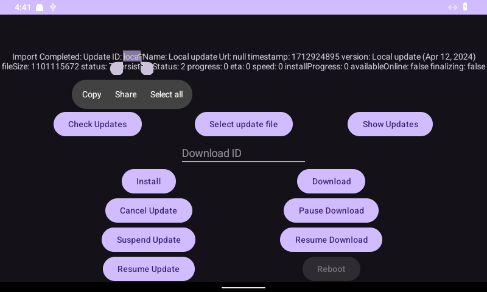
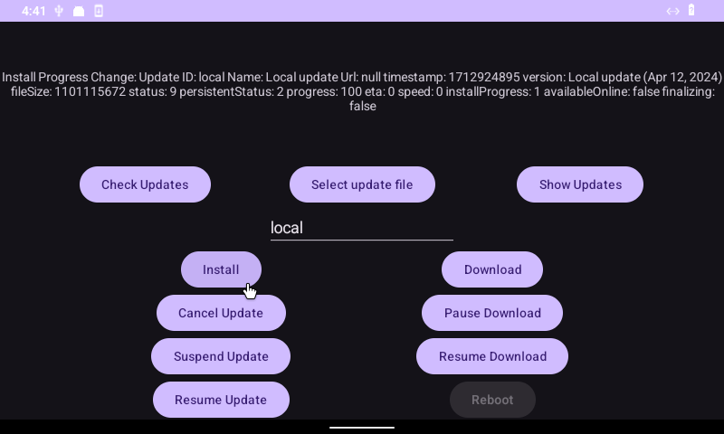
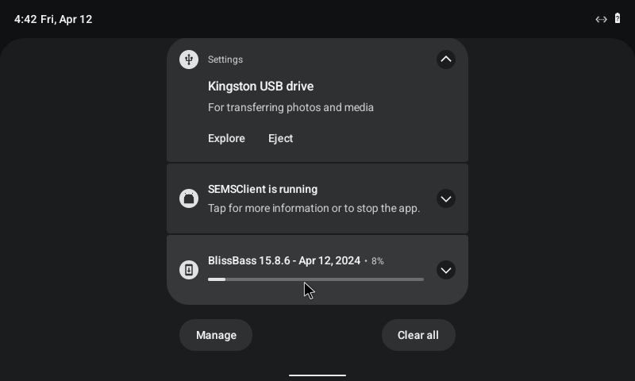
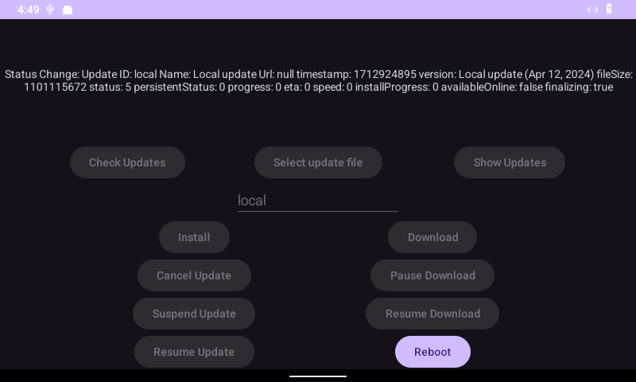
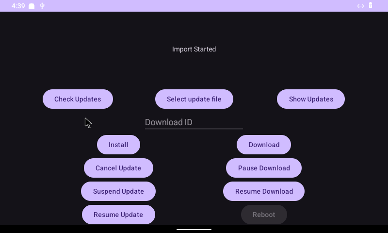

# Updating Bliss Bass builds

We support a variety of methods for updating Bliss Bass builds. Our installwe is simular to Bliss OS, but we add a few product focused options and features. 


### Manually - USB Installer

When installed this way, you can easily update to the newest versions of your Bliss Bass by running the USB installer and selecting the EXT4 partition, and select Do Not Format. This will retain the data from the previous install. 


### Manually - USB OEM Update

If you have installed the OS using the Bootable USB installer, then you can also update the OS manually by inserting the USB with the new version of BlissBass on it, and on Grub boot menu, navigate to OEM Install > OEM Update

Once selected, the device will boot into the OEM installer and auto-update the existing OS on the device. 

### OTA - Local Streaming

The UpdateService AIDL allows us to stream an OTA zip from the local device or network attached endpoint. 

The UpdaterSDK interface has three main parts: \

#### IUpdater.aidl

```
interface IUpdater {
   void setCallback(IUpdaterCallback cb);
   void checkForUpdates();
   List<UpdateItemInfo> getAvaliableUpdates();
   void downloadUpdate(String id);
   void pauseDownload(String id);
   void resumeDownload(String id);
   void installUpdate(String id);
   void cancelUpdate();
   void suspendUpdate();
   void resumeUpdate();

   void importUpdate(in ParcelFileDescriptor pfd);
}
```

#### IUpdaterCallback.aidl

```
interface IUpdaterCallback {
   void onUpdateCheckCompleted(boolean hasNewUpdates);

   void onStatusChange(in UpdateItemInfo update);
   void onDownloadProgressChange(in UpdateItemInfo update);
   void onInstallProgress(in UpdateItemInfo update);

   void onImportStarted();
   void onImportCompleted(in UpdateItemInfo updateBase);
}
```

#### UpdateItemInfo.aidl

```
parcelable UpdateItemInfo {
   String name;
   String downloadUrl;
   String downloadId;
   long timestamp;
   String version;
   long fileSize;

   int status;
   int persistentStatus;
   int progress;
   long eta;
   long speed;
   int installProgress;
   boolean availableOnline;
   boolean finalizing;
}
```

You can use the BlissUpdaterSDK-debug.aar from your target app to stream all required update information to the BlissUpdater app and system update engine. 

#### Example: UpdaterClient

The UpdaterClient app acts as an example app for interfacing with the BlissUpdaterSDK. The apps MainActivity calls the AIDL methods with each button, and prints out the output in the textbox above. 



Clicking **Select update file** will launch the `ACTION_GET_CONTENT` intent and then the `ParcelFileDescriptor` will be passed to the UpdaterManager.importUpdate. And the import process is triggered, import results can be observed from callbacks onImportStarted and onImportCompleted


Once the import status is complete, the output will be the imported files information:


Using the imported ID (in this case, **local**), we can enter the ID and initiate the Install process:



From there, it will also register the updater service notification:



Once the install process starts, it will have a status of **9** and you can track the **installProgress** percentage. 



And after that is complete the **finalizing** process is started and set to **true** and the **installProgress** will track the process percentage.



Then after receiving a status of **10 (Installed)** or **5 (tmp zip Deleted)**, then the updater service will trigger for a restart. And we can display that in the example by enabling that action


The restart is carried out by the BlissPowerManager:

```
BlissPowerManager blissPowerManager = BlissPowerManager.getInstance(this);
       mRebootBtn.setOnClickListener(v -> blissPowerManager.reboot());
```

### OTA - Local Server

By default, testing OTA on an unsecured HTTP server is disabled. In order to test OTA, you will need to setup a secured HTTPS nginx server, or change this line in the Updater package to **True**: [https://github.com/BlissRoms/platform_packages_apps_BlissUpdater/blob/arcadia-next/AndroidManifest.xml#L23](https://github.com/BlissRoms/platform_packages_apps_BlissUpdater/blob/arcadia-next/AndroidManifest.xml#L23)  \
Then recompile BlissBass to disable this security measure. 

#### Manually setting OTA URI address:

We do allow the ability to manually set the OTA update URI via kernel cmdline interface. This allows you to set the value only when needed for added security. To do so, you should add the following value:

* `SET_CUSTOM_OTA_URI` - Sets the custom URL for OTA updates

```
SET_CUSTOM_OTA_URI=https://192.168.1.1/updates/update.json
```

Or you can set the following system property via ADB:

* `bliss.updater.uri`

```
Setprop bliss.updater.uri https://192.168.1.1/updates/update.json
```

Setting Up The Server:

On the server, we will need to have it setup as a basic nginx web server, with the OTA update .zip located in the same folder as the update.json, with the updates/update.json file formatted like this:

```
{
   "response": [
       {
           "datetime": 1698795869,1698793200
           "filename": "Bliss-Go-v15.8.6-x86_64-OFFICIAL-vanilla-20231031.zip",
           "id": "f017547c509f01b885792faad33b38e2d30380907454e723dcbb257189b8e80d",
           "size": 1194109016,
           "version": "v15.8",
           "variant": "vanilla",
           "url": "https://192.168.1.1/Bliss-Go-v15.8.6-x86_64-OFFICIAL-vanilla-20231031.zip"
       }
   ]
}
```

The values are as follows:

* “**datetime**” - is calculated using the date command. Example: 

```
$ date --date='2023-10-31 19:00' +"%s"

```

* “**id**” -  is the sha256 value. Example:

```
$ sha256sum Bliss-Go-v15.8.6-x86_64-OFFICIAL-vanilla-20231031.zip

```

* “**size**” - is the size in bytes. Example: 

```
$ wc -c Bliss-Go-v15.8.6-x86_64-OFFICIAL-vanilla-20231031.zip
```

### OTA - Dedicated Update Server

**ShipperStack**

BlissLabs has produced [ShipperStack](https://github.com/shipperstack/shipper/tree/master/docs), and that is what we use for our update server needs. You can find more information on how to setup and host on the project documentation page. 

**LineageOS Updater**

The updater we use is also compatible with the LineageOS updater framework. You can also find a version of that that is configured for local web servers as well [here](https://git.libremobileos.com/infrastructure/updater)
