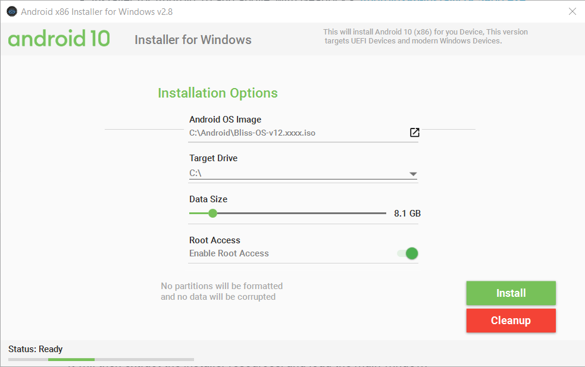

# Install from Windows - UEFI/ESP \(64-bit\)

### Before you begin

For 32bit or MBR/Legacy install, Axon from Supreme-Gamers put together a great installer that works with MBR or EFI and installs on NTFS or EXT4. Check it out here: [https://supreme-gamers.com/t/advanced-android-x86-installer-for-windows.300/](https://supreme-gamers.com/t/advanced-android-x86-installer-for-windows.300/)

## Windows-based installer - UEFI/ESP \(64-bit\)

**Proceed at your own risk.** This method might be the easiest currently if you understand what you are doing.

For the overall instructions on using this method, please refer to the [tool's original thread](https://forum.xda-developers.com/android/software/winapp-android-x86-installer-uefi-t3222483). The tools have been updated by Team Bliss for easy installation on UEFI/ESP machines. The [builds we produce can be found here.](https://github.com/BlissRoms-x86/Androidx86-Installer-for-Windows/tree/q10-2.8/bin) And the [source for those builds can be found here.](https://github.com/BlissRoms-x86/Androidx86-Installer-for-Windows) This tool should work on Remix OS as well, but this has not been tested yet.

### Part 1 - Downloading the Installer

We normally include the installer in our .iso, but with some builds, it may not be included. So we make a few alternate versions of the Windows Installer available for users.

* Installer for Android 9 and below -  [Androidx86-Installv26.0003.exe](https://github.com/BlissRoms-x86/Androidx86-Installer-for-Windows/blob/q10-2.8/bin/Androidx86-Installv26.0003.exe)
* Installer for Android 10 and above -  [Androidx86-Installv28.5800.exe](https://github.com/BlissRoms-x86/Androidx86-Installer-for-Windows/blob/q10-2.8/bin/Androidx86-Installv28.5800.exe)
* Installer for Android 10 and above, with Gearlock -  [Androidx86-Installv28.5900.exe](https://github.com/BlissRoms-x86/Androidx86-Installer-for-Windows/blob/q10-2.8/bin/Androidx86-Installv28.5900.exe)

### Part 2 - Using the Installer

The installer has been updated to accept the `.iso` files for our 8.x/10.x/11.x/12.x/14/x releases. Just execute the installer, give it Admin permissions, and follow the prompts the installer gives. Refer to the original thread for any questions, and please search before asking.

It will initially ask if you want to install Bliss OS, select "Yes":

It will then extract the installer resources, and load the main window:

1. You will want to start by selecting an Android OS Image \(Bliss OS, Phoenix OS Darkmatter, Android-x86, etc\)
2. Then make sure you target your current Windows drive \(typically C:\\)
3. Drag the slider to your desired data size. This will create a single data.img on your drive, the larger size you select, the longer it takes to create. 
4. If you plan on using root, then enable "Root Access". Otherwise, if you find that you need root later, you will need to manually extract the system.img from within the system.sfs file. Then you must delete the system.sfs file after extracting

.**Warning** - for Pie, you will need to add `androidboot.hardware=android_x86_64` to the grub entry in order to boot!

### Part 3 - Switching the UEFI/EFI boot entry

Option 1: Use the EasyUEFI tool, then switch the UEFI/EFI entry it created to boot first. Close and reboot. Option two is to use your BIOS to select the added UEFI boot entry.

Option 2: Hit Start Button &gt; Settings &gt; Update & Security &gt; Recovery, and select the Restart Now button under Advanced Startup.

This will start to restart your PC, and show a Blue screen \(Metro bootloader\) where you will want to select "Use a Device"  
Then on the next screen, your Android install will show up as either Bliss OS, Android OS or Linpus Lite. Select that, and it will reboot to grub and let you select the boot options for Android from there.

**Troubleshooting Installer Issues:**

Sometimes, the windows installer will fail with: Error output: The directory is not empty. 

This means that windows currently has something mounted at Z: or your EFI is mounted elsewhere. To fix it, launch CMD as Administrator \(Ctrl-Shift-LClick\), and type: `mountvol Z: /S   
mountvol Z: /D`

Then relaunch the installer and try again.

