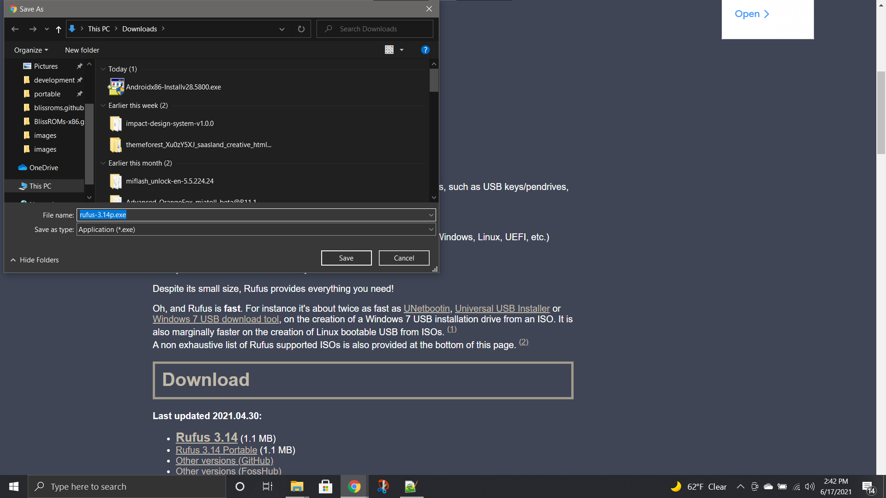
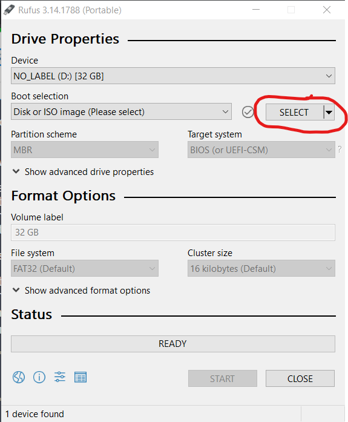
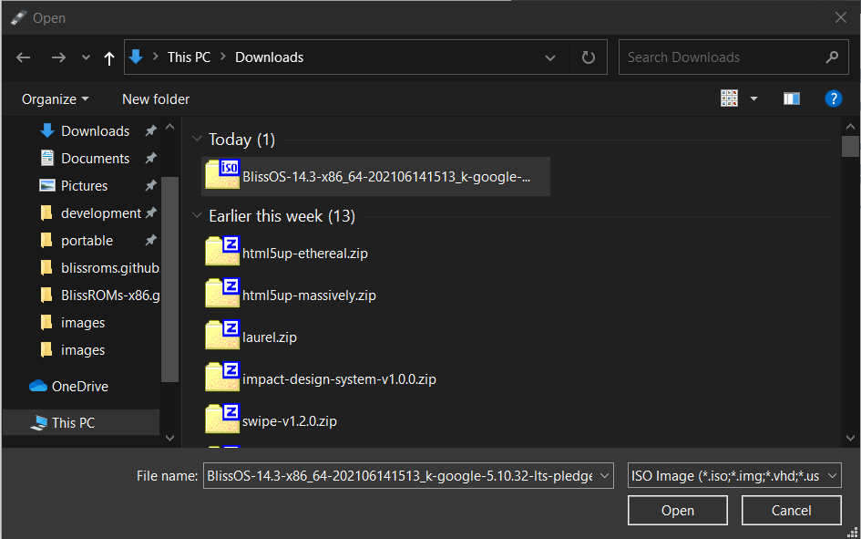
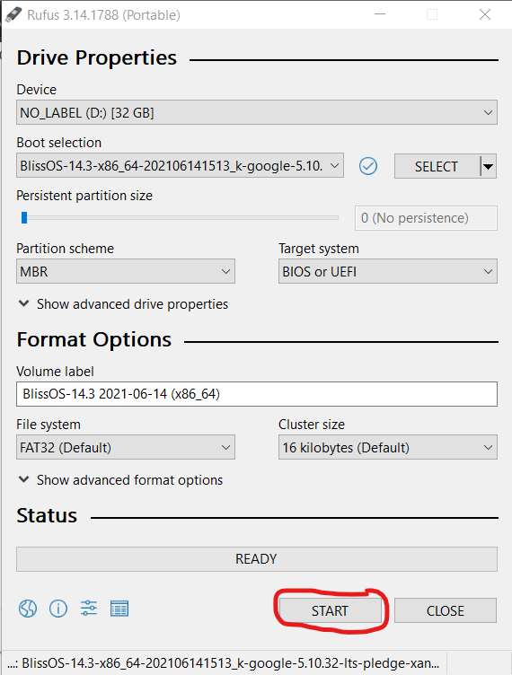
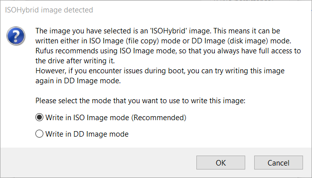
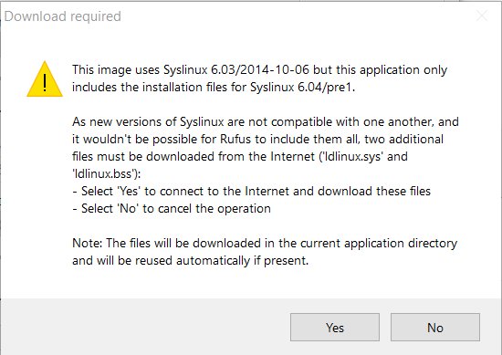
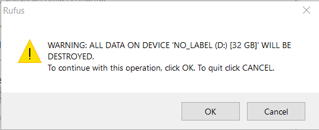
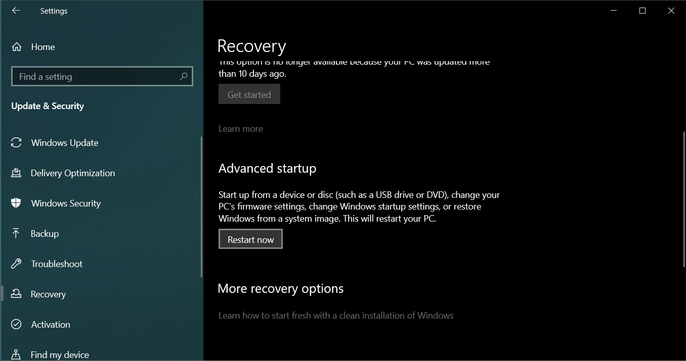

# Live boot Bliss OS

### Downloading Rufus

Giving our Android builds a try on your PC is pretty simple and straight forward. To start out, let's head over to [https://rufus.ie](https://rufus.ie/en_US/) and download the latest version of Rufus \(I use the portable version\)

### Using Rufus to flash your USB drive

Once downloaded, plug in your USB drive, and launch Rufus and give it permissions to make changes to your device. Then press the "**Select**" button to browse for the .iso or .img file. 

Select the .iso by pressing the "**Open**" button on that dialog:

Once selected, keep all the rest of the settings as default and click the Start button:

It will then show an ISOHybrid dialog, we will want to select .iso mode:

There might also be a notice about Syslinux, asking to download something. Select "**Yes**" and it will then continue.

Once that is done, it may ask you to "**OK**" the cleaning of your USB drive. Please select "**OK**"  

Rufus will then start to write the USB drive with what is on the Android .iso you downloaded. This process may take some time. 

### Rebooting from windows into your USB drive

From Windows, hit the Start Button &gt; Settings &gt; Update & Security &gt; Recovery and select the Restart Now button under Advanced Startup. 

This will start to restart your PC, and show a Blue screen \(Metro bootloader\) where you will want to select "Use a Device"  
Then on the next screen, your USB Drive should show up as either Bliss OS, Android OS or something to that effect. Select that, and it will reboot to grub and let you select the boot options to Live Boot Android from there.   

