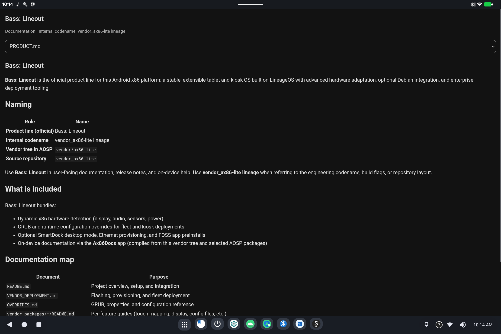

# Ax86Docs (this help app)

> **Android 16 Lineout.** Screenshots and steps on these pages were taken on **Bass: Lineout** (Lineage **23.2** / Android **16**). On **Android 14** (Lineage **21.0**) the same tools can look different, sit in a different Settings place, or be missing from that image entirely.

Ax86Docs is the on-device manual for Bass: Lineout. It does not need a network connection.

## How to open it

Look for **Ax86Docs** in the app grid, or a document-style icon on the taskbar.

## How to use it

1. Use the list at the top to pick a page.
2. **Using this device** is the simple guides (start here).
3. **Technical reference** is the developer / administrator write-ups (build flags, properties, source layout).

Pictures in these guides are screenshots from a typical Bass tablet. Your wallpaper, taskbar icons, and which tools are installed may differ.

## Related

- [Getting started](README.md)
- Technical: [Ax86Docs (technical)](../../applications/Ax86Docs/Ax86Docs.md)
