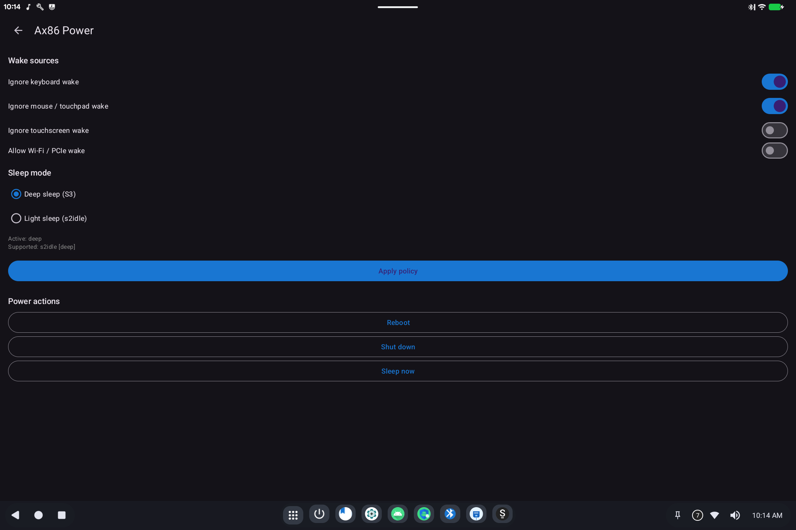

# Ax86 Power

> **Android 16 Lineout.** Screenshots and steps on these pages were taken on **Bass: Lineout** (Lineage **23.2** / Android **16**). On **Android 14** (Lineage **21.0**) the same tools can look different, sit in a different Settings place, or be missing from that image entirely.

Ax86 Power decides **when the computer sleeps** and **what is allowed to wake it**. It also has Reboot, Shut down, and Sleep now.

Open it from **Settings → System → Ax86 Power** (it usually does not appear as a normal app icon).

## What it is for

On a tablet or laptop, a USB keyboard, mouse, or Wi-Fi card can wake the machine if you bump the desk. These switches tell the hardware to ignore those wake sources.

## Wake sources

| Switch | When to use it |
|--------|----------------|
| **Ignore keyboard wake** | Stop a USB/PS2 keyboard from waking the device |
| **Ignore mouse / touchpad wake** | Stop a mouse or touchpad from waking the device |
| **Ignore touchscreen wake** | Stop the panel from waking the device (leave off if you tap to wake) |
| **Allow Wi-Fi / PCIe wake** | Allow the network card to wake the device (usually leave off) |

After changing switches, tap **Apply policy**.

## Sleep mode

- **Deep sleep (S3)**: lowest power; best for battery when the lid is closed. Not every PC supports it.
- **Light sleep (s2idle)**: lighter pause; more hardware keeps running.

The line under the choices shows what this machine actually supports. If Deep sleep is not listed as supported, use Light sleep.

## Power actions

- **Reboot**: restart Android.
- **Shut down**: power off.
- **Sleep now**: sleep immediately using the policy above.

## Related

- [Getting started](README.md)

- Technical: [Ax86 Power](../../applications/Ax86Power/Ax86Power.md)
