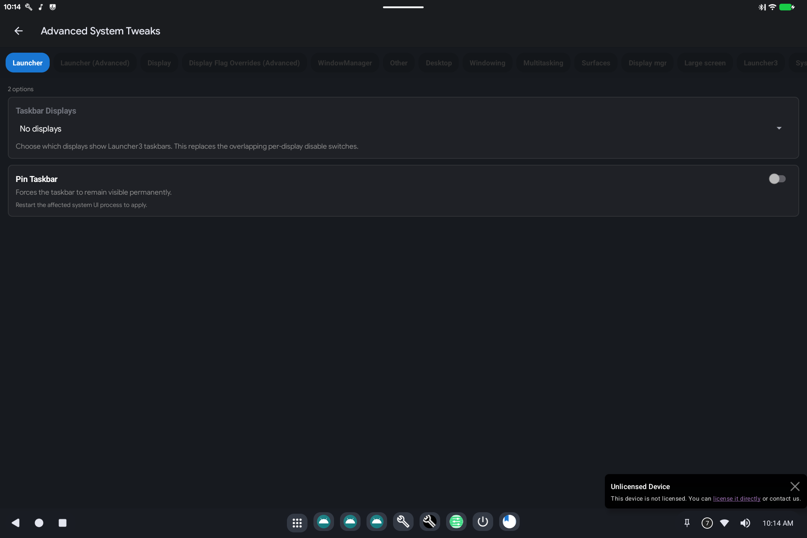

# BlissTweaks

> **Android 16 Lineout.** Screenshots and steps on these pages were taken on **Bass: Lineout** (Lineage **23.2** / Android **16**). On **Android 14** (Lineage **21.0**) the same tools can look different, sit in a different Settings place, or be missing from that image entirely.

BlissTweaks is a **Settings → System** page with extra switches for the launcher, extra displays, and windowing (desktop-style windows).

## What it is for

Stock Android Settings does not expose every PC/desktop option. BlissTweaks groups the ones this product uses: taskbar behavior, how extra monitors are treated, and whether apps open as windows.

## How to use it

Open **Settings → System → BlissTweaks** (name may appear as Bliss Tweaks).

Work from the tabs or sections:

- **Launcher**: show/hide or pin the taskbar.
- **Display**: how extra screens are used (presentation vs a normal desktop). Prefer [Display Mapper](display-mapper.md) for size and rotation.
- **Window manager**: freeform windows vs a single full-screen app. Changing these can make the next session look like a desktop or like a phone. Reboot or restart System UI if a switch says so.

Leave developer-style flag lists (aconfig / device_config tabs) alone unless you were asked to flip a specific item.

## Related

- [Getting started](README.md)

- [SmartDock](smartdock.md)
- Technical: [BlissTweaks](../../applications/BlissTweaks/BlissTweaks.md)
