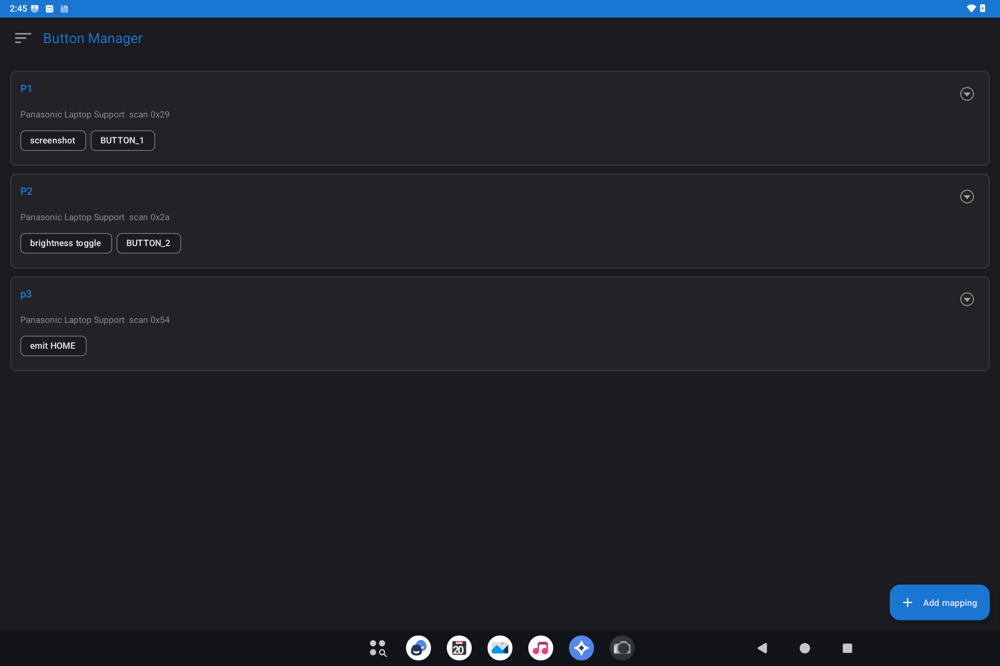

# Button Manager

> **Android 14 and 16.** Button Manager ships on **Bass: Lineout** for both Lineage **21.0** (Android **14**) and Lineage **23.2** (Android **16**). The screenshot below is from an **Android 14** Lineout device (Panasonic CF-33).

Button Manager assigns the extra **hardware keys** on some x86 tablets and convertibles (often labeled P1, P2, P3) to useful actions: screenshot, keyboard shortcuts, brightness, opening an app, and similar.

This image may not include Button Manager. If **Settings → System** has no **Button Manager** row, skip this page.

## What it is for

Those extra keys do nothing useful until something maps them. Button Manager is that map.

## How to use it

1. Open **Settings → System → Button Manager**.
2. Pick a key (P1 / P2 / ...).
3. Choose an action (screenshot, key combo, app, brightness, volume, ...).
4. Save. Press the physical key to try it.

If a key does nothing, the device may not expose that button to Android, or another tool may already be capturing it.

## Related

- [Getting started](README.md)

- Technical: [Button Manager](../../applications/Ax86ButtonManager/Ax86ButtonManager.md)
