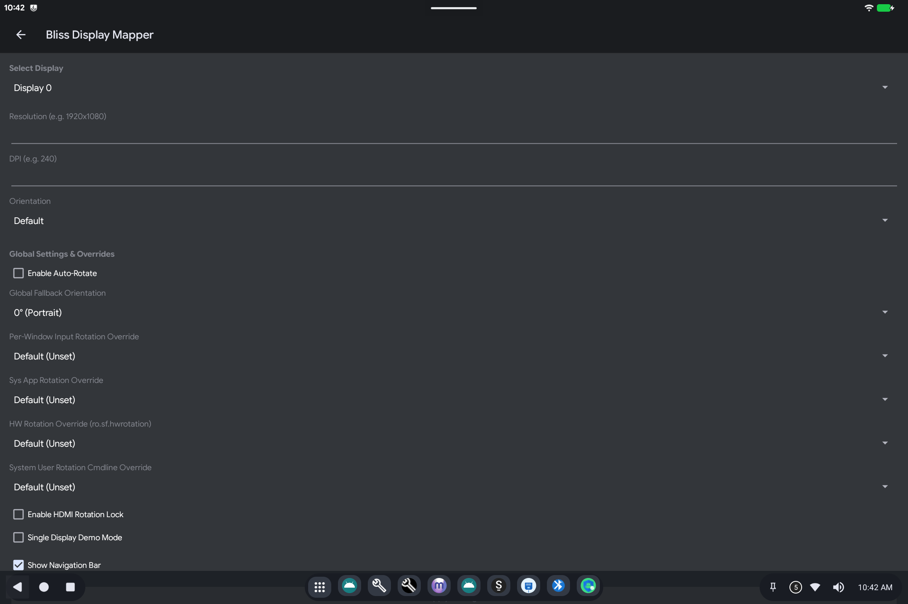

# Display Mapper

> **Android 16 Lineout.** Screenshots and steps on these pages were taken on **Bass: Lineout** (Lineage **23.2** / Android **16**). On **Android 14** (Lineage **21.0**) the same tools can look different, sit in a different Settings place, or be missing from that image entirely.

Display Mapper controls **resolution, density (how large things look), and rotation** for the built-in panel and extra monitors.

Open it from **Settings** (search for **Display Mapper** or **Bliss Display Mapper**).

## What it is for

PC panels and HDMI monitors often need a different size or rotation than Android guessed. This screen lets you set that per display.

## How to use it

1. **Select Display**: `Display 0` is usually the built-in screen; `Display 1` is often HDMI/USB-C.
2. **Resolution**: for example `1920x1080`. Leave blank to keep the default.
3. **DPI**: higher numbers make text and icons larger. Leave blank for default.
4. **Orientation**: lock landscape/portrait, or leave **Default**.
5. **Show Navigation Bar**: the Back / Home / Recents bar. Uncheck only if you have another way to go Home (for example SmartDock).
6. Apply / save if the screen offers it, then check the display. Some rotation locks need a moment after you plug in a monitor.

Leave **Single Display Demo Mode** and the advanced rotation overrides alone unless a second screen is stuck the wrong way and the simple Orientation menu did not fix it.

## Related

- [Getting started](README.md)

- [Touch Mapper](touch-mapper.md) if the picture rotated but touch did not
- Technical: [Display Mapper](../../applications/BlissDisplayMapper/BlissDisplayMapper.md)
