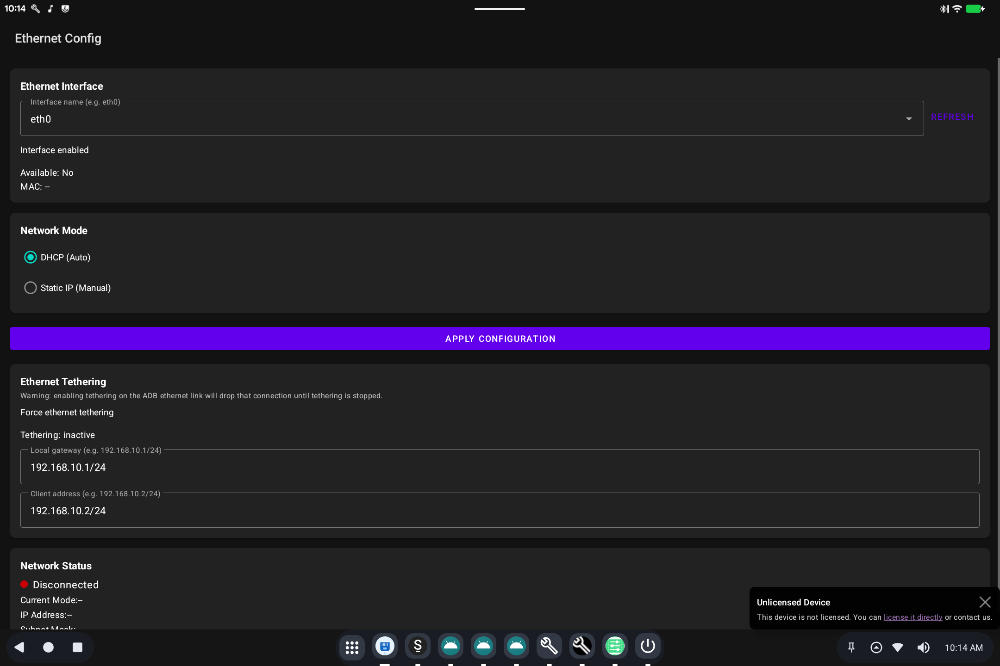

# Ethernet Config

> **Android 16 Lineout.** Screenshots and steps on these pages were taken on **Bass: Lineout** (Lineage **23.2** / Android **16**). On **Android 14** (Lineage **21.0**) the same tools can look different, sit in a different Settings place, or be missing from that image entirely.

Ethernet Config is the screen for a **wired network** (RJ-45 or USB Ethernet).

## What it is for

Wi-Fi is in **Settings → Network & internet**. This tool is for a cable: DHCP vs a manual address, and related Ethernet options used on kiosks and desktops that stay plugged in.

## How to use it

1. Plug in the Ethernet adapter or cable.
2. Open **Ethernet Config** from Settings or the app list.
3. Choose automatic address (DHCP) unless your network team gave you a static IP.
4. Apply / save, then confirm **Settings → Network & internet** shows a connection.

If the page is missing, this image may not include Ethernet Config.

## Related

- [Getting started](README.md)

- [Ethernet Config (technical)](../../applications/EthernetConfig/EthernetConfig.md)
