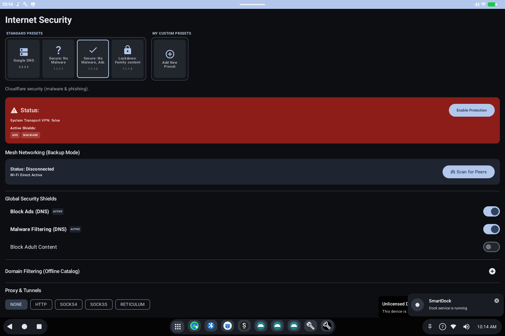

# Internet Security

> **Android 16 Lineout.** Screenshots and steps on these pages were taken on **Bass: Lineout** (Lineage **23.2** / Android **16**). On **Android 14** (Lineage **21.0**) the same tools can look different, sit in a different Settings place, or be missing from that image entirely.

Internet Security is an extra **network protection** app that can be preinstalled on Bass images.

## What it is for

It sits beside Android's built-in VPN and privacy settings. Use it when your organization or image includes this app for filtering, VPN, or similar protection.

## How to use it

Open **Internet Security** from the app grid. Follow the on-screen setup (permissions, VPN confirmations). If Android asks to allow a VPN connection, that is expected for this kind of app.

If you do not see it, this image was built without that preinstall.

## Related

- [Getting started](README.md)
